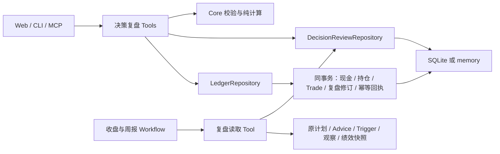

# MVP3 决策与复盘详细设计

> 状态：D0–D4 已完成本地实现与隔离验收；2026-10-04 收尾。初稿于 2026-09-30 编写。
> 产品范围：[MVP3 产品计划](../prd/mvp3-product-plan.md)。首批实现手工登记或选择已有成交，
> 未包含券商文件导入；验收未连接真实外部通知或生产投资数据。
> 权威约束：[CONTEXT](../../CONTEXT.md)、[ARCHITECTURE](../ARCHITECTURE.md)、[SECURITY](../SECURITY.md)。
> 关联：[Phase 2 完成计划](./decision-loop-phase2-completion-plan.md)、[账户绩效设计](./account-performance-detailed-design.md)。
> §1 保留实施前基线，其余章节记录设计约束；实际字段与行为以代码、测试和[架构复盘层](../ARCHITECTURE.md#64-复盘层)为准。

## 1. 当前实现与必须补齐的断点

| 当前事实 | 代码来源 | 本设计的增量 |
|---|---|---|
| Trade 已有账户、成交时间与 Advice/研究假设/策略版本引用 | [Trade](../../packages/core/src/entity/trade.ts)、[add-trade](../../packages/tools/src/tools/add-trade.ts) | 让用户选择来源，并原子保存成交与复盘关联 |
| `LedgerRepository.applyTrade` 原子修改 Trade、Holding 和现金，校验旧持仓；同 Trade ID 不重复结算 | [接口](../../packages/core/src/repository/index.ts)、[Drizzle](../../packages/db/src/repository/drizzle/ledger.ts)、[memory](../../packages/db/src/repository/memory/ledger.ts) | 请求幂等、复盘关联同事务、明确的顺序追加资格；不能仅依赖每次新生成的 Trade ID |
| AdviceOutcome 按 adviceId 覆盖，没有 accountId；Advice 查询自动挂载全局 outcome | [Advice 仓储](../../packages/db/src/repository/drizzle/advice.ts)、[Outcome Tool](../../packages/tools/src/tools/record-advice-outcome.ts) | 账户级记录与不可变修订；移除当前账户视图中的全局 outcome 回退 |
| WatchTrigger 有全局 feedback；账户计划触发在 evalSnapshot 中保存 planVersionId | [触发实体](../../packages/core/src/entity/watch-trigger.ts)、[计划监控](../../packages/workflows/src/intraday-trading-plan-watch.ts) | 账户级反馈与结构化来源解码，不修改触发的行情、边沿或投递状态 |
| 复盘聚合按持仓/交易股票投影 Advice 和观察，不证明这些共享事实属于该账户 | [get-decision-loop-review](../../packages/tools/src/tools/get-decision-loop-review.ts) | 将共享研究上下文与明确账户执行事实分开，披露覆盖范围 |
| 收盘报告不可变且有补充版；周报同周期仍可覆盖更新 | [Report 仓储](../../packages/db/src/repository/drizzle/report.ts)、[report-runner](../../packages/workflows/src/internal/report-runner.ts) | 明确周报版本增量，补充反馈不能覆盖已保存的报告，也不能意外触发通知 |
| Web 交易表单缺少完整时间/来源选择，复盘手输 Trade ID | [持仓操作](../../apps/web/public/js/holdings-actions.js)、[页面](../../apps/web/public/js/pages.js) | 来源上下文、已有成交选择、冲突恢复和可追溯回看 |

MVP2 的计划生成、预算、盘中求值、行情资格和报告截止调度继续复用。本设计不修改 100%/30%
预算默认值，不恢复行业上限、盘中 AI 改计划、T+20 或已移除的 AccountSnapshot。

## 2. 设计结论与首批边界

1. 新增账户级 `DecisionReview`，只承载用户反馈、备注及已登记成交的显式关联。
   它有独立的修改历史，不能从 Advice、Trade 或 WatchTrigger 推导，因此需要持久化。
2. 一条记录锚定一个确切对象：Advice、TradingPlan 版本或 WatchTrigger。同股不同来源不自动合并身份。
   计划和触发的父级引用作为研究上下文展示，不自动生成对所有父级建议的“跟随”反馈。
3. AdviceOutcome 与触发反馈继续使用原枚举，通过账户级记录提供投影；不引入“决定已执行”等新状态机。
   计划版本只支持备注和成交关联，首批不给它强行套用 AdviceOutcome。
4. `Trade` 是成交事实，`LedgerRepository` 是现金/持仓原子提交边界。新登记与关联必须在同一事务内完成。
   已有成交的关联、更正或解除不改变现金、数量、成本或手续费。
5. 新复盘读模型区分原始依据、用户陈述、登记成交、信号观察、账户绩效。首批不计算单条建议的自动盈亏归因。
6. 写入只改变本地事实；不自动生成 Advice、改变策略、停用预警、下单或通知。报告补充单独执行。

首批覆盖沪深 A 股、本地单用户的多账户隔离、Web 主要旅程及同一 Tool 的 CLI/MCP 调用。
券商导入、任意历史交易插入、交易冲正、独立“继续观察”状态、远程访问和新的模型推理不进入本设计。

## 3. 模块边界与数据流



- Core 定义 schema、不变量、关联校验所需事实输入、纯持仓计算与聚合；不访问数据库、时钟或行情。
- Tools 解析账户和来源，调用 repository，输出 Zod 定义的 `ToolResult`。共用内部组装函数，
  不通过“一个 Tool 调另一个 Tool handler”拼装事务。
- DB 实现一致的 Drizzle 与 memory 合约；事务细节留在 DB，不把 SQLite transaction 对象传到 Tool。
- Workflow 只调用 `ctx.tools.*`。Web 只组织交互，不自行归因、计算盈亏或拼接来源关系。

## 4. 领域模型与来源资格

### 4.1 记录身份

拟新增以下领域类型，实际实现以 Zod schema 派生类型：

```ts
type DecisionReviewSubject =
  | { kind: 'advice'; id: string }
  | { kind: 'trading-plan-version'; id: string }
  | { kind: 'watch-trigger'; id: string };

interface DecisionReview {
  readonly id: string;
  readonly accountId: string;
  readonly subject: DecisionReviewSubject;
  readonly stockId: string | null;
  readonly sourceOccurredAt: Date;
  readonly context: DecisionReviewContextSnapshot;
  readonly currentRevision: number;
  readonly createdAt: Date;
}

interface DecisionReviewContent {
  readonly tradeIds: readonly string[];
  readonly adviceFeedback: {
    readonly outcome: 'followed' | 'partially_followed' | 'ignored';
    readonly pnl?: Money;
    readonly benchmarkPnl?: Money;
    readonly holdingHours?: number;
  } | null;
  readonly triggerFeedback: 'handled' | 'useful' | 'useless' | 'ignored' | null;
  readonly note: string | null;
}

interface DecisionReviewRevision {
  readonly reviewId: string;
  readonly revision: number;
  readonly sequence: number;
  readonly content: DecisionReviewContent;
  readonly tradeFactHashes: Readonly<Record<string, string>>;
  readonly contentHash: string;
  readonly recordedAt: Date;
  readonly changeNote: string | null;
}
```

身份唯一键为 `(accountId, subject.kind, subject.id)`，ID 使用该元组规范序列化后的稳定散列，
不依赖含分隔符的裸字符串拼接。`revision` 从 1 递增，`sequence` 是仓储级提交序号，用于读取水位。
记录只在首次写入时创建；打开详情和预览不能创建空记录。
`sourceOccurredAt` 分别取 Advice、计划版本或 Trigger 的 createdAt；上游行情事件时间另行保留，
不能用更早的行情时间证明该建议已经存在。

`stockId` 通常必有；为保留现有 portfolio Advice 的回填能力允许 null，此时 Advice.subjectId
必须等于账户。MVP3 单股登记 UI 不提供 portfolio Advice 入口；其旧 Tool 回填只能关联本账户成交，
不能拿组合层面的结果填充某只股票的复盘。

### 4.2 内容不变量

- Advice 记录才允许 `adviceFeedback`；WatchTrigger 记录才允许 `triggerFeedback`；计划记录两者均为 null。
- 用户显式选择采纳状态；关联成交不推导 followed，反馈“已处理”不推导 Trade。
- 首次写入至少有一个非空内容项；后续允许全部清空，以新修订表示撤回，保留旧修订。
- `tradeIds` 去重、稳定排序，单记录最多 100 笔；超过时明确拒绝，不能静默截断。
- `note/changeNote` 最长 2,000 字；数值沿用 Money/现有 Outcome schema，盈亏缺省是未知，0 是已填零值。
- 解除成交关联或修改已填盈亏必须提供 `changeNote`；不因盈亏更正改变账本。
- 一笔成交可关联多条依据；读模型按 Trade ID 去重。记录与成交的关联不分摊资金、不建立因果结论。
- 内容完全相同的重复保存不产生新修订；不同内容的修改必须携带当前 revision。

### 4.3 来源解析与账户归属

由 Tools 内单一来源解析模块构建上下文，各 surface 不直接探测 `evalSnapshot` 任意字段。

| 来源 | 资格校验 | 必须保留的原始身份 |
|---|---|---|
| 股票 Advice | subjectId 为股票；若 `basedOn.strategy.accountId` 存在则须匹配账户；无账户的股票研究可被用户显式选入当前账户 | Advice ID、股票、createdAt、validFrom/validUntil、完整反证与风险 |
| position Advice | 根据 Holding 解析 accountId/stockId；持仓可已平仓，账户必须一致 | Advice ID 与原 position ID；不拿当前新 Advice 替代 |
| portfolio Advice | subjectId 必须是当前账户 | Advice ID 与账户；不视为单股来源 |
| TradingPlan 版本 | 用 `findByVersionId` 读取，校验 plan.accountId 与 stockId | 完整 versionId、原计划条件、source.adviceIds、事实时间与有效期 |
| 账户计划 WatchTrigger | 解码 planVersionId，核对原计划账户、股票与 `poolId=trading-plan-watch:<accountId>`，不能只信池名或 ID 前缀 | Trigger ID、planVersionId、conditionId、原 evalSnapshot 与行情时间 |
| 普通 WatchTrigger | 沿用 Watchlist/AlertPlan 可见性检查；portfolio 来源需验证账户，共享观察触发必须由用户显式选择账户 | Trigger ID、原方案/规则/股票；个人反馈不回写共享触发 |

旧记录无法解析来源时，返回 `sourceStatus=unavailable` 和原因；不能通过股票、日期或自然语言 reason
补出来源。账户不匹配返回 `permission_denied`，错误不回显另一账户内容。

### 4.4 原始依据快照

`DecisionReviewContextSnapshot` 在第一次确认写入时保存，包含 `schemaVersion=1`、主体的类型化
快照、明确父级引用及可取得的证据、`capturedAt`、`sourceDataAsOf`、`contextHash`。
Advice 快照排除其可变 outcome；Trigger 快照排除用户 feedback、投递重试等可变运行字段；
原投递状态另作读取时的运行信息。计划使用原版本，不取最新生效版本覆盖。

保留快照的原因是当前 Advice 可 upsert/删除，不能仅靠外键保证日后仍能看到原依据。
快照不是新的 Advice，也不能用于触发交易计划；记录“本次捕获时间”，不声称恢复了已经丢失的历史。
来源删除后，已保存快照仍可用于回看；显示“来源已删除”，可编辑反馈，不再从它生成当前行动。

预览输出 contextHash；首次写入在事务内重读来源并核对，来源已变则要求刷新。记录建立后 context
不变，后续保存针对冻结快照；原来源的新变化在 `currentValidity` 单独显示。
账户事实变化导致计划失效不妨碍记录用户实际行动，提交界面须明确“历史依据，当前已失效”。

### 4.5 成交关联资格

- 普通单股记录只接受同账户、同股票成交；portfolio Advice 仅校验同账户并保持组合级展示。
- `trade.executedAt >= sourceOccurredAt` 才能标为该依据下的实际行动；更早的成交可在流水查看，
  不能把后来生成的研究伪装成当时依据。
- 依据过期后发生的真实成交可被显式关联，但必须显示“成交时依据已过期”，不把历史记录拒绝为不存在。
- 已有成交的来源多义时，由用户逐项选择。Trigger → 原计划 → 多 Advice 是上下文链，
  不等于用户采纳了链上每条 Advice。
- 关联时保存 Trade 关键事实 hash。之后原 Trade 缺失或被导入修改，显示缺失/已修订，
  不静默沿用旧的实际结果；历史修订保留原引用和 hash。

## 5. 存储、仓储与迁移

### 5.1 表与唯一性

新增四张表，Drizzle schema 与 `ensureSchema` DDL 同步：

| 表 | 主要字段 | 约束 / 索引 |
|---|---|---|
| `decision_reviews` | id、account_id、subject_kind、subject_id、stock_id、source_occurred_at、context_json、context_hash、current_revision、created_at | PK id；UNIQUE(account_id, subject_kind, subject_id)；账户+来源时间+id 索引 |
| `decision_review_revisions` | sequence、review_id、revision、content_json、content_hash、trade_fact_hashes_json、recorded_at、change_note | sequence INTEGER PK AUTOINCREMENT；UNIQUE(review_id, revision)；review_id+sequence 索引 |
| `decision_review_trade_links` | review_id、account_id、trade_id、revision | PK(review_id, trade_id)；account_id+trade_id 索引；当前关联投影 |
| `decision_write_receipts` | account_id、request_id、command、request_hash、result_json、committed_at | PK(account_id, request_id)；只保存已提交成功回执 |

revision 中的 `tradeIds` 是关联权威内容；links 表是用于反查和统计的可重建投影，不接受独立写入。
record header、revision、links、receipt 在同一事务提交。content_json 用版本化 Zod schema 校验；
索引列与载荷一致，不能让两个字段各自承载不同的账户/股票身份。
不为来源对象设置级联删除复盘记录的行为；Trade 的物理删除不会悄悄消除用户修订，读取时保留缺失。
既有 reports 增加 `decision_review_snapshot`（可空 JSON）与 `notification_policy`（可空枚举）列，
旧行不重写正文；版本列和周期+版本唯一约束复用现有结构。迁移复用既有 `schema_migrations`，
记录固定 migration ID、checksum 和迁移/缺口计数，不另建迁移框架。

### 5.2 Repository 契约

拟新增 `DecisionReviewRepository`：

```ts
findBySubject({ accountId, subject }): Promise<DecisionReviewWithRevision | null>
findById({ accountId, id, revision? }): Promise<DecisionReviewWithRevision | null>
list({ accountId, window, stockId?, subjectKind?, cursor?, limit, throughSequence? }): Promise<DecisionReviewPage>
listRevisions({ accountId, reviewId, cursor?, limit }): Promise<DecisionReviewRevisionPage>
findWriteReceipt({ accountId, requestId }): Promise<DecisionWriteReceipt | null>
commit({ command, requestId, requestHash, changes }): Promise<DecisionWriteCommit>
```

`changes` 是有界的、已准备但还需事务内核验的变更：subject/context、expectedRevision、完整新 content。
一次保存最多涉及 20 个来源，同一主体不得在批次中重复；超限是 invalid_input。
repository 在一个事务中核验全部账户/来源/Trade 与修订，再全部提交；不得逐条部分成功。

扩展 `LedgerRepository.applyTrade` 的输入，增加可选的 `decisionWrite` 提交包；原有调用不带该包
仍执行原有账本事务。带包时同事务核对请求幂等、账本状态和复盘修订，并返回提交回执。
把当前 add-trade 中计算下一持仓的代码收口为 core 纯函数，旧 Tool 与新入口调用同一计算器。
不建立新的账户账本，不在两个 Tool 中复制加权成本算法。

Drizzle 使用 `BEGIN IMMEDIATE`。memory 的 ledger 与 review repository 必须共享同一实例写锁，
先构造并校验所有新值，再同步替换 Map；提交阶段不穿插可能失败的 await。复用同一组 contract tests。

### 5.3 旧数据处理与单一写入来源

1. 创建新表和索引，既有 `advice_outcomes` 与 WatchTrigger.feedback 原值保留，不批量猜账户。
   即使库里目前只有一个账户，也不能证明旧反馈属于它。
2. 对已有 `Trade.adviceId`，这是明确的账户与来源引用：可幂等创建仅含成交关联的账户复盘记录，
   不从中生成 followed、盈亏或备注。多个 Trade 合并为同一 subject 的关联集合。
   来源缺失、账户冲突或时间逆序的引用不导入当前有效关联，保留原字段并输出迁移缺口。
3. 迁移事务内完成版本标记和关联建立；重启不重复修订、不重新计算现金、不修改已有新记录。
   从旧数据捕获的上下文标 `captureOrigin=legacy-explicit-link`，时间是实际迁移时间。
   单主体显式引用超过首版关联上限时保留完整旧引用并记迁移缺口，不截断成看似完整的新记录。
4. `Trade.adviceId` 等保留为创建时来源。迁移完成后，新个人复盘和 Advice 关联统计以新记录的当前
   links 为准；不能把旧字段再 union 回来，导致用户解除的关联重新出现。旧字段在流水详情标“登记时来源”。
   Strategy/研究假设归因继续使用已有明确字段，不据此扩造 Advice 关联。
5. `record_advice_outcome` 与 `set_watch_trigger_feedback` 切换为当前账户记录的写入口；不双写旧全局字段。
   老反馈只在显式打开的“历史未归属反馈”区域展示，不进入任何账户的采纳率、盈亏或校准统计。
   用户重新确认后保存为当前账户的新修订，不把旧记录物理搬走或绑定给多个账户。
6. AdviceRepository 不再自动把全局 outcome 挂入普通 Advice。`get_advice` 等在 Tool 层用明确 accountId
   批量附加本账户的 Outcome 投影；只有 Advice 主体且 adviceFeedback 非空才产生该投影。
   没有新反馈时返回无 outcome，不能回退旧全局记录。

旧 Trade 链接迁移必须先完成再启用新统计，避免半迁移状态漏数。新功能发布要求全部消费者同步，
不依靠旧全局结果兜底兼容。导入 v1 旧数据包同样按上述规则处理，不能只在进程首次启动时迁移。

## 6. 写入协议、幂等与账本顺序

### 6.1 客户端请求身份

新写 Tool 必填 `requestId`（UUID）；Web 在用户确认提交前生成，超时重试和查询结果均复用它。
requestHash 由服务端计算，覆盖 command、accountId、规范化输入、预期 revision/账本状态和来源 hash；
数组先去重排序，日期统一 UTC ISO，金额按当前领域精度。首次提交的成交时间必须显式传入，
不能在每次重试时重新取“现在”。

事务顺序必须是**先查回执，再检查当前账本或 revision**：

| 条件 | 返回与副作用 |
|---|---|
| 相同 accountId/requestId，hash 相同 | 返回原结果并标 `replayed=true`，不再改现金、持仓或修订 |
| 相同键，hash 不同 | invariant_violation；提示该请求已用于另一内容，不执行 |
| 无回执，预期状态一致 | 原子提交全部事实及回执 |
| 无回执，账本或任一 revision 已变 | invariant_violation；全部不写，要求刷新后重新确认 |
| 提交前进程退出/异常 | 事务回滚；同键重试可重新执行 |
| 已提交但响应丢失 | 同键查询/重试取得回执；不能生成新 requestId 再登记一次 |

回执只证明本地登记，不是券商成交回执。返回的 holding/现金是 `atCommit` 状态，重放后 UI 再读取
当前账户，不能用旧回执覆盖较新的持仓。失败不保存成功回执；查询不到回执也不证明另一个请求未在执行，
客户端应复用同键重试。
Tool 也必须在完成输入结构与账户访问校验、算出 requestHash 后先查回执，再准备账本/来源事实；
否则提交后来源被删除或账本变化，会错误阻断本应成功的重放。事务内仍复查回执以处理并发竞争。

### 6.2 保存反馈与选择已有成交

`save_decision_review` 提交完整内容和 `expectedRevision`（首次为 0）。仓储事务内重新核验全部关联，
以 CAS 更新 header。不同标签页同时编辑，只有一个成功；另一个刷新比较，不采用后写覆盖。
用户清除已有链接时，新 revision 保留操作原因，links 投影同步删除，但不触碰 Trade。

旧 `record_advice_outcome` / `set_watch_trigger_feedback` 可接受可选 requestId/expectedRevision；
新 Web/CLI/Agent 必须传入。旧调用缺省时仅为这类无账本写入生成请求身份、读取当前 revision 做 CAS，
内容相同不加版本；并发冲突仍返回错误，不承诺其网络重试精确重放。
这些兼容入口共享内部准备函数及新 repository，不继续写入旧全局字段。
兼容 Outcome 回填仍显式更新其 tradeIds 集合；兼容 Trigger 反馈仅改 triggerFeedback，必须保留
现有成交关联与 note，不能用空默认值清掉新入口记录的内容。

### 6.3 新增实际成交并关联

`record_decision_trade` 是 `write`，表示登记用户已在系统外完成的成交。输入含完整 Trade 字段、
明确账户、`expectedLedgerStateHash`、`confirmedNotRecorded=true`、所选来源及其 expectedRevision。
可不选来源以登记自主成交；此时不伪造 DecisionReview。单次最多一个新 Trade，可关联最多 20 个来源。
每个来源项固定为 `{subject, contextHash, expectedRevision}`，均来自预览；成交时间使用带时区的
RFC3339 值，Web 明确按 Asia/Shanghai 转换，不能依赖浏览器所在时区猜测。
Trade.id 由服务端生成，source 固定 manual；客户端不能传入已有 Trade ID 冒充新增。关联变更在各
subject 当前内容上追加新 Trade ID，保留已有反馈与备注；expectedRevision 冲突则整体拒绝。
只有用户明确选中恰好一条 Advice 时才同时记录 Trade.adviceId 作为登记时来源，多 Advice 或仅
计划/Trigger 时留空，不自动取第一条。当前关联仍以复盘记录为准。

```text
读本地账本与来源 → 用户确认实际价/量/时间/依据 → 请求固定 requestId
  → 事务中查回执
  → 核对账户、当前持仓、现金、时间顺序及所有来源/修订
  → 使用相同 core 规则计算持仓与现金
  → 写 Trade + Holding + Account.cashBalance + 复盘修订/links + receipt
  → 提交并返回
```

`expectedLedgerStateHash` 是独立的本地账本并发标记，不复用含行情资格语义的 AccountFacts。
它覆盖账户现金/本金/币种、当前持仓的数量/可卖数量/成本/开平仓身份，以及账户交易、持仓调整、
资金流水和公司行动的事实身份及内容 hash；事务内按同一口径重算。正常行情变化不导致用户无法登记已发生成交。
该读取不拉行情、不要求 external。成交完成后重新读取 AccountFacts，旧计划按既有 digest 规则失效，
不在本写事务中调用 AI 或新建计划。
新入口要求股票身份已存在于本地目录；缺失返回 not_found，用户先通过既有搜索/目录能力补齐。
不能沿用旧 add-trade 在事务外调用 ensureStockStub 的顺序后，再宣称整个新请求没有部分写入。

沿用现金账本当前规则：买卖按数量 × 成交价，不在本设计中改成扣交易手续费；fee 仍作为 Trade
事实保留。账户绩效按其既有含费用口径计算，UI 保留两种口径的说明，不暗中统一或重复扣费。
可卖数量仍使用现有账本规则，本设计不宣称新增了完整券商交割/T+1 子账本。

### 6.4 顺序追加资格与不能检测的事实

新入口只接受 `executedAt <= serverNow`，且不早于该账户的追加水位：

```text
appendFrom = max(
  account.createdAt,
  已登记 Trade.executedAt,
  HoldingCashAdjustment.occurredAt,
  PortfolioCashFlow.occurredAt,
  PortfolioCorporateAction.occurredAt
)
```

水位在事务内计算；相同时间的多个独立成交允许顺序追加，以真实提交顺序留审计，不据时间相等自动去重。
还须通过当前现金/数量对账与旧持仓 CAS。旧账本无法证明覆盖完整、含不可解释的数量缺口，
或 executedAt 早于水位时，拒绝新增并说明需核对账本；仍允许选择已有成交和写反馈。
这是保守的顺序追加能力，不是历史账本重放；账户间各自计算水位。

工具不能从“当前持仓看起来合理”证明某笔实际成交未录入。预览列出本账户同股、同方向、相近时间
的已有成交供选择；用户明确确认“尚未登记且未通过持仓调整体现”。requestId 消除同次请求重试，
不把不同 requestId 下相同价量的真实多笔成交自动合并。所有入口提示两者的区别。
既有 `add_trade` 保留，但 MVP3 Web 从新入口提交；它与新入口共用持仓计算和 Ledger 原子实现。
从旧入口或导入发生的账本变化同样进入新入口的 hash 和水位校验，不能绕过冲突检测。

## 7. Tool 与 API 契约

### 7.1 Tool 清单

下表名称为拟新增/扩展契约，实施时同步桶导出、registry、WorkflowToolMap 和 Skill 能力分类。

| Tool | 副作用 | 输入要点 | 输出要点 |
|---|---|---|---|
| `get_decision_review_context`（新） | read | accountId?、subject、revision? | 冻结/预览上下文、当前有效性、当前修订、来源候选、账本 hash/追加水位、缺口 |
| `list_decision_reviews`（新） | read | accountId?、stockId?、subjectKind?、since/until?、timeBasis、cursor?、limit | 当前记录或历史活动、总数/覆盖、水位、nextCursor |
| `save_decision_review`（新） | write | requestId、accountId?、subject、contextHash、expectedRevision、完整 content、changeNote? | reviewId、revision、sequence、committedAt、replayed |
| `record_decision_trade`（新） | write | §6.3 字段、来源选择集合 | Trade、atCommit 账户/持仓、所涉及 revision、requestId、replayed |
| `get_decision_write_receipt`（新） | read | accountId?、requestId | 已提交的 command/结果/时间；不存在返回 not_found |
| `refresh_decision_review_report`（新） | write | accountId?、reportId、expectedLatestReportId、requestId | 原报告复用或新增补充版、是否 created、`notified=false` |
| `list_trades`（扩展） | read | 保留旧筛选，增加 cursor/asOf | 稳定分页、筛选后 total、nextCursor；现有 trades/total 保留 |
| `get_decision_loop_review`（扩展） | read | accountId?、窗口、stockId?、schemaVersion=2 | 明确账户反馈/成交、共享观察、未知项、快照身份及完整统计 |
| `record_advice_outcome` / `set_watch_trigger_feedback`（扩展） | write | 增加 accountId?、requestId?、expectedRevision? | 保留原主要返回字段，增加账户与 revision 元数据 |

所有账户省略时解析 `ctx.user.defaultAccountId`，为空或不存在立即返回错误，不使用“所有账户”作为 fallback。
new write schema 使用 strict object，不能让未声明的 raw snapshot、Trade ID 或 accountId 覆盖已解析的值。
上下文与聚合读取仅使用本地事实和已有绩效快照；需要刷新行情/计算绩效时继续调用原 external 工具，
不让复盘 read 隐含外部访问。
context 输出的账本 hash、追加水位和当前 revision 必须来自同一个本地读取快照；没有新成交能力时
返回 `appendEligibility=unavailable` 和原因，但反馈编辑与已有成交选择仍可用。

示例：仅关联一笔已登记成交并记录用户明确选择的部分跟随：

```json
{
  "requestId": "770ad40e-7f35-4457-ae2f-7df2ec6ffb1c",
  "accountId": "account-example",
  "subject": { "kind": "advice", "id": "advice-example" },
  "contextHash": "服务端预览返回的散列",
  "expectedRevision": 0,
  "content": {
    "tradeIds": ["trade-example"],
    "adviceFeedback": { "outcome": "partially_followed" },
    "triggerFeedback": null,
    "note": "按实际成交记录，保留剩余持仓"
  }
}
```

### 7.2 错误与冲突

不新增 ToolError.kind：输入形状/值非法用 invalid_input，缺对象用 not_found，账户冲突用
permission_denied，revision/账本变化、请求键复用和顺序不满足用 invariant_violation，内部异常用 internal。
错误消息说明“未提交”和下一步，不回显完整账本。UI 不解析中文错误字符串做业务分支：
invariant_violation 后保留草稿并刷新上下文，由用户重新确认；不能自动把旧输入覆盖新状态。

纯读取成功但数据不足返回 ok=true，数据内保留 coverage/sourceStatus/reasons；不能把没有观察、
未填结果或未到期样本变成 Tool 执行失败。真正仓储读取失败返回 ToolResult 错误。

### 7.3 Web 路由和账户绑定

拟新增薄路由：

| HTTP | 路由 | 对应能力 |
|---|---|---|
| GET | `/api/decision-reviews/context?subjectKind=...&subjectId=...` | context |
| GET | `/api/decision-reviews` | list |
| POST | `/api/decision-reviews` | save |
| POST | `/api/decision-trades` | record trade |
| GET | `/api/decision-writes/:requestId` | receipt |
| POST | `/api/reports/:id/decision-review-refresh` | report supplement |

`X-Luoome-Account-Id` 是请求级账户选择；上述路由不接受另一个 body/query accountId，出现不一致即拒绝。
通用 `/api/tools/:name/call` 对这些工具执行同样的账户约束，不能绕过薄路由；CLI/MCP 显式 accountId
在本地用户可访问账户内工作。此约束不声称提供网络多用户鉴权。
POST 复用 write capability + Origin/Fetch Metadata 校验；无 write 时 GET 仍可用，写按钮给出配置说明。
任何服务端调用都走 tools，不在 Hono handler 内写 repository。

旧 `/api/review/:id/outcome` 映射到新版 Tool，固定路径 id 为权威，不能再让 body.adviceId 覆盖。
旧复盘趋势与校准端点同步采用账户级 Tool 统计，不继续在 surface 上计算全局 outcome 命中率。

## 8. 复盘读取、观察与统计

### 8.1 一条记录的四层输出

| 层 | 输出与口径 |
|---|---|
| `basis` | 冻结的依据、明确来源链接、原有效期和当前失效原因；旧版本仍可看 |
| `userRecord` | 账户级反馈、备注、修订时间、显式关联；空内容为未记录/已撤回 |
| `execution` | 原始 Trade、关联身份、数量/价格/实际时间、事实是否变化；多来源只列一次成交 |
| `results` | 用户填报盈亏、来源严格匹配的信号观察、账户/股票绩效快照分别返回，均带来源/截止时间/缺失原因 |

计划或 Trigger 关联 Trade 不自动生成对应 AdviceOutcome。查看父级上下文时可列出子级记录的链接，
但必须标明反馈属于哪条记录，统计不复制子级反馈到所有父级。

### 8.2 观察来源

- Trigger 记录只读取 `sourceKind=watch-trigger && sourceId=trigger.id` 的有效周期观察。
- Advice 只有在其持久证据中有明确 StrategyRun/StrategySignal 身份且通过归属校验时才接入该信号观察。
  用已有 StrategyObservationEvidence 校验 run/version/stock/horizon，不用同股同日匹配。
- 计划沿明确 Advice/Trigger 来源展示观察，并保留原 sourceId；多个来源去重后列示，不假定存在
  一个“计划收益率”。不存在严格链路则 `status=unavailable, reason=no-explicit-observation-source`。
- T+1/T+3/T+5 未到期为 pending；缺行情为 unavailable；T+20 不进入新视图或统计。
- 共享观察的账户范围仅是研究投影，不能标为个人实际执行结果。

### 8.3 账户、时间与分页

日期由服务端按 Asia/Shanghai 转为 UTC；新增列表窗口使用 `[since, until)`，旧 list_trades 的闭区间
参数保留原意，适配器显式转换，不能在多个 surface 各做一次。所有响应返回实际窗口和 timeBasis。

- 默认 `timeBasis=source`：按依据发生时间看同一批计划/提醒，展示其最新记录。
- `timeBasis=recorded`：按修订 recordedAt 看本期新增/更正活动，一条主体可有多次活动，不等于多次决策。
- 成交统计按 executedAt；补充反馈时间不会把旧成交移动到本周。
- 报告同时固定业务窗口和知识截止水位：保存 `throughSequence` 与所用 revision/Trade hash；补充版本可
  使用更高水位，原版继续引用原水位。

新列表默认 50、最多 100 行；按 `(sourceOccurredAt, id)` 或 `(recordedAt, sequence)` 排序，使用含
账户、筛选 hash、水位和最后排序键的不透明 cursor。下一页账户/筛选不匹配返回 invalid_input。
读取水位以内的每个主体最新 revision，而非先取当前 header 再丢掉晚于水位的记录。
交易选择器使用 `(executedAt, id)` 游标和首屏 asOf；导入/删除等导致事实快照变化时要求刷新，
不把它伪装成可永久回看的历史快照。

### 8.4 聚合与样本分母

- `distinctTrades` 按本账户 Trade ID 去重；`linkedTrades` 是其中有当前有效关联的子集，统计与详情同筛选。
- `adviceFeedbackCount` 只数该账户、Advice 主体的最新非空反馈；Trigger 反馈和计划备注分别计数。
- “待记录”分母只包括窗口内明确属于该账户的计划/触发、具有明确账户来源的 Advice，以及用户
  已显式选入的共享 Advice；仅因股票出现在持仓而投影出的研究不进入分母。尚无 DecisionReview
  的合格来源也要计入，用主体身份左连接记录；全部内容撤回按未记录处理，保留撤回历史。
- `userReportedPnl` 只展示本账户用户填写且非缺省的值；首批不跨多来源记录求和，避免同一成交收益重复累计。
- 信号统计按已有 stock-day-horizon 去重，并返回 uniqueStocks、pending、unavailable、missingRate；
  实际建议关联数和观察样本数分别列示。
- 分母为 0 返回 `rate=null, reason=no-samples`；未知金额不是 0。已有 get_advice_stats 与 confidence
  calibration 的个人结果改用账户级 Outcome 投影，同步标注样本数和用户填报来源。
- 实际结果不能由持仓增减倒推；未填写不算 ignored；未平仓不输出“成功/失败”；未采纳不计算假想收益。

统计契约显式升级：get_advice_stats / get_confidence_calibration 增加 accountId 和输出
`schemaVersion=2`；比率与均值允许 null，并返回各自 denominator 与 unavailableReason。
历史 pnlWhenFollowed/pnlWhenIgnored 跨记录累计字段在 V2 为 null，注明“不提供单条建议收益合计”，
不把不同依据的填报简单相加。旧数字非空假设的 Web/TUI/CLI 消费者与 Zod schema 同批更新，
外部调用方通过 discovery 获取新 schema；不保留回退全局 outcome 的 V1 统计路径。
若保留 hitRate 字段，其 V2 定义统一为“明确 followed 且填有 pnl 的样本中 pnl > 0 的比例”，
桶内和整体使用同一分母，不以 confidence 阈值混入分子；页面称“填报盈利占比”，不是预测胜率。
partially_followed/ignored 的样本独立列示，不混入该比率；用户自报、样本量和缺失必须一同展示。

repository 用完整筛选集合统计 count，再分页返回明细；需要逐条校验来源的聚合按页处理。
单次上限 10,000 条相关事实，超过时返回 `coverage=partial`、processed/knownTotal/truncated，
不显示貌似完整的采纳率或命中率。不同事实类型的覆盖分别披露，不用一个 complete 遮住缺口。

## 9. 报告集成与补充版本

### 9.1 初次生成

closing-report 的 prior-day-review 和 weekly-report 的账户复盘区块调用扩展后的
`get_decision_loop_review(schemaVersion=2, accountId, window)`。窗口内的计划/触发/交易原始计数保留，
增加显式关联、用户反馈、待核对事项和数据缺口。不将研究观察与个人执行混为一列。
all-accounts 报告只聚合非私人摘要；账户明细只写入 account scope，沿用通知内容脱敏。

Report 拟增加可选 `decisionReviewSnapshot`，包含 schemaVersion、accountId、业务窗口、
throughSequence、revisionIds、Trade fact hash 集合、`inputFingerprint`。持久化的指标与证据随报告冻结。
其中 revisionIds 是 `{reviewId, revision}` 元组数组；报告使用的反馈在该序号水位内可重复读取。
指纹包含模板版本、所用修订/成交/观察/绩效快照身份与覆盖状态，排除 generatedAt 等易变展示字段。
不能只看 AccountFacts.digest：新增反馈不会修改现金或持仓。

### 9.2 反馈保存后

保存反馈/成交关联立即更新复盘页，但不在账本事务内重建报告或调用外部数据。
报告页比较当前本地复盘指纹与报告快照，显示“有后补记录，可生成补充版”；读操作不写报告。
用户点击后调用 `refresh_decision_review_report`，只根据本地已存事实替换复盘区块，其他市场/研究区块
沿用上一版并保留原截止时间，不能拿今天行情伪造昨天的完整研究。
首次快照缺失显示“此报告尚未包含新版复盘”，生成补充版后保留旧版可查。

### 9.3 版本与并发

- 收盘和账户周报都采用不可变版本；周报这是本次明确增量，修改两种 ReportRepository 和 report-runner。
  旧周报作为 v1 保留，不再覆盖它；opening-report 不因本任务改变。
- `refresh_decision_review_report` 同一事务核对 expectedLatestReportId、原报告 scope/window 和输入指纹，
  分配 `version=latest+1`、`supersedesReportId=latest.id`，保存补充版及幂等回执。
- 聚合准备与保存之间相关事实有变化时，不提交以旧指纹冒充当前的补充版；事务核对所用输入身份，
  返回冲突后重读。原版不变，不在事务内请求行情或运行 AI。
- 与已保存最新版本复盘指纹相同则复用；不同请求并发而前驱已变，返回冲突，不能让两个不同内容
  通过相同版本的 onConflictDoNothing 静默返回对方结果。
- 新增 repository 条件追加方法供补充 Tool 使用；既有 scheduler 的补充路径也采用一致的前驱校验。
  出现冲突后重读最新版，仍有真实内容差异时才生成下一版本。
- 正常周报生成也按同周期内容指纹决定复用/追加，不能只在专用补充按钮里实现不可变性。

### 9.4 不扩大通知

新增 Report 可选 `notificationPolicy='eligible'|'never'`，旧报告缺省按原规则解释。
复盘后补版本固定 `never`、deliveryStatus=not-requested；刷新 Tool 无 notify 参数。
通知 claim、send 和 set delivery status 均拒绝 never 报告，不能只靠前端不传 notify。
截止补投/恢复流程选取有投递资格的版本，不能因为最新补充版未通知就补发它，也不能因此漏掉
原主版失败投递。审计将“有意不通知”与 pending/failed 分列。
正常主报告及原研究补充版继续沿用既有通知政策，不重新发送私人成交明细。

## 10. Web 交互与 Agent 接入

### 10.1 来源入口与登记弹窗

计划详情、Advice 卡片和触发卡片提供“记录与复盘”，打开共享详情组件；不另建全局消息中心。
弹窗固定展示账户、股票名称/代码、原来源时间、有效性以及写入范围。
股票标识复用 `stockIdentityLink`，不自行拼接点击区域。

```text
当时依据：原计划/Advice/触发条件、证据与风险       [查看原对象]
我的记录：已有反馈与备注                       [编辑]
实际成交：[选择已有成交] [登记尚未入账成交]
后来结果：用户填报 / 行情观察 / 账户绩效，分块显示来源与缺口
修改记录：时间、修订与更正说明                  [历史]
```

已有成交选择器默认同账户同股，显示真实时间、方向、数量、价格和已关联来源；可分页与日期筛选，
空列表给出可修改的查询范围，不暗示用户没有交易。
新增登记的时间/价格/数量由用户填写确认；行情价只可作为明确标记的参考，不自动当实际成交价提交。
多 Advice 来源默认不全选；若只选择 Trigger，就只保存对该 Trigger 的明确关联。

请求提交后按钮禁用；失败保留输入。未决请求将 requestId、账户与原始规范输入保存在本标签页
sessionStorage，仅用于同键恢复，不保存来源正文快照或密钥；成功后立即清理。刷新后先查回执，
已提交即展示结果，否则用同键、同输入重试，不能因暂时查不到回执就换键再次登记。
关闭标签页后若输入已丢失，不自动补发；引导先核对已有交易。恢复同键请求与重新确认一笔不同成交
是两个动作，不用重新生成请求键掩盖旧提交状态不明。
切换账户取消旧读取，并按请求发出时账户校验响应；旧账户的成功结果不能覆盖新账户页面。

### 10.2 复盘页

优先保留现有 `#review` 入口，增加账户记录列表、原始依据详情及修订历史；支持来源/股票/时间筛选。
从报告跳转携带 reviewId/revision；看历史版本时不悄悄切换为最新记录。
历史修订只读，返回 selectedRevision 与 currentRevision；进入编辑时显式加载当前修订后确认，
不能把历史版本直接作为最新内容覆盖保存。
绩效部分读取已有快照并显示 dataAsOf；刷新绩效沿用原 external 能力入口。
无数据、只反馈无成交、来源删除、观察未到期、已平仓与部分平仓均有明确状态，不画填零的收益曲线。

### 10.3 Agent 与 CLI

只读能力接入现有 Agent 场景白名单。写入须使用现有草案确认流程，草案展示账户、实际成交字段、
来源选择、账本变动及反馈含义；确认时绑定 contextHash、expectedRevision、ledger hash 与 requestId。
取消草案零写入；重复确认同键幂等；上下文冲突需展示变化后重新确认，不能静默重新签发请求。
不得仅因用户说“看起来有用”自动登记 followed 或成交。
CLI/MCP 通过相同 Tool 获得能力；新增工具默认 read 可见，write 显式 opt-in，trade 硬卡不变。

## 11. 数据导入导出与兼容消费者

扩展现有 `luoome-data` v1 分类与逐表 validator，不改变其为本地数据包的定位，不加入券商 CSV。
新复盘分类携带依赖的账户/来源/Trade 引用、header、全部 revisions、links 与成功 receipts。
导入前验证账户与股票、revision 连续性、header 指针、projection 一致性、requestHash/result 身份；
依赖缺失或已有相同 ID/请求键却内容不同时原子拒绝，不静默改写当前事实。
links 可由已验证 revision 重建，但不能以重建为由丢掉历史或回执。导入 Trade 仍按数据恢复处理，
不能逐条执行 add_trade 再扣一次现金。

旧包没有新增表仍可导入；旧全局 Outcome 归入未归属历史，显式 Trade.adviceId 按 §5.3 转换。
新包恢复 receipts，避免响应丢失后在恢复库中重复提交同一请求。普通内容导出不裁剪还在使用的幂等回执。
完整备份包含私人上下文与账本，仍只写用户选择的本地目标；日志仅保存 ID、计数、状态和 error.kind。

下列消费者必须同一交付切片同步，避免账户隔离只在新页面生效：

| 消费者 | 同步要求 |
|---|---|
| get_advice / get_advice_stats / get_confidence_calibration / get_decision_loop_review | 显式账户解析、批量附加新 Outcome、旧反馈不回退、完整样本分母 |
| list_watch_triggers / WatchTriggerRepository.query / 预警反馈统计 | 按账户挂载新反馈；feedback 筛选和 feedbackCounts 在分页前使用新记录，不能继续按旧 feedback 列过滤；投递与行情计数不变 |
| Strategy 运行闭环/洞察中读取 Advice.outcome 或 Trade.adviceId 的路径 | 使用当前明确关联；登记时原字段作为历史来源展示，不恢复已解除关联 |
| daily-review / weekly-report / closing-report | 按账户调用新版读模型；报告存水位，私人明细不进入全账户通知 |
| Web `/api/review`、trend、calibration、outcome、通用 Tool endpoint | 同一账户口径；业务统计移入 Tool，统一权限与 Origin |
| CLI advice outcome / TUI outcome 与 stats / Agent 确认 | 账户、状态枚举、幂等请求、修订冲突说明 |
| data-transfer / delete-advice / 删除账户相关路径 | 快照和历史不被级联误删；账户删除按既有显式流程处理其私人记录与回执，不留跨账户引用 |

触发的运行态读取仍由 WatchTriggerRepository 负责；新增账户反馈筛选应在仓储查询中按当前 review
修订联接，不能由前端或 Tool 先截取一页再过滤。共享 Trigger 的用户反馈只影响当前账户视图，
不改变其它账户的反馈分母或盘中求值。

## 12. 测试与验收矩阵

| 层 | 必须验证的场景 |
|---|---|
| Core | 主体/反馈枚举组合、null 与零、来源时间、同股多来源、hash 规范化、完整内容清空、观察严格归属 |
| 双仓储 contract | 同账户同主体唯一；CAS；修订不可变；links 可重建；跨账户拒绝；无变化不加修订；水位读取旧版本 |
| Ledger contract | Trade/现金/持仓/复盘/回执全成功或全失败；同键同内容重放；异内容冲突；余额不足、旧持仓、旧 revision、来源变化均不留部分写入 |
| SQLite 独立连接并发 | 两进程同请求只结算一次；不同请求竞争同持仓；一边改反馈一边登记；报告相同指纹与不同指纹竞争 |
| 重启/故障注入 | 提交前退出无回执；提交后响应丢失可恢复；恢复旧 receipt 不重复记账；memory 不发生部分 Map 更新 |
| 迁移/导入 | 单账户旧反馈仍不猜归属；显式 Trade 引用只迁移关联；孤立来源保留缺口；重复启动不加版本；包恢复不重放现金 |
| Tool/权限 | 默认账户为空、路径/body/header 冲突、跨账户 Trade/position/plan、readonly、Origin、通用路由旁路、MCP trade 硬卡 |
| 聚合 | 同一 Trade 多来源不重复累计；零分母 null；不同记录时间/成交时间；分页水位与截断；无明确观察来源不按股票拼链 |
| 报告 | 原 closing/weekly 版本不变；后补只改复盘区块；内容不变不增版本；冲突不静默丢更改；never 版本任何补投路径都不发 |
| 浏览器 | 提醒到已有成交关联、新登记、部分成交、未填盈亏、过期依据、改/撤关联、刷新恢复、两标签冲突、切账户迟到响应、移动窄屏与键盘 |

首次完整浏览器验收使用隔离 SQLite 与明确测试账户，不把 fixture 写入生产账本。
真实用户试用验证记录负担与回看可理解性；不足以据此宣称建议收益有效。外部行情缺失保持缺失，
不要求本功能为了验收新增真实交易。

文档阶段只做相对链接与 `git diff --check`。实施中按变更运行最小测试，交付前执行
`bun run test`、`bun run test:db`、`bun run test:web`、`bun run typecheck`、`bun run lint`、`bun run build`，
新增 MCP 暴露面时补 `bun run mcp:smoke`；不得用 Node 加载依赖 bun:sqlite 的 DB/Web 测试。

## 13. 实施顺序与文件落点

| 切片 | 可独立核验的结果 | 主要落点 |
|---|---|---|
| D0：账户记录与来源 | 新模型/双仓储/迁移，旧全局反馈不进入个人统计 | core entity/repository/invariants；db schema/client 与双实现；相邻 contract tests |
| D1：已有成交关联 | 一条来源 → 选择 Trade → 原子保存 → 回看修订，账本无变化 | tools 新 context/save/list/receipt；list-trades 分页；Web 共享详情组件与 review |
| D2：新成交完整切片 | 登记未入账成交、明确来源、重试只扣一次现金 | core 纯持仓计算；ledger 双实现；record-decision-trade；holdings-actions |
| D3：聚合与全部消费者 | 账户事实不串用，严格观察来源与覆盖分母一致 | get-advice/统计/校准/decision-loop；Strategy 相关消费；CLI/TUI/Agent；data-transfer |
| D4：报告与端到端 | closing/weekly 不可变补充、无额外通知、完整浏览器验收 | Report schema/repo、report-runner、closing/weekly、投递/截止恢复、Web 报告导航 |

D0～D3 的账户语义改造须成组发布，不能只开放新表单而让旧统计继续读取全局 outcome。
实现可分步测试，但正式切换前完成旧消费者检查；D4 未完成时不得宣称首版完整验收。
只在上述落点新增确有职责的文件，优先复用现有 ledger、报告与 UI 表单组件，不顺带重构其它模块。

本稿没有未定义的首批账户归属或事务选择：采用账户记录、显式引用、原子提交和幂等回执。
仍属于产品假设的是手工录入优先；若用户改选券商导入或只维护持仓，需要调整 D2 的用户旅程，
不能把新导入解析和历史账本重放顺手塞入本切片。
