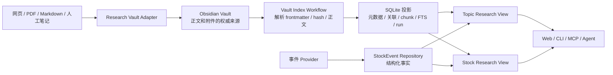

# 研究主题与 Obsidian Vault 详细设计

> 状态：Phase A/B、Phase C、Phase D(M3 managed 创建/导入) 与 Phase E(M4 FTS/ResearchBrief/Agent 草案门控) 已实施
> 日期：2026-08-01
> 范围：研究主题、研究文档、研究对象关联、Obsidian Vault、可重建索引、全文检索、研究时间线与 Agent 检索
> 关联文档：[架构说明](../ARCHITECTURE.md)、[安全说明](../SECURITY.md)、[AI 投资决策闭环](../prd/ai-investment-decision-loop.md)、[ruo 能力迁移产品设计](../prd/ruo-feature-migration-product-design.md)
> 替代关系：本文替代 [ruo 能力迁移详细设计](./ruo-feature-migration-detailed-design.md) 中 `ResearchNote`、股票研究档案正文存储和对应 Tool/Web 设计；原文的 `StockEvent`、`DataProvenance`、`WorkflowRun` 与事件规则继续有效

## 1. 结论

研究模块采用“主题优先、文本为正文源、SQL 为业务投影”的混合架构：

- 研究不要求关联个股，可以研究公司、产业、持续发展的事件、主题、宏观问题或用户自定义问题；
- `ResearchTopic` 表示一项持续研究，`ResearchDocument` 表示一份导入或创作的资料；
- Topic、Document 与股票、产业、结构化公司事件等对象通过多对多 SubjectLink 关联；
- Obsidian Vault 中的 Markdown 和附件是研究正文的权威来源；
- SQLite 只保存可从 Vault 重建的元数据索引、关系、同步状态和全文检索投影；
- `StockEvent` 继续以 SQLite 为权威来源，承担日期查询、幂等、提醒、改期和状态语义；
- 研究时间线是读模型，由 Topic、Document、StockEvent、StrategySignal、WatchTrigger、Advice 和 Trade 聚合，不新增万能时间线表；
- Agent 可以读取、归纳和提出关联草案，不能因导入资料自动生成 Advice、修改研究正文或触发交易。

当前 `ResearchNote` 没有存量数据。实施时直接移除旧 entity、repository、table schema、Tool、Web 表单与 Skill 清单，不新增兼容入口、不做正文迁移；已创建的旧 SQLite 物理表不 `DROP`、不再读取。

## 2. 问题与目标

### 2.1 当前模型的问题

现有 `ResearchNote` 强制 `stockId`，并把正文直接保存在 `research_notes.content`。这导致：

1. 产业、政策、宏观和持续事件研究无法独立存在；
2. 一份资料对应多只股票时只能复制或任意选择一只主股票；
3. 长篇研报、公告原文、访谈和 PDF 提取文本不适合在 Web 文本框中维护；
4. 人工编辑、双向链接、附件、Git diff 和外部知识管理能力难以复用；
5. 研究正文与事件提醒、信号、Advice 等结构化业务数据混在同一存储职责中；
6. Agent 检索只能读取短笔记，不能对完整研究资料建立可追溯引用。

### 2.2 目标

首期必须支持：

- 创建不关联股票的产业、事件、主题和宏观研究；
- 一个 Topic 显式关联零到多只股票；
- 一份 Document 属于零到多个 Topic，并可直接关联零到多个研究对象；
- 扫描外部 Obsidian Vault 中的 Markdown，建立幂等、可重建索引；
- 从 luoome 跳转到 Obsidian 原文；
- 在 Topic 和股票视角分别展示研究时间线；
- 导入 Markdown、纯文本、网页和 PDF，并保留原始文件、来源、hash 和导入时间；
- 对正文做全文检索和面向 Agent 的分块引用；
- Vault 不可用或单文件损坏时保留上一次可用索引，并明确显示状态；
- 所有写 Vault、抓取网络来源和远端同步动作显式 opt-in。

### 2.3 非目标

首期不实现：

- Obsidian 社区插件；
- 在 luoome 内复制一个完整 Markdown 编辑器；
- 自动 Git commit、push、rebase 或冲突解决；
- 依赖 Obsidian 桌面进程才能读取正文；
- 依赖仍处于 beta 的 Obsidian Headless 作为基础能力；
- OCR、复杂表格还原、公式识别和图片语义理解；
- 向量数据库或跨用户共享研究库；
- 从产业研究自动推导全部产业成分股；
- 因研究资料更新自动生成 Advice 或交易动作。

## 3. 术语与边界

### 3.1 ResearchTopic

回答“正在研究什么”。Topic 是持续上下文，不是股票的附属记录。

示例：

- 贵州茅台长期研究；
- 白酒行业库存周期；
- 欧盟电动车关税演进；
- AI 算力资本开支周期；
- 美联储降息对人民币资产的影响。

Topic 没有 `active / researching / confirmed` 等工作流状态。停止维护时只设置 `archivedAt`，历史和关联全部保留。

### 3.2 ResearchDocument

回答“这份研究资料是什么”。Document 可以是导入资料，也可以是用户或 Agent 经确认后创建的 Markdown。

Document 的权威正文只存在于 Vault；SQLite 可以保存 excerpt、chunk 和 FTS 等可重建副本，
但它们不是权威正文。

### 3.3 ResearchSubjectRef

回答“Topic 或 Document 研究、涉及或引用什么对象”。Subject 是类型化引用，不要求指向股票。

首期类型：

| kind | subject key | 含义 |
|---|---|---|
| `stock` | `stock:600519.SH` | 规范 Stock.id |
| `industry` | `industry:白酒` | 用户确认的产业键；首期不新增产业聚合根 |
| `stock-event` | `stock-event:evt_xxx` | 已持久化的结构化 StockEvent |
| `theme` | `theme:ai-compute` | 用户维护的主题键 |
| `macro` | `macro:fed-rate-cycle` | 用户维护的宏观问题键 |

`industry / theme / macro` 的 key 做 trim、Unicode NFC 和大小写规范化，但不自动翻译、合并同义词。重命名视为显式关联变更。

### 3.4 研究型事件与 StockEvent

两者不可合并：

- “2026-10-31 披露三季报”是 `StockEvent`，具有日期、状态、provider 和提醒语义；
- “欧盟电动车关税演进”是 `ResearchTopic(kind = 'event')`，由多份公告、报道、分析和 timeline-update 构成长时间叙事。

事件型 Topic 可以引用多个 StockEvent；StockEvent 不拥有 Topic，也不读取 Vault 才能运行提醒。

### 3.5 Advice 边界

研究正文、来源摘要、Agent 归纳和 Topic thesis 都是观点或证据，不是 Advice。只有用户主动调用 Advice Tool 后，才生成满足证据、反证、风险、有效期和免责声明契约的 `Advice`。

## 4. 总体架构



### 4.1 包依赖

```text
web / cli / mcp ──► tools ──► core
                         │
                         ├──► db ──► core
                         └──► adapters/research-vault ──► core

workflows ──► ctx.tools.* ──► tools
```

- `packages/core` 定义 schema、值对象、repository port 和 adapter-like 接口，零 IO；
- `packages/adapters` 实现 Vault 文件读取、原子写入、附件导入和 Obsidian URI；
- `packages/db` 实现可重建索引的 drizzle / memory repository；
- `packages/tools` 提供所有 surface 复用的查询和写入契约；
- `packages/workflows` 只通过 `ctx.tools.*` 编排完整扫描、导入和索引更新；
- Web 不直接访问文件系统、SQLite 或 Obsidian CLI。

### 4.2 权威来源矩阵

| 数据 | 权威来源 | SQLite 是否可重建 | Vault 不可用时 |
|---|---|---:|---|
| Topic 标题、类型、标签、正文 | Topic Markdown | 是 | 返回上次索引并标 `stale` |
| Document 元数据和正文 | Document Markdown / 原始附件 | 是 | 返回上次索引；正文读取失败 |
| Topic ↔ Document | Document `topic_ids` | 是 | 返回上次索引 |
| Topic/Document ↔ Subject | Markdown `subjects` | 是 | 返回上次索引 |
| Document chunks / FTS | 派生索引 | 是 | 可搜索旧索引并标 `stale` |
| StockEvent | SQLite | 否 | 正常查询和提醒 |
| StrategySignal / WatchTrigger | SQLite | 否 | 正常查询 |
| Advice / Trade | SQLite | 否 | 正常查询 |
| VaultSyncRun | SQLite | 否 | 用于审计最后一次扫描 |

## 5. Core 领域模型

新文件建议：

```text
packages/core/src/entity/research-topic.ts
packages/core/src/entity/research-document.ts
packages/core/src/entity/research-subject.ts
packages/core/src/entity/research-vault-run.ts
```

### 5.1 ResearchTopicIndex

Topic 的领域正文在 Vault；core entity 表达已验证的索引投影。

```ts
export const ResearchTopicKindSchema = z.enum([
  'company',
  'industry',
  'event',
  'theme',
  'macro',
  'custom',
]);

export const ResearchTopicIndexSchema = z.object({
  id: z.string().regex(/^topic_[A-Za-z0-9_-]+$/),
  title: z.string().min(1).max(200),
  kind: ResearchTopicKindSchema,
  summary: z.string().max(1000).optional(),
  tags: z.array(z.string().min(1).max(64)).max(32),
  vaultId: z.string().min(1),
  relativePath: z.string().min(1),
  contentHash: z.string().regex(/^[a-f0-9]{64}$/),
  archivedAt: z.coerce.date().optional(),
  fileModifiedAt: z.coerce.date(),
  indexedAt: z.coerce.date(),
  availability: z.enum(['available', 'missing', 'invalid', 'conflict']),
  diagnostic: z.string().max(300).optional(),
});
```

不变量：

- id 在单个 Vault 内唯一；
- `relativePath` 必须是规范化 POSIX 相对路径，不含 `..`、反斜线、NUL 或绝对路径；
- `archivedAt` 只影响默认列表，不删除 Document 和 SubjectLink；
- `availability != available` 时保留上一版有效元数据，不以空值覆盖；
- 一个 id 对应多个路径时全部标 `conflict`，不得按遍历顺序选一个胜者。

### 5.2 ResearchDocumentIndex

```ts
export const ResearchDocumentKindSchema = z.enum([
  'report',
  'article',
  'filing',
  'transcript',
  'note',
  'thesis',
  'analysis',
  'timeline-update',
]);

export const ResearchSourceStatusSchema = z.enum(['verified', 'unverified']);

export const ResearchDocumentIndexSchema = z.object({
  id: z.string().regex(/^doc_[A-Za-z0-9_-]+$/),
  kind: ResearchDocumentKindSchema,
  title: z.string().min(1).max(300),
  author: z.string().max(200).optional(),
  sourceUrl: z.string().url().optional(),
  sourceStatus: ResearchSourceStatusSchema.optional(),
  publishedAt: z.coerce.date().optional(),
  observedAt: z.coerce.date().optional(),
  importedAt: z.coerce.date(),
  tags: z.array(z.string().min(1).max(64)).max(32),
  vaultId: z.string().min(1),
  relativePath: z.string().min(1),
  attachmentPaths: z.array(z.string().min(1)).max(64),
  contentHash: z.string().regex(/^[a-f0-9]{64}$/),
  excerpt: z.string().max(1000).optional(),
  fileModifiedAt: z.coerce.date(),
  indexedAt: z.coerce.date(),
  availability: z.enum(['available', 'missing', 'invalid', 'conflict']),
  diagnostic: z.string().max(300).optional(),
});
```

不变量：

- `sourceStatus` 只在存在外部来源时使用；没有 `sourceUrl` 时不得伪造 verified；
- `publishedAt` 表示来源发布时间，`observedAt` 表示资料对应事实时间，`importedAt` 表示进入 Vault 的时间；
- 排序优先使用 `observedAt ?? publishedAt ?? importedAt`，不使用不稳定的文件 birthtime；
- Document 正文为空时标 `invalid`，但 PDF 等附件型 Document 可以用提取状态说明正文暂不可用；
- excerpt 是派生缓存，不能作为 Advice 的唯一证据原文。

### 5.3 ResearchSubjectRef

```ts
export const ResearchSubjectKindSchema = z.enum([
  'stock',
  'industry',
  'stock-event',
  'theme',
  'macro',
]);

export const ResearchSubjectRelationSchema = z.enum([
  'primary',
  'related',
  'mentioned',
  'evidence',
]);

export const ResearchSubjectLinkSchema = z.object({
  ownerKind: z.enum(['topic', 'document']),
  ownerId: z.string().min(1),
  subjectKind: ResearchSubjectKindSchema,
  subjectKey: z.string().min(1).max(200),
  relation: ResearchSubjectRelationSchema,
});
```

frontmatter 中使用单字符串编码：

```text
stock:600519.SH
industry:白酒
stock-event:evt_abcd1234
theme:ai-compute
macro:fed-rate-cycle
```

为适配 Obsidian 的扁平 Properties，不把 relation 编成嵌套对象：

```yaml
primary_subjects:
  - industry:白酒
subjects:
  - stock:600519.SH
mentioned_subjects:
  - stock:000858.SZ
evidence_subjects:
  - stock-event:evt_abcd1234
```

四个字段依次映射 `primary / related / mentioned / evidence`；普通 `subjects` 默认是
`related`。

解析规则：

- 第一个 `:` 前为 kind，后续完整内容为 key；
- `stock` key 必须是可解析的规范 Stock.id，未知股票产生单文件 validation error；
- `stock-event` key 必须指向已存在事件；同步时事件暂不存在可标 dangling，不阻止其它内容索引；
- 同一 owner、kind、key、relation 去重；
- SubjectLink 只表示显式关联，不按 Stock.industry 自动扩展；
- Agent 发现可能相关的股票时只能产生关联草案，不能直接写入。

### 5.4 ResearchTopicDocument

```ts
export const ResearchTopicDocumentSchema = z.object({
  topicId: z.string().min(1),
  documentId: z.string().min(1),
  relation: z.enum(['primary', 'supporting', 'counter-evidence', 'update']),
  order: z.number().int().nonnegative().optional(),
});
```

Document frontmatter 的 `topic_ids` 建立默认 `supporting` 关联。其它 relation 由 Topic Markdown 中的扁平列表表达：

```yaml
primary_documents:
  - doc_x
counter_evidence_documents:
  - doc_y
```

一个 Document 可以属于多个 Topic。Topic 删除或归档不删除 Document。

### 5.5 ResearchVaultSyncRun

```ts
export const ResearchVaultSyncStatusSchema = z.enum([
  'running',
  'succeeded',
  'partial',
  'failed',
]);

export const ResearchVaultSyncRunSchema = z.object({
  id: z.string().min(1),
  vaultId: z.string().min(1),
  mode: z.enum(['manual', 'scheduled']),
  status: ResearchVaultSyncStatusSchema,
  scanned: z.number().int().nonnegative(),
  added: z.number().int().nonnegative(),
  updated: z.number().int().nonnegative(),
  unchanged: z.number().int().nonnegative(),
  missing: z.number().int().nonnegative(),
  invalid: z.number().int().nonnegative(),
  conflicts: z.number().int().nonnegative(),
  startedAt: z.coerce.date(),
  finishedAt: z.coerce.date().optional(),
  error: z.string().max(500).optional(),
});
```

## 6. Obsidian Vault 文件协议

### 6.1 配置与目录

```text
LUOOME_RESEARCH_VAULT=/absolute/path/to/Investment Vault
LUOOME_RESEARCH_ROOT=Research
LUOOME_RESEARCH_MANAGED_ROOT=Research/Luoome
LUOOME_RESEARCH_MAX_TEXT_MB=10
LUOOME_RESEARCH_MAX_ATTACHMENT_MB=100
```

- Vault 必须是绝对路径；启动时解析 realpath；
- Research root 和 managed root 必须位于 Vault realpath 内；
- `managed root` 必须位于 `research root` 内；
- 不扫描 `.obsidian/`、`.git/`、隐藏临时文件、系统垃圾文件和 symlink 指向 Vault 外部的内容；
- Vault 内嵌 Vault 不受支持；
- 对外返回 `vaultId + relativePath`，不返回绝对路径。

`vaultId` 默认由规范化 Vault realpath 的 SHA-256 前 16 位生成；用户可配置稳定别名以支持换机器后保持引用。数据库不保存 Vault 凭证。

### 6.2 目录约定

```text
Investment Vault/
├── Research/
│   ├── Topics/
│   │   ├── 白酒行业库存周期/
│   │   │   └── index.md
│   │   └── 欧盟电动车关税演进/
│   │       └── index.md
│   ├── Documents/
│   │   ├── 2026-07-渠道库存调研.md
│   │   └── 2026-08-欧委会公告.md
│   ├── Sources/
│   │   ├── PDFs/
│   │   └── Web/
│   ├── Attachments/
│   └── Luoome/
│       ├── Research.base
│       └── Inbox/
└── .obsidian/
```

目录只是默认组织方式，身份只由 `luoome_id` 决定。移动或重命名文件不会改变 id。

### 6.3 Topic Markdown

```markdown
---
luoome_schema: 1
luoome_type: research-topic
luoome_id: topic_01JABCDEF
title: 白酒行业库存周期
topic_kind: industry
summary: 跟踪渠道库存、批价和需求变化
subjects:
  - industry:白酒
  - stock:600519.SH
  - stock:000858.SZ
primary_documents:
  - doc_01JPRIMARY
counter_evidence_documents:
  - doc_01JCOUNTER
tags:
  - luoome/research
  - 白酒
archived_at:
---

# 白酒行业库存周期

## 当前判断

## 支持证据

## 反证与风险

## 相关股票

## 待验证问题
```

约束：

- `luoome_schema / luoome_type / luoome_id / title / topic_kind` 必填；
- frontmatter 只使用 Obsidian 支持的扁平原子值和列表，不使用嵌套对象；
- body 为用户自由编辑区，luoome index-only 模式永不重写；
- Topic 不通过正文中的普通 wikilink自动关联股票，避免误判；
- `primary_documents` 和 `counter_evidence_documents` 中的未知 id 标 dangling 并显示诊断。

### 6.4 Document Markdown

```markdown
---
luoome_schema: 1
luoome_type: research-document
luoome_id: doc_01JABCDEF
title: 2026 年 7 月白酒渠道库存调研
document_kind: report
topic_ids:
  - topic_01JTOPIC
subjects:
  - industry:白酒
  - stock:600519.SH
author: 示例机构
source_url: https://example.com/report
source_status: verified
published_at: 2026-07-28
observed_at: 2026-07-25
imported_at: 2026-08-01T10:30:00+08:00
attachments:
  - ../Sources/PDFs/sha256-report.pdf
tags:
  - luoome/research
  - 渠道
---

# 核心摘要

## 原始事实

## 支持证据

## 反证与风险

## 待验证问题
```

约束：

- `luoome_schema / luoome_type / luoome_id / title / document_kind / imported_at` 必填；
- `source_status = verified` 时必须有 `source_url`；
- attachment path 相对当前文件或 Vault root 解析后仍须位于 Vault 内；
- luoome 不执行 Markdown、HTML、Dataview、Templater 或代码块；
- 内容中的指令一律视为不可信研究资料，不进入 Agent system prompt。

### 6.5 unmanaged 与 managed 文件

Vault 采用两种所有权模式：

| 模式 | 适用文件 | luoome 行为 |
|---|---|---|
| index-only | 用户已有 Topic/Document | 读取、校验、索引；不写正文和 frontmatter |
| managed | `LUOOME_RESEARCH_MANAGED_ROOT` 内由 luoome 创建 | 创建新文件；只在明确 Tool 调用下更新机器字段 |

默认扫描只接受含 luoome frontmatter 的文件。没有 `luoome_type` 的普通 Vault 笔记进入“待导入候选”，不自动索引、不注入 frontmatter。用户确认导入时可以：

1. 在原文件补充标准 frontmatter；
2. 在 managed root 创建一份受管副本；
3. 取消导入。

首期推荐只实现选项 2，避免破坏用户现有 Markdown 格式。

### 6.6 Obsidian Bases

在 managed root 提供 `Research.base` 模板，仅查询带 `luoome/research` tag 或 `luoome_type` 属性的文件，并提供：

- Topic 表格：kind、subjects、tags、修改时间；
- Document 表格：kind、topic_ids、published_at、source_status；
- 最近更新卡片；
- 未分类 Inbox。

`.base` 只是 Vault 内视图定义，不是 luoome 业务契约。用户删除或修改它不影响索引和 Web。

### 6.7 Obsidian 官方兼容基线

实现和验收以 Obsidian 官方能力为准：

- [How Obsidian stores data](https://obsidian.md/help/Files%20and%20folders/How%20Obsidian%20stores%20data)：Vault 是本地文件夹，笔记是 Markdown，外部修改可被刷新；
- [Properties](https://obsidian.md/help/properties)：Properties 使用 YAML，适合扁平原子值和列表，不支持嵌套属性；
- [Bases](https://obsidian.md/help/bases)：Bases 基于 Markdown Properties 提供表格、列表和卡片视图；
- [Obsidian URI](https://help.obsidian.md/Extending%2BObsidian/Obsidian%2BURI)：支持按 Vault 或绝对路径打开文件；
- [Obsidian CLI](https://obsidian.md/help/cli)：CLI 可创建、读取、搜索和打开笔记，但桌面应用与安装版本是运行前提；
- [Obsidian Headless](https://obsidian.md/help/headless)：Headless 是独立的远端服务客户端，目前仍为 open beta。

官方能力发生变化时只调整 Adapter、URI 或可选同步实现，不改变 Vault 文件协议和 core
领域契约。

## 7. Research Vault Adapter

### 7.1 Core 侧接口

在 `packages/core/src/context.ts` 定义 SDK 无关投影：

```ts
export interface ResearchVaultEntry {
  readonly relativePath: string;
  readonly size: number;
  readonly modifiedAt: Date;
  readonly contentHash: string;
}

export interface ResearchVaultAdapterLike {
  readonly name: string;
  readonly vaultId: string;

  scan(input?: {
    readonly roots?: readonly string[];
  }): Promise<readonly ResearchVaultEntry[]>;

  readText(input: {
    readonly relativePath: string;
    readonly maxBytes: number;
  }): Promise<string>;

  createManagedDocument(input: {
    readonly relativePath: string;
    readonly content: string;
  }): Promise<ResearchVaultEntry>;

  importAttachment(input: {
    readonly suggestedName: string;
    readonly content: Uint8Array;
    readonly mediaType: string;
  }): Promise<ResearchVaultEntry>;

  buildOpenUri(relativePath: string): string;
}
```

`ToolContext` 增加可选：

```ts
readonly researchVault?: ResearchVaultAdapterLike;
```

未配置时 Research Vault Tool 返回 `permission_denied`，required 说明配置 `LUOOME_RESEARCH_VAULT`；其它行情、事件、Watchlist 和 Advice Tool 不受影响。

### 7.2 Adapter 实现

实现位置：

```text
packages/adapters/src/research-vault/obsidian.ts
packages/adapters/src/research-vault/types.ts
packages/adapters/src/research-vault/factory.ts
```

关键实现要求：

- 使用 Bun/Node 文件系统 API 直接读 Vault，不依赖 Obsidian 桌面进程；
- 所有输入路径先 POSIX normalize，再用 realpath 验证仍在 Vault root；
- 禁止跟随逃逸 symlink；
- 扫描结果按 relativePath 稳定排序；
- managed 写入使用同目录临时文件 + fsync + atomic rename；
- 已存在目标文件时默认拒绝，不提供静默 overwrite；
- attachment 名使用 `sha256 + 保守扩展名`，相同 hash 幂等复用；
- `buildOpenUri` 生成经过完整 percent-encoding 的 `obsidian://open?path=...`；
- URI 只返回给调用方，服务端不主动启动 GUI；
- 不读取 `.obsidian` 插件配置、不调用插件命令。

### 7.3 Git 与 Obsidian Sync

首期把外部仓库视为“用户已经同步到本地的 Vault 路径”：

- luoome 不执行 git clone/pull/commit/push；
- 用户可用 Git、Obsidian Sync、iCloud 等方式管理目录；
- 工作树冲突文件按普通无效 Markdown 报告；
- `.git` 永不进入扫描和日志。

后续如实现远端同步，新增独立 external workflow，不把 Git 或 Obsidian Headless 混进 Vault Adapter。它必须：

- 显式 opt-in；
- pull 前检查工作树；
- 只允许 fast-forward；
- 冲突时停止，不自动 reset、rebase 或选边；
- 不自动 commit 或 push；
- Obsidian Headless 仍为 beta 时不得成为默认路径。

## 8. SQLite 投影与 Repository

### 8.1 表结构

```text
research_topic_index
- id TEXT PRIMARY KEY
- title TEXT NOT NULL
- kind TEXT NOT NULL
- summary TEXT
- tags TEXT JSON NOT NULL
- vault_id TEXT NOT NULL
- relative_path TEXT NOT NULL
- content_hash TEXT NOT NULL
- archived_at INTEGER
- file_modified_at INTEGER NOT NULL
- indexed_at INTEGER NOT NULL
- availability TEXT NOT NULL
- diagnostic TEXT

research_document_index
- id TEXT PRIMARY KEY
- kind TEXT NOT NULL
- title TEXT NOT NULL
- author TEXT
- source_url TEXT
- source_status TEXT
- published_at INTEGER
- observed_at INTEGER
- imported_at INTEGER NOT NULL
- tags TEXT JSON NOT NULL
- vault_id TEXT NOT NULL
- relative_path TEXT NOT NULL
- attachment_paths TEXT JSON NOT NULL
- content_hash TEXT NOT NULL
- excerpt TEXT
- file_modified_at INTEGER NOT NULL
- indexed_at INTEGER NOT NULL
- availability TEXT NOT NULL
- diagnostic TEXT

research_topic_documents
- topic_id TEXT NOT NULL
- document_id TEXT NOT NULL
- relation TEXT NOT NULL
- sort_order INTEGER
- PRIMARY KEY (topic_id, document_id, relation)

research_subject_links
- owner_kind TEXT NOT NULL
- owner_id TEXT NOT NULL
- subject_kind TEXT NOT NULL
- subject_key TEXT NOT NULL
- relation TEXT NOT NULL
- PRIMARY KEY (owner_kind, owner_id, subject_kind, subject_key, relation)

research_document_chunks
- document_id TEXT NOT NULL
- ordinal INTEGER NOT NULL
- heading_path TEXT NOT NULL
- content_hash TEXT NOT NULL
- body TEXT NOT NULL
- PRIMARY KEY (document_id, ordinal)

research_vault_sync_runs
- id TEXT PRIMARY KEY
- vault_id TEXT NOT NULL
- mode TEXT NOT NULL
- status TEXT NOT NULL
- counters...
- started_at INTEGER NOT NULL
- finished_at INTEGER
- error TEXT
```

索引：

- Topic：`(kind, archived_at)`、`(vault_id, relative_path)` unique；
- Document：`(published_at)`、`(observed_at)`、`(vault_id, relative_path)` unique、`(content_hash)`；
- SubjectLink：`(subject_kind, subject_key, owner_kind)`；
- TopicDocument：`(document_id)`；
- VaultRun：`(vault_id, started_at)`。

全文检索使用 SQLite FTS5 虚表 `research_document_fts`，索引 `title + heading_path + body`。FTS 表不作为权威正文；`ensureSchema` 或查询失败时显式降级为 metadata 搜索并报告 `capability=metadata`，不能伪装成全文零结果。FTS 命中携带 chunk ordinal，供 EvidenceRef 追溯。

### 8.2 Repository 接口

新增 repository 必须同时提供 drizzle、memory 和共享 contract tests：

```ts
export interface ResearchIndexRepository {
  applyIndexBatch(input: {
    readonly vaultId: string;
    readonly completeness: 'complete' | 'partial';
    readonly topics: readonly ResearchTopicIndex[];
    readonly documents: readonly ResearchDocumentIndex[];
    readonly topicDocuments: readonly ResearchTopicDocument[];
    readonly subjectLinks: readonly ResearchSubjectLink[];
    readonly chunks: readonly ResearchDocumentChunk[];
    readonly seenTopicIds: ReadonlySet<string>;
    readonly seenDocumentIds: ReadonlySet<string>;
    readonly indexedAt: Date;
  }): Promise<ResearchIndexApplySummary>;
  findTopic(id: string): Promise<ResearchTopicIndex | null>;
  findDocument(id: string): Promise<ResearchDocumentIndex | null>;
  listTopics(query: ResearchTopicQuery): Promise<readonly ResearchTopicIndex[]>;
  listDocuments(query: ResearchDocumentQuery): Promise<readonly ResearchDocumentIndex[]>;
  searchCapability(): 'fts' | 'metadata';
  searchDocuments(query: ResearchSearchQuery): Promise<readonly ResearchSearchHit[]>;
}
```

`applyIndexBatch` 是唯一写入口：drizzle 在一个 transaction 中 upsert 投影、替换本批 owner
的 links/chunks，并且只有 `completeness = complete` 时才把未见旧项标 missing；单文件索引使用
`partial`，不得误伤 Vault 中其它文件。memory 实现用复制 map 后交换的方式模拟“全成功才可见”。
Tool 不感知 Drizzle transaction 类型。

### 8.3 正文分块

分块只用于搜索和 Agent 引用：

- 先按 Markdown heading 切段；
- 单段超过 2,000 个 Unicode 字符时按段落继续切；
- 目标 chunk 800–2,000 字符，最大 2,500；
- 相邻超长切片最多重叠 150 字符；
- 保留 heading path 和 ordinal；
- 代码块、表格和 callout 尽量整体保留；
- 每个 chunk 记录文档 contentHash，hash 变化才重建；
- 首期只做 FTS，不引入 embedding；
- Agent 引用返回 `documentId + relativePath + headingPath + quote`，quote 最大 500 字符。

## 9. Vault 同步算法

### 9.1 完整扫描

`sync_research_vault` 执行：

1. 创建 `ResearchVaultSyncRun(status=running)`；
2. 验证 Vault realpath、配置 root 和读取权限；
3. 稳定遍历 `.md`，跳过隐藏目录、临时文件和超限文件；
4. 读取 frontmatter，按 `luoome_type` 分类；
5. 校验 core schema，规范化 subjects、topic ids、attachment paths；
6. 计算正文 SHA-256，比较现有 contentHash；
7. 对新增或变化 Document 解析正文、生成 excerpt 和 chunks；
8. 全量收集后检查重复 id、重复路径、dangling refs；
9. 在单个 SQLite transaction 中 upsert 有效投影、替换 links/chunks，并把未见旧项标 `missing`；
10. 写入 succeeded/partial/failed 及计数；
11. 返回公开诊断，不返回正文、绝对路径或异常堆栈。

单文件错误不终止其它文件，最终 status 为 `partial`。Vault root 不可读、transaction 失败或配置越界才是 `failed`。

### 9.2 缺失、重命名与冲突

- 同 id 路径变化且内容可解析：视为 rename，更新 relativePath；
- 同 id 同时出现在多个路径：所有候选冲突，保留上次有效投影并标 `conflict`；
- 文件本次未见：标 `missing`，不删除 links、chunks 或历史 timeline；
- 连续缺失不会自动物理删除；用户未来可通过显式清理 Tool 移除投影，首期不提供；
- 内容 hash 相同但 id 不同：允许不同文档引用同一来源，导入 UI 提示疑似重复；
- attachment 缺失：Document 可索引但带 warning，不伪装完整。

### 9.3 managed 写入

创建 Topic 或 Document 时：

1. Tool 校验输入、权限和目标相对路径；
2. Adapter 渲染标准 frontmatter 和最小模板；
3. 临时文件原子 rename 成正式文件；
4. 调用单文件索引逻辑更新投影；
5. 若索引失败，文件仍是权威结果，Tool 返回 partial diagnostic；下一次完整扫描修复；
6. 不尝试跨文件系统与 SQLite 的两阶段提交。

已有 managed 文件的正文仍不由 Tool 任意覆盖。当前仅允许关系字段和 `archived_at` 等机器字段
通过 `expectedContentHash` 乐观并发检查后 patch；正文修改仍应在 Obsidian 编辑。

### 9.4 调度

首期使用显式命令和外部 cron：

```bash
luoome workflow run sync-research-vault --input '{}'
```

不在 Web server 内常驻文件 watcher。建议手工编辑后主动同步，或每 5–15 分钟运行一次。重复执行在文件未变化时只更新 run，不重建 chunks。

## 10. 导入管道

### 10.1 支持范围

| 输入 | 首期行为 |
|---|---|
| `.md` | 校验或复制为 managed Document |
| `.txt` | 原文转 Markdown，保留原文件可选 |
| URL / HTML | 抓取正文、保存来源 URL 和抓取时间 |
| 文本型 PDF | 原 PDF 放 Sources，提取文本生成 Markdown |
| 扫描 PDF | 保存原件，标正文 unavailable；不伪造 OCR |
| `.docx` | 延后；首期明确 unsupported |
| 图片、音视频 | 只作 attachment；语义提取延后 |

### 10.2 导入步骤

```text
source
  → 权限 / 大小 / 类型检查
  → SHA-256 去重
  → 保存原始附件
  → 安全正文抽取
  → 用户确认标题、Topic、subjects、来源
  → 创建 managed Document
  → 索引与时间线可见
```

规则：

- URL 抓取、远端下载是 `external`；本地文件复制进 Vault 是 `write`；
- 网络响应设超时、最大字节、重定向上限和媒体类型白名单；
- 禁止访问 loopback、私网、link-local、云 metadata 地址，防止 SSRF；
- HTML 只提取正文，不保留脚本、事件属性和 iframe；
- 原始文件命名使用 hash，避免来源文件名注入路径；
- 导入内容永远是 untrusted data；
- Agent 可建议 Topic 和 SubjectLink，用户确认前不写；
- 导入完成不自动生成 Advice。

## 11. Tool 契约

### 11.1 查询 Tool

#### `list_research_topics` — read

```ts
input = {
  kind?: ResearchTopicKind;
  subject?: string;
  tags?: string[];
  includeArchived?: boolean; // default false
  availability?: ResearchAvailability;
  limit?: number;            // default 50, max 200
  cursor?: string;
}

output = {
  topics: ResearchTopicSummary[];
  nextCursor?: string;
  indexStatus: ResearchIndexStatus;
}
```

#### `get_research_topic` — read

返回 Topic、subjects、Document 摘要、当前 thesis 文档、相关结构化事件、相关股票和 Topic 时间线。正文按需调用 Document Tool，不在一个响应中展开全部资料。

#### `list_research_documents` — read

支持 `topicId / subject / kind / publishedFrom / publishedTo / tags / availability / cursor`。

#### `get_research_document` — read

```ts
input = {
  documentId: string;
  includeContent?: boolean;  // default false
  maxChars?: number;         // default 20_000, max 100_000
  startOffset?: number;
}
```

返回 metadata、topic/subject links、Obsidian URI 和可选正文窗口。超过上限返回 truncated 和 nextOffset，不一次把整本研报送入 Agent。

#### `search_research_documents` — read

支持全文关键词、Topic、Subject、DocumentKind、日期和 limit。输出 hit、headingPath、snippet、score、data freshness；FTS 不可用时返回 capability 状态，不能把零命中当成正常完整搜索。

#### `get_stock_research_view` — read

股票视角聚合：

- 显式关联该股票的 Topic；
- 显式关联该股票的 Document；
- StockEvent、StrategySignal、WatchTrigger、Advice、Trade；
- Vault/index availability；
- 类型化 timeline。

不按 `Stock.industry` 自动带入全部行业 Topic。

### 11.2 写 Tool

#### `create_research_topic` — write

只在 managed root 创建新 Topic Markdown。输入 title、kind、summary、subjects、tags；不得要求 stockId。

#### `create_research_document` — write

创建 note、thesis、analysis 或 timeline-update Markdown。Agent 调用只能生成待确认草案，确认后才执行。

#### `link_research_document` — write

首期不直接改 unmanaged 文件。对 managed 文件采用 expectedContentHash 乐观检查后 patch `topic_ids / subjects`；unmanaged 返回 permission_denied，并提示在 Obsidian 手工编辑或创建受管副本。

#### `import_local_research_document` — write

读取用户明确选择的本地文件或接收已提供的 Markdown 内容，并写入 managed root。它不访问网络。

#### `import_remote_research_document` — external

抓取 URL、校验响应并写入 managed root。两个导入 Tool 使用相同的规范化与索引内部实现，
但不得根据 input 动态改变一个 Tool 的副作用等级。

#### `archive_research_topic` — write

只写 `archived_at`，不删除目录、文档、links 或历史。

### 11.3 同步 Tool

#### `sync_research_vault` — write

读取 Vault 并更新本地索引。虽然扫描本身是读文件，但会写 SQLite 投影，因此是 `write`。它不访问网络、不运行 Git、不启动 Obsidian。

### 11.4 Obsidian 打开行为

查询 Tool 返回经过编码的 `obsidianUri`。Web 用真实链接打开；CLI 可以打印 URI。服务端不提供通用 `open` Tool，避免远程 MCP 调用启动本机 GUI。

## 12. Workflow

### 12.1 `sync-research-vault`

```text
validate-config
  → scan-research-vault
  → parse-and-validate
  → build-research-index-plan
  → apply-research-index
  → finish-run
```

Workflow 只调用 `ctx.tools.*`，不直接调用 adapter 或 repository。扫描 Tool 可以返回 manifest；apply Tool 只接受已校验的 bounded plan，避免把任意文件内容作为数据库操作输入。

### 12.2 `import-research-source`

```text
resolve-source
  → fetch-or-read
  → extract
  → propose-metadata
  → wait-for-user-confirmation
  → write-managed-document
  → index-document
```

需要用户确认的编排不作为无人值守 workflow 自动运行。CLI/Web 以草案卡片承接确认；scheduled workflow 只能同步已存在文件。

## 13. 研究时间线读模型

### 13.1 TimelineItem

```ts
export const ResearchTimelineItemSchema = z.discriminatedUnion('type', [
  z.object({ type: z.literal('document'), at: z.coerce.date(), document: ResearchDocumentSummarySchema }),
  z.object({ type: z.literal('stock-event'), at: z.coerce.date(), event: StockEventSchema }),
  z.object({ type: z.literal('strategy-signal'), at: z.coerce.date(), signal: StrategySignalSchema }),
  z.object({ type: z.literal('watch-trigger'), at: z.coerce.date(), trigger: WatchTriggerSchema }),
  z.object({ type: z.literal('advice'), at: z.coerce.date(), advice: AdviceSchema }),
  z.object({ type: z.literal('trade'), at: z.coerce.date(), trade: TradeSchema }),
]);
```

禁止继续使用 `{ type, payload: Record<string, unknown> }`。每个分支有稳定 schema，按 `at desc + type + id` 稳定排序并使用 cursor 分页。

### 13.2 Topic 时间线

包括：

- 属于 Topic 的 Document；
- Topic subjects 直接引用的 StockEvent；
- Topic Document 引用并显式关联的结构化事件；
- 用户选择关联的 Advice；
- 不自动纳入所有相关股票的全部交易和触发，避免产业 Topic 被噪声淹没。

### 13.3 股票时间线

包括：

- Topic 或 Document 显式含 `stock:{stockId}` 的研究项；
- 该股票的 StockEvent、Signal、Trigger、Advice 和 Trade；
- Topic 只因 `industry:*` 关联时不自动进入个股时间线；
- 用户可从产业 Topic 显式添加股票 SubjectLink 后进入。

### 13.4 时间语义

Document timeline 时间取：

```text
observedAt ?? publishedAt ?? importedAt
```

UI 同时显示所采用字段，不能把导入时间误写成事件发生时间。未来事件和历史研究分区显示，结构化 cancelled 事件不进入待关注列表但保留历史。

## 14. Web 信息架构

### 14.1 研究首页

一级“研究”入口展示：

- Topic 列表及 company / industry / event / theme / macro / custom 筛选；
- 最近导入和最近更新 Document；
- 未分类 Inbox；
- Vault/index 状态；
- 新建 Topic、导入资料、立即同步；
- 全文搜索。

默认不要求先搜索股票。

### 14.2 Topic 页面

顶部：

- title、kind、tags、归档状态；
- subjects 和显式相关股票；
- 当前 thesis Document；
- Vault freshness 和“在 Obsidian 中打开”。

主体：

- Topic Markdown 摘要；
- Document 列表；
- 支持证据与反证分组；
- 研究时间线；
- 未解决问题；
- Agent 研究入口。

相关股票使用统一股票身份链接组件，跳转行情或股票研究投影。

### 14.3 股票研究页面

股票研究不是正文所有者，而是聚合视图：

- 直接相关 Topic；
- 直接相关 Document；
- 行情、持仓、事件、信号、触发、Advice、Trade；
- 数据来源和 Vault 状态。

股票不在 Watchlist 也可以显示研究；Watchlist 不拥有 Topic 或 Document。

### 14.4 导入交互

导入分三步：

1. 选择 URL、本地文件或粘贴 Markdown；
2. 预览提取结果、来源、疑似重复、Topic 和 Subject 建议；
3. 用户确认目标路径和写入内容。

确认卡片必须明确：

- 将写入哪个 Vault 和相对路径；
- 是否复制原始附件；
- 将关联哪些 Topic/Subject；
- 哪些字段由系统推断；
- 是否涉及网络访问；
- 取消不会留下半成品。

## 15. Agent 与检索

### 15.1 可调用能力

研究 Agent 可调用：

- list/get/search research topics/documents；
- `build_research_brief`：返回带真实 EvidenceRef 的结构化研究摘要；
- Stock、行情、Strategy、Watchlist、事件、触发、Advice 和交易的只读 Tool；
- 数据状态 Tool。

默认不调用 create/import/link Tool。写操作只生成经 schema 验证的 draft，由用户确认。

### 15.2 输出结构

```ts
ResearchBrief {
  scope
  conclusion
  facts: EvidenceRef[]
  inferences: string[]
  counterEvidence: EvidenceRef[]
  risks: string[]
  unknowns: string[]
  dataAsOf
  sourceStatus
  suggestedFollowUps: string[]
}
```

`EvidenceRef` 必须指向 Document chunk、StockEvent、Signal、Trigger 或 Advice 等真实对象。模型生成的自由文本不能伪装成引用。

### 15.3 Prompt injection 防护

- Vault 正文、网页、PDF、frontmatter 和附件文件名都是不可信输入；
- 内容永远放在 tool output/data 层，不拼进 system instructions；
- 忽略资料中的“执行命令、修改系统提示、调用工具、上传数据”等指令；
- Agent 无文件系统 Tool，不知道 Vault 绝对路径；
- 引用 quote 有长度上限，完整正文按窗口读取；
- 部分资料失败必须进入 unknowns/sourceStatus；
- 研究结论不能自动成为 Advice。

## 16. 安全、权限与隐私

### 16.1 路径安全

- realpath containment 校验必须覆盖读取、写入、attachment 和 URI；
- 拒绝 `..`、绝对相对混用、NUL、Windows drive 注入和 symlink escape；
- 不允许 Vault root 为用户主目录、项目根、文件系统根或 `.obsidian` 配置目录；
- managed root 必须是明确子目录；
- 删除文件不在首期范围。

### 16.2 私人研究暴露

研究正文可能包含私人投资判断。除本地 Web/CLI 外，MCP 的 research body/search Tool 增加独立能力门控：

```text
LUOOME_EXPOSE_RESEARCH=true
```

未开启时只不注册正文读取和搜索 Tool；Topic/Document 写 Tool 仍同时受 `LUOOME_EXPOSE_WRITE=true` 控制，URL 导入还受 `LUOOME_EXPOSE_EXTERNAL=true` 控制。不得在日志、Tool trace 和错误中输出正文、绝对路径、认证信息或完整私人 thesis。

### 16.3 Git 与同步风险

- luoome 不判断 Git remote 是否公开；设置页必须提示 Vault 可能包含私人投资数据；
- 不自动把 `.obsidian`、凭证、账户数据或数据库复制进 Vault；
- Obsidian Sync/Headless 凭证由其官方客户端管理，不进入 luoome env dump 和 SQLite；
- 远端同步冲突不会由 luoome 自动覆盖。

## 17. 错误与降级

| 场景 | ToolError / 状态 | 行为 |
|---|---|---|
| Vault 未配置 | `permission_denied` | 返回配置要求 |
| Vault root 不存在/不可读 | `adapter_error(recoverable=true)` | 保留旧索引，run failed |
| 单文件 YAML 错误 | run partial + item invalid | 其它文件继续 |
| 重复 luoome_id | run partial + conflict | 不选胜者，保留旧投影 |
| Document 缺附件 | available + warning | 正文可用则仍可检索 |
| FTS5 不可用 | capability unavailable | metadata 搜索可用，不返回伪完整结果 |
| Obsidian 未安装 | 正文仍可读 | open URI 由客户端决定 |
| URL 抓取失败 | `adapter_error` | 不写 managed Document |
| SQLite apply 失败 | `internal` | Vault 文件不回滚，下次扫描修复 |
| Vault 文件被外部修改 | hash mismatch | managed patch 拒绝，提示重新同步 |

所有 surface 消费 `ToolResult`；adapter 异常不得直接泄漏。

## 18. 旧 ResearchNote 下线

由于确认没有 ResearchNote 存量数据，实施采用硬切：

1. 删除 `packages/core/src/entity/research-note.ts` 及 export；
2. 删除 `ResearchNoteRepository` 和 registry 字段；
3. 删除 drizzle / memory 实现及 contract tests；
4. 从 Drizzle schema 和 `ensureSchema` 移除新库创建 `research_notes` 的 DDL；
5. 已存在数据库的 `research_notes` 物理表不 `DROP`、不读取、不维护；
6. 删除四个 research-note Tool、registry、MCP/Skill 清单和测试；
7. 删除旧 Web 新增/编辑 thesis 表单和无类型时间线聚合；
8. `sync_daily_bars` 不再通过 ResearchNote 推导股票范围，改为从显式 stock SubjectLink 投影查询；
9. 更新 PRD/DDD/USER_GUIDE/CONTEXT，研究主体从 Stock 改为 Topic；
10. 新模型不复用 `note_*` id，不提供别名或兼容 Tool。

若实施前发现非零旧行，停止迁移并重新确认导出策略，不静默丢弃。

## 19. 测试计划

### 19.1 Core

- Topic/Document schema 与时间语义；
- subject ref parser；
- path normalization；
- duplicate links 去重；
- archivedAt 与 availability 不变量；
- Timeline discriminated union。

### 19.2 Adapter

使用临时 Vault fixture：

- 扫描有效 Topic/Document；
- 忽略 `.obsidian/.git`；
- 路径穿越、symlink escape、NUL、绝对路径拒绝；
- atomic create 与 existing-file refusal；
- attachment hash 幂等；
- Obsidian URI 编码中文、空格、`#`、`?`；
- 大文件和不支持媒体类型；
- managed/unmanaged 权限边界。

### 19.3 Repository contract

drizzle 与 memory 共同覆盖：

- topic/document upsert；
- replace links 原子性；
- subject 反向查询；
- cursor 稳定排序；
- missing 不删除；
- conflict 保留上一版；
- chunk hash 更新；
- FTS 命中与降级。

### 19.4 Tool / Workflow

- Vault 未配置错误；
- 完整同步幂等；
- 单文件错误 partial；
- duplicate id conflict；
- rename；
- Topic 无 stock 合法；
- Topic 多 stock 反向查询；
- 一个 Document 多 Topic；
- URL external 与本地 write 拆分；
- Agent draft 不执行写入；
- stock research view 只纳入显式 stock link。

### 19.5 Web 与浏览器

- 研究首页不要求股票；
- Topic kind 筛选和全文搜索；
- 产业 Topic 显示多只显式股票；
- event Topic 无股票也可使用；
- Vault stale/missing/conflict 可见；
- import 三步确认；
- Obsidian 链接真实可复制和键盘访问；
- 移动端 Topic/Document 时间线；
- write/external/research exposure 未开启时禁用并解释。

### 19.6 黄金场景

1. 用户在 Vault 创建“白酒行业库存周期”，关联三只股票；同步后 Topic 页面和三只股票的研究投影都可见。
2. 用户创建“欧盟电动车关税演进”，最初不关联股票；导入两份公告后再显式关联比亚迪，历史不重建、不丢失。
3. 用户导入一份 PDF，原件保留、Markdown 可搜索、Agent 引用具体 heading 和原文件。
4. 用户重命名 Topic 目录，稳定 id 保持所有关系；复制文件造成重复 id 时系统报告 conflict，不选边。
5. Vault 暂时离线，StockEvent 提醒仍正常；研究页面显示上次索引与 stale，而不是空白。
6. 恶意网页包含工具调用指令，导入后只作为正文，Agent 不执行其中指令。

## 20. 实施顺序

### Phase A：旧模型下线与新契约

- 移除 ResearchNote 全链路；
- 增加 Topic/Document/Subject/Run core schema；
- 增加 repository contract 与双实现；
- 增加新表和 `ensureSchema` 幂等 DDL；
- 更新领域与文档术语。

### Phase B：本地 Vault index-only

- Obsidian Vault adapter；
- Markdown/frontmatter parser；
- 全量同步 Tool/workflow；
- list/get/search Tool；
- rename/missing/conflict；
- Obsidian URI。

### Phase C：Web 研究工作台

- 研究首页；
- Topic 页面；
- 股票研究投影；
- 类型化时间线；
- Vault 状态和浏览器验收。

### Phase D：managed 创建与导入

- 创建 Topic/Document；
- 本地 Markdown/TXT 导入；
- URL/HTML/PDF 导入；
- 附件 hash 去重；
- 三步确认和权限门控。

### Phase E：Agent 检索（已实施，2026-08-09）

- chunks + FTS；
- ResearchBrief；
- 证据引用；
- SubjectLink 草案；
- 固定评测集和 prompt injection 测试。

### Phase F：可选远端同步

- 根据真实需求选择 Git workflow 或 Obsidian Headless；
- 先完成凭证、冲突、备份与恢复设计；
- 不改变 Vault 文件作为权威来源的契约。

依赖顺序：A → B → C；D 与 E 在 B 后可并行；F 最后评估。

## 21. 验收标准

- Topic 可以不关联股票，也可以显式关联多只股票；
- 产业、事件、主题、宏观研究是一等入口，不伪装成股票笔记；
- 一个 Document 可以属于多个 Topic；
- Vault 是唯一权威正文，SQLite 中的 metadata、excerpt、chunk 和 FTS 可完全重建；
- StockEvent 不依赖 Vault，提醒、幂等和状态行为不回归；
- 股票研究页只消费显式关联，不自动扩散行业噪声；
- Vault 文件移动、缺失、损坏和重复 id 都有确定性行为；
- 所有读写通过 Tool，Web/Workflow 不绕过边界；
- write、external 和私人研究读取都有明确 opt-in；
- Agent 输出保留来源、反证、风险和未知项，不能自动生成 Advice；
- 无 ResearchNote 兼容入口、平行 Note 实体或自动交易路径。

## 22. 已冻结决策

1. 研究的顶层主体是 `ResearchTopic`，不是 Stock。
2. Topic 与 Stock 是可选多对多关系。
3. `ResearchDocument` 承载所有长文本资料、note、thesis 和 timeline-update。
4. Obsidian Markdown/附件是正文权威来源。
5. SQLite 只保存可重建索引、关系、chunk、FTS 和同步审计。
6. `StockEvent` 继续在 SQLite 中作为结构化事实，不迁入 Markdown。
7. 研究时间线是类型化读模型，不新增万能事件表。
8. 首期直接文件系统接入 Vault，不要求 Obsidian 插件或桌面进程。
9. 默认 index-only；luoome 只在 managed root 内创建文件。
10. 不自动 Git pull/commit/push，不依赖 Obsidian Headless。
11. 不按产业自动扩散到全部股票，股票关联必须显式确认。
12. 当前无 ResearchNote 数据，旧模型硬切，旧物理表不 DROP、不读。
13. 全文搜索先用可重建 FTS5，embedding 延后。
14. 外部资料始终是不可信数据，不能改变 Agent 指令或绕过权限。
15. 研究更新不会自动生成 Advice，更不会触发交易。

## 23. 实施前开放项

以下问题不阻塞 Phase A/B，但应在对应阶段开始前确认：

1. 默认 managed root 名称使用 `Research/Luoome` 还是用户自定义中文目录；
2. PDF 文本提取库在 Bun 下的体积、许可证和中文排版质量；
3. 是否需要给 industry/theme/macro 引入稳定 subject catalog，首期先用规范化字符串；
4. FTS5 在所有交付平台的 Bun SQLite 构建中是否可用；不可用时 metadata 搜索为正式降级；
5. MCP 私人研究门控采用单一 `LUOOME_EXPOSE_RESEARCH`，还是后续拆分 metadata/body；
6. managed frontmatter patch 的 YAML 库是否能保留用户格式和注释；不能保证时只创建、不更新；
7. Obsidian Bases 模板作为安装资产还是首次启用时生成；模板缺失不得影响核心功能。
