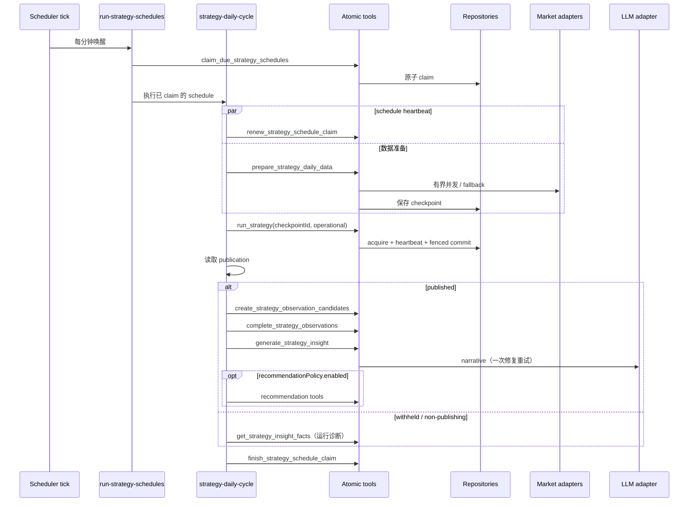
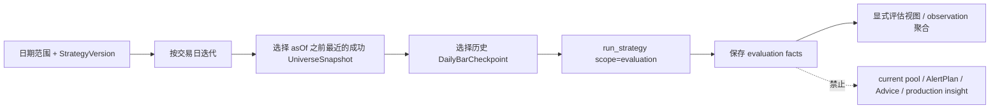

# Strategy 日运行与历史评估可靠性详细设计

> 状态：核心实现已落地；真实跨日性能、持续生产观察与 R5 T+20 仍按开发计划持续验收
> 日期：2026-08-20
> 关联计划：[Strategy 日运行与评估可靠性开发计划](../strategy-reliability-development-plan.md)
> 影响范围：core、db、tools、workflows、Web/CLI/MCP 读取面

实现复核（2026-08-20）：R0～R4、R6～R7 的 Tool/Workflow/存储契约已接入当前代码；真实 Sina 全市场
5,207 只数据准备、首个 schedule 审计和 2 个交易日 PIT replay 已验证。历史区间缺少对应
日期的真实 PIT universe 时保持 `not_found`，不使用当前快照冒充历史版本。replay 对盘中固化的
snapshot 使用交易日日终 `universeAsOf`，而 checkpoint 的 `dataAsOf` 仍保持目标交易日时点，避免
PIT 目录查找在午夜和日终之间分叉。

本轮可靠性收口补充了 schedule lease 在数据准备后、发布后和推荐/通知前的同步续租检查；调度器将
schedule lease、数据并发、陈旧窗口、重试和请求超时作为有界启动参数。数据准备与 observation candidate
审计现在保留实际 bar/baseline provider、fallback 使用情况和 T+1/T+3/T+5/T+20 的创建/完成/pending
分布；汇总 Tool 将 `gate`（可靠性阻塞）与 `observationTarget`（样本成熟度）分离。跨交易日真实分布和
R5 发布后的完整 T+20 仍未完成，继续按运维手册持续观察。

## 1. 背景与覆盖关系

现有 Strategy Workspace 已实现版本、规则求值、运行、调度、观察、事实洞察和草案迭代，但真实
全市场日运行暴露了新的可靠性缺口：

- `complete` 只说明结果包提交完成，不能说明覆盖质量足以发布；
- replay 与 operational run 共用“可用运行”判断，存在污染当前股票池和洞察的风险；
- run lease 和 schedule lease 都是固定期限，没有 heartbeat 和所有权提交；
- 观察补全依赖独立 cron，无法与 24～143 分钟的运行耗时稳定衔接；
- scheduled run 在执行期逐股访问外部行情，全市场 provider 波动会放大为长时间部分失败；
- AI 输出被正确校验拒绝后，没有可交付的事实型降级结果；
- 某些“窗口内未发生”的指标被表示成 missing，污染 incomplete 统计；
- 同一股票连续满足条件时每天产生 level signal，观察样本相关性过高。

本设计补充并覆盖以下旧结论：

1. `docs/prd/strategy-v2.md` 中“任意 complete 都成为当前视图”；
2. `strategy-workspace-detailed-design.md` 中“complete + dataHealth=partial 直接发布”；
3. `docs/ARCHITECTURE.md` 中“观察补全继续依赖外部 cron”的默认运行方式。

未被本设计明确修改的 Strategy、Watchlist、AlertPlan、Advice 和安全边界继续有效。

## 2. 目标与非目标

### 2.1 目标

1. 日运行在长耗时、多实例、provider 部分失败时仍至多提交一次。
2. 数据事实与发布决策分离：`dataHealth` 描述事实，`acceptance` 判断质量，`publication` 决定能否
   成为 operational current。
3. operational 与 evaluation 共享 evaluator，但消费者边界严格隔离。
4. 调度、运行、观察、洞察和可选推荐形成一个有审计的 daily cycle。
5. scheduled run 消费可追溯的数据 checkpoint，减少执行期外部 IO；正式运行完成后只按 active
   StrategyWatchlistSubscription 投影到 Watchlist。
6. 历史区间可断点重放，并使用 point-in-time universe。
7. LLM 不可用时仍交付确定性事实，且不伪造 AI narrative。

### 2.2 非目标

- 不实现自动交易；
- 不把 StrategySignal 变成 Advice；
- 不在 P0/P1 输出净值、年化、Sharpe 或严格回测胜率；
- 不让 LLM 参与逐股 selection/scoring/signal 求值；
- 不修改已发布 StrategyVersion；
- 不扩大到分钟行情或非沪深 A 股。

## 3. 架构原则

本设计使用现有架构语言：module、interface、implementation、depth、deep、shallow、seam、
adapter、leverage、locality。

### 3.1 需要加深的模块

| module | public interface | 隐藏的复杂度 | 设计判断 |
|---|---|---|---|
| StrategyRunPublication | `decideStrategyRunPublication(runFacts, policy)` | scope、全量/子集、比率、阈值、reason codes、legacy 兼容 | deep；纯 core module |
| StrategyRunExecution | `run_strategy` | evaluation data adapter、fencing lease、heartbeat、checkpoint、并发求值、fenced commit | deep；tool 是系统 seam |
| StrategyDailyCycle | `strategy-daily-cycle` workflow | schedule claim、运行、观察、洞察、推荐、审计 | deep；复用原子 tools |
| StrategyDataPreparation | `prepare_strategy_daily_data` | 分页、并发、重试、provider fallback、checkpoint | deep；external tool + adapter |
| StrategyEvaluation | `strategy-replay-range` workflow | 交易日、断点、PIT universe、幂等 run identity | deep；与 production 消费者隔离 |
| StrategyInsight | facts tool + narrative tool | 事实聚合、引用校验、修复重试、facts-only fallback | deep；不泄漏 prompt/provider 细节 |

不得为每个阶段增加只转发参数的 shallow wrapper。复用既有 tool 时直接调用；只有需要隐藏稳定
复杂度或形成权限 seam 时才新增 interface。

### 3.2 分层保持不变

```text
cli / tui / mcp / web ──► tools ──► core
                          │
                          └─► { db, adapters } ──► core
workflows ──► tools ──► core
```

- core 只放 schema、不变量、acceptance 和 emission 纯逻辑；
- repository interface 在 core，Drizzle/memory implementation 在 db；
- tools 可以访问 repository/adapter；
- workflows 只调用 `ctx.tools.*`，不直接访问 repository 或 adapter；
- 正式 daily cycle 在数据准备前通过 `list_strategy_runs(scope=operational)` 检查同一
  schedule/UTC 交易日是否已有 `mode=scheduled` 正式运行；重复 cron claim 只释放 lease 并保留
  `schedule-day-duplicate` skipped 审计，不重复拉取外部数据或写入 StrategyRun；可靠性汇总不把
  skipped claim 计入生产周期样本；
- Web/API 不复制 current-run、acceptance 或观察聚合规则。

`StrategyRunExecution` 内部保留两个真实 adapter implementation：

- `LiveStrategyEvaluationDataAdapter`；
- `CheckpointStrategyEvaluationDataAdapter`。

两者实现同一个 `StrategyEvaluationData` interface，隐藏 quote/daily-bars 的时点、来源、缺失和
checkpoint 差异。trial、scheduled 和未来 simulation 不各自复制数据准备逻辑。

## 4. 目标数据流

### 4.1 生产日周期



### 4.2 历史评估



## 5. 领域模型

### 5.1 StrategyRunScope

```ts
const StrategyRunScopeSchema = z.enum(['operational', 'evaluation']);
```

映射规则：

| mode | scope |
|---|---|
| `scan` + 全市场 | `operational` |
| `scan` + 显式子集 | `evaluation` |
| `scheduled` | `operational` |
| `replay` | `evaluation` |
| `backtest` | `evaluation` |

`mode` 说明触发方式，`scope` 说明允许哪些下游消费者读取；两者不能互相替代。scope 由
`mode + universeKind` 派生，调用方不能直接指定。这样 `persist=true + scan + stockIds` 仍可保存
诊断事实，但一定是 non-publishing evaluation。

### 5.2 StrategyRunAcceptancePolicy

```ts
const StrategyRunAcceptancePolicySchema = z.object({
  policyVersion: z.literal('strategy-run-acceptance-v1'),
  minEvaluatedRatio: z.number().min(0).max(1).default(0.98),
  maxFailedRatio: z.number().min(0).max(1).default(0.02),
  maxIncompleteRatio: z.number().min(0).max(1).default(0.10),
});
```

policy 作为 `StrategySchedule.acceptancePolicy` 可选配置；没有 schedule 的手工正式运行使用 core
默认值。阈值必须快照进 run summary，后续修改 policy 不重写历史判断。

### 5.3 StrategyRunAcceptance

```ts
const StrategyRunAcceptanceReasonSchema = z.enum([
  'run-not-complete',
  'empty-universe',
  'evaluated-ratio-below-min',
  'failed-ratio-above-max',
  'incomplete-ratio-above-max',
]);

const StrategyRunAcceptanceSchema = z.object({
  decision: z.enum(['accepted', 'rejected']),
  policy: StrategyRunAcceptancePolicySchema,
  metrics: z.object({
    evaluatedRatio: z.number().min(0).max(1),
    failedRatio: z.number().min(0).max(1),
    incompleteRatio: z.number().min(0).max(1),
  }),
  reasons: z.array(StrategyRunAcceptanceReasonSchema),
  assessedAt: z.coerce.date(),
});
```

比率分母统一为 `universeCount`；空 universe 不做除零，三个比率均为 0，并以
`empty-universe` 拒绝。

纯函数接口：

```ts
interface AssessStrategyRunInput {
  readonly status: StrategyRun['status'];
  readonly universeCount: number;
  readonly evaluatedCount: number;
  readonly failedCount: number;
  readonly incompleteCount: number;
  readonly policy: StrategyRunAcceptancePolicy;
  readonly assessedAt: Date;
}

function assessStrategyRun(input: AssessStrategyRunInput): StrategyRunAcceptance;
```

不变量：

- `accepted` 必须没有 reasons；
- `rejected` 至少一个 reason；
- `evaluatedCount + failedCount === universeCount`；
- `incompleteCount <= evaluatedCount`；
- acceptance 不改变 `dataHealth`；一个 partial dataHealth 的 run 可以 accepted，也可以 rejected。

### 5.4 StrategyRunPublication

publication 是持久化在 StrategyRun 顶层的下游消费决定：

```ts
const StrategyRunPublicationSchema = z.object({
  status: z.enum(['published', 'withheld', 'non-publishing']),
  reasons: z.array(z.enum([
    'evaluation-scope',
    'explicit-subset',
    'acceptance-rejected',
    'run-not-complete',
    'universe-checkpoint-missing',
  ])),
  decidedAt: z.coerce.date(),
});

function decideStrategyRunPublication(input: {
  scope: StrategyRunScope;
  universeKind: 'full' | 'explicit';
  status: StrategyRun['status'];
  universeCheckpointPresent: boolean;
  acceptance: StrategyRunAcceptance;
  decidedAt: Date;
}): StrategyRunPublication;
```

规则：

- operational + full universe + complete + acceptance accepted = `published`；
- operational 但质量门不通过 = `withheld`，手工触发也不能绕过；
- evaluation 或显式子集 = `non-publishing`；
- `published` 必须 reasons 为空；其它状态至少一个 reason；
- publication 不等于 Advice/notify，也不改变 run 的执行事实。

`requestedBy` 只记录运行来源，不参与 publication 决策。Web 的运行确认不能替代结果生成后的数据质量门；手工、scheduled 与 replay 使用一致的 acceptance policy。

`StrategyRunSchema` 新增：

```ts
scope: StrategyRunScopeSchema.optional(), // optional 仅用于读取 legacy
publication: StrategyRunPublicationSchema.optional(), // 新运行必填
```

数据库用 `publication_status` 独立列支持直接查找 current；reasons/decidedAt 可存
`publication_json`。不能只把 publication 放在 `summary_json` 后继续扫描最近 10 条，因为连续失败
或 withheld 后仍必须找到更早的 published run。

### 5.5 StrategyRunSummary V4

```ts
const StrategyRunSummaryV4Schema = z.object({
  schemaVersion: z.literal(4),
  dataHealth: StrategyRunDataHealthSchema,
  universeCount: z.number().int().nonnegative(),
  evaluatedCount: z.number().int().nonnegative(),
  selectedCount: z.number().int().nonnegative(),
  signalCount: z.number().int().nonnegative(),
  incompleteCount: z.number().int().nonnegative(),
  failedCount: z.number().int().nonnegative(),
  failureSamples: z.array(FailureSampleSchema).max(20),
  acceptance: StrategyRunAcceptanceSchema,
});
```

`StrategyRun.status` 仍只表达生命周期：`running/complete/failed`；不恢复写入新的 partial。旧
`status=partial` 只作为 legacy 读取。

### 5.6 publishable current run

core 提供唯一判断：

```ts
function isPublishableOperationalRun(run: StrategyRun): boolean {
  return run.scope === 'operational'
    && run.status === 'complete'
    && run.publication?.status === 'published';
}
```

legacy 策略：

- 没有 `scope`：由 mode 映射；replay/backtest 必须视为 evaluation；
- 没有 Summary V4 acceptance/publication：执行一次幂等迁移并返回 `legacy-publication` warning；
- 兼容只用于存量记录，所有新运行必须写 V4。

### 5.7 StrategyRunInputSnapshot V3

```ts
const StrategyRunInputSnapshotV3Schema = z.object({
  schemaVersion: z.literal(3),
  strategyVersionId: z.string(),
  definitionHash: z.string(),
  evaluatorVersion: z.string(),
  scope: StrategyRunScopeSchema,
  universeKind: z.enum(['full', 'explicit']),
  coverage: z.literal('CN_A_SHARES_SH_SZ'),
  stockIds: z.array(z.string()),
  stockIdChecksum: z.string(),
  requestedBy: z.enum(['manual', 'scheduled', 'replay']),
  universeCheckpoint: z.object({
    syncId: z.string(),
    provider: z.string(),
    observedAt: z.coerce.date(),
    memberChecksum: z.string(),
  }),
  dataCheckpoint: z.object({
    id: z.string(),
    dataAsOf: z.coerce.date(),
    checksum: z.string(),
  }).optional(),
  acceptancePolicyVersion: z.string(),
});
```

scheduled 和 range replay 必须带两个 checkpoint。手工显式小样本 scan 在 P1 过渡期可以没有
dataCheckpoint，但 providerStatuses 必须反映 live fetch。

### 5.8 StrategyDataCheckpoint

```ts
interface StrategyDataCheckpoint {
  readonly id: string;
  readonly coverage: 'CN_A_SHARES_SH_SZ';
  readonly dataAsOf: Date;
  readonly status: 'running' | 'complete' | 'partial' | 'failed';
  readonly universeSyncId: string;
  readonly requestedCount: number;
  readonly availableCount: number;
  readonly failedCount: number;
  readonly memberChecksum: string;
  readonly dataChecksum: string;
  readonly providerStatuses: readonly ProviderStatus[];
  readonly startedAt: Date;
  readonly finishedAt?: Date;
}
```

checkpoint 是运行输入事实，不复制 DailyBar 正文。member rows 只记录每只股票在该 checkpoint 的
最新日线日期、barCount、source 和失败种类；实际 OHLCV 继续存 `daily_bars`。

### 5.9 Signal emission V2

已发布 DSL v1 保持 level 语义。新增 DSL v2：

```ts
const StrategySignalEmissionSchema = z.object({
  mode: z.enum(['level', 'edge']).default('level'),
  cooldownTradingDays: z.number().int().min(0).max(60).default(0),
});

const StrategySignalRuleV2Schema = StrategySignalRuleSchema.extend({
  emission: StrategySignalEmissionSchema.default({ mode: 'level', cooldownTradingDays: 0 }),
});
```

edge 的前态只读取更早的 published operational run；evaluation range 内只读取同一个 evaluation
session 的前一交易日。withheld run、其它 scope 和不同 StrategyVersion 都不能充当前态。

只有真正 emitted 的 signal 创建 SignalObservation。持续 matched 仍保留在 StrategyResult 的
RuleEvaluation 中，不创建假 signal。

### 5.10 StrategyProviderCoverage

现有 `ProviderStatus{provider,ok}` 不能表达全市场部分失败。Summary V4 旁增加运行级 coverage
信封：

```ts
const StrategyProviderCoverageSchema = z.object({
  capability: z.enum(['quote', 'daily-bars', 'universe']),
  provider: z.string(),
  requested: z.number().int().nonnegative(),
  succeeded: z.number().int().nonnegative(),
  failed: z.number().int().nonnegative(),
  missing: z.number().int().nonnegative(),
  fallbackUsed: z.boolean(),
  freshness: z.enum(['fresh', 'stale', 'unavailable']),
  dataAsOf: z.coerce.date().optional(),
  errorKinds: z.array(z.string()).max(20),
});
```

run.dataAsOf 是所有必需 capability/股票事实中最保守的实际观测时间，不使用 startedAt 代替；
StrategyResult.dataAsOf 保留逐股实际时间。空 bars、字段全缺或 stale 不能被记为 provider ok。

## 6. Repository interface

### 6.1 StrategyRunRepository

```ts
interface StrategyRunRepository {
  acquireRunLease(input: AcquireRunLeaseInput): Promise<StrategyLeaseToken | null>;
  renewRunLease(input: { token: StrategyLeaseToken; now: Date; leaseUntil: Date }): Promise<boolean>;
  releaseRunLease(input: { token: StrategyLeaseToken }): Promise<void>;

  saveStartedRun(run: StrategyRun): Promise<void>;
  commitRunWithFence(input: {
    token: StrategyLeaseToken;
    now: Date;
    bundle: StrategyRunBundle;
  }): Promise<'committed' | 'lease-lost'>;

  findLatestPublishedRun(strategyId: string): Promise<StrategyRun | null>;
  findPreviousPublishedRun(input: {
    strategyId: string;
    beforeStartedAt: Date;
    beforeRunId: string;
  }): Promise<StrategyRun | null>;

  listRuns(filter?: {
    strategyId?: string;
    status?: StrategyRun['status'];
    scope?: StrategyRunScope;
    since?: Date;
    limit?: number;
  }): Promise<readonly StrategyRun[]>;
}
```

`StrategyLeaseToken` 至少包含 lease key、owner 和单调递增 `fence`。`commitRunWithFence` 是关键
seam：在同一事务内验证 owner、fence、`lease_until > now`、running run identity，然后提交
run/results/signals。它不能先查 lease 再调用旧 `commitRun`，否则存在 TOCTOU。

Drizzle 实现事务顺序：

1. 查询 `(strategy_id, strategy_version_id)` lease；
2. 校验 owner、fence 和 leaseUntil；
3. 校验目标 run 当前为 running；
4. 写 results/signals，更新终态 run；
5. 删除或保留到 release 的 lease；
6. 任一失败整笔回滚。

memory implementation 使用相同顺序，并由共享 contract tests 固定。

### 6.2 StrategyScheduleRepository

新增：

```ts
renewClaim(input: {
  id: string;
  owner: string;
  fence: number;
  now: Date;
  leaseUntil: Date;
}): Promise<boolean>;
```

claim 返回带 fence 的 token。`finishClaim` 只有 owner + fence 且 claim 未过期时可推进
`nextRunAt`。如果周期失败，仍推进到下一个 cron，但 WorkflowRun 保留失败；启动补跑规则继续保持
“每次 tick 最多补一次”。

### 6.3 StockUniverseRepository

新增 point-in-time interface：

```ts
listSnapshotMembers(syncId: string): Promise<readonly Stock[]>;
latestSnapshotAtOrBefore(input: {
  coverage: MarketCoverage;
  asOf: Date;
}): Promise<StockUniverseSyncRun | null>;
```

`applySnapshot` 在同一事务中写当前 membership 和 immutable snapshot members。失败 sync 不写
snapshot members，也不能成为 PIT universe。snapshot 选择依据 `observedAt <= asOf`，不能用晚于
目标交易日的 sync finishedAt 偷看未来；asOf 固定为目标交易日收盘后可获得时点。

### 6.4 StrategyDataCheckpointRepository

```ts
interface StrategyDataCheckpointRepository {
  saveStarted(checkpoint: StrategyDataCheckpoint): Promise<void>;
  commit(input: {
    checkpoint: StrategyDataCheckpoint;
    members: readonly StrategyDataCheckpointMember[];
  }): Promise<void>;
  findById(id: string): Promise<StrategyDataCheckpoint | null>;
  listMembers(id: string): Promise<readonly StrategyDataCheckpointMember[]>;
  latestUsableAtOrBefore(input: {
    coverage: MarketCoverage;
    asOf: Date;
    universeSyncId: string;
  }): Promise<StrategyDataCheckpoint | null>;
}
```

## 7. 租约与故障语义

### 7.1 参数

首版安全不变量与生产默认：

- run lease：15 分钟；heartbeat：每 5 分钟；
- schedule lease：30 分钟；heartbeat：每 5 分钟；scheduler 可通过
  `LUOOME_STRATEGY_SCHEDULE_LEASE_MINUTES` 在 5～240 分钟内有界调整；
- 数据准备默认 8 workers、允许陈旧 1 个交易日、最多重试 2 次、单请求超时 20 秒，分别由
  `LUOOME_STRATEGY_DATA_CONCURRENCY`、`LUOOME_STRATEGY_DATA_MAX_STALENESS_TRADING_DAYS`、
  `LUOOME_STRATEGY_DATA_MAX_RETRIES`、`LUOOME_STRATEGY_DATA_REQUEST_TIMEOUT_MS` 有界调整；
- 每次成功接管都分配更大的 fencing token；
- heartbeat 连续失败一次即标记 lease-lost，不等待最终提交才发现；
- 参数是 implementation 配置，不进入 Strategy DSL。

### 7.2 heartbeat helper

tools/workflows 各自提供一个内部 `withRenewableLease` helper，公开调用方只看到执行函数。helper
负责启动、续期、停止、异常传播和 timer 清理。测试使用 fake timers；不把 timer 放进 core。

### 7.3 lease 丢失

1. 立即停止启动新的逐股任务；已在途请求允许收敛但结果不提交；
2. `commitRunWithFence` 返回 `lease-lost`；
3. 若当前 owner 仍有权更新 started run，则写 failed，error 为
   `lease_lost_before_commit`；否则由接管者或 stale-run reconciler 收敛；
4. 不写 observation candidates、Advice 或通知；
5. 日周期 WorkflowRun 为 failed，provider statuses 仍保留。

### 7.4 stale running reconciliation

新增 internal write tool `reconcile_stale_strategy_runs`：只处理没有有效 lease 且 startedAt 超过阈值
的 running run，将其标记 failed。它不删除 facts，不覆盖可能仍有效的 owner。

## 8. Tool 契约

### 8.1 `run_strategy`

输入扩展：

```ts
{
  strategyId: string;
  versionId?: string;
  mode: 'scan' | 'scheduled' | 'replay';
  asOf?: Date;
  stockIds?: string[];
  dataCheckpointId?: string;
  evaluationSessionId?: string;
  acceptancePolicy?: StrategyRunAcceptancePolicy;
  persist: boolean;
}
```

约束：

- scope 只能从 `mode + stockIds/universeKind` 派生，调用方不能单独传入以绕过边界；
- scheduled 必须 `persist=true` 且在 P1 后必须带 checkpoint；
- replay 必须 asOf；没有 PIT snapshot 时只允许显式 stockIds，直到 R6 完成；
- 正式运行先写 started run，再准备/读取上下文；
- Summary V4 和 acceptance 在 commit 前计算；
- publication 在 commit 前计算并写顶层/indexed column；
- `dataAsOf` 取本次求值实际依赖数据的最旧观测时间；逐股 Result 保留自己的 dataAsOf；
- provider coverage 保存 success/failed/missing、fallback、stale 和各来源 dataAsOf；
- observation 创建从 tool 内移出，避免 withheld/evaluation signal 自动进入生产观察；
- `persist=false` 不取得正式 lease、不保存 run、signal 或 observation。

### 8.2 `prepare_strategy_daily_data`

```ts
input = {
  coverage: 'CN_A_SHARES_SH_SZ';
  universeSyncId: string;
  asOf: Date;
  requiredLookback: number;
  correctionWindowDays: number;
}

output = {
  checkpoint: StrategyDataCheckpoint;
  failures: Array<{ stockId: string; kind: string }>;
}
```

实现使用有界 worker pool，初始并发 8；adapter 内部 fallback 保持既有顺序。重试只针对 adapter
标记的 retryable 错误，最多 2 次并使用 jitter backoff。业务 no_data 不盲目重试。

逐股错误只返回稳定 kind 和最多 20 条 samples；完整错误写 logger，禁止把凭证或 URL query 输出
到 ToolResult。

### 8.3 schedule claim tools

- `claim_due_strategy_schedules` 默认 lease 从 120 分钟改为 20 分钟；
- dispatcher 每次只 claim 即将执行的 schedule，或以很小的有限并行度 claim；禁止先保留 20 个再
  串行等待；
- 新增 `renew_strategy_schedule_claim`；
- `finish_strategy_schedule_claim` 校验 owner + fence、claim 未过期并记录 `lastRunId`；
- claim 的 heartbeat 由 daily cycle helper 负责。

### 8.4 observation tools

新增 internal write tool：

```ts
create_strategy_observation_candidates({ runId: string })
```

它只接受 publishable operational run，按 emitted signals 幂等创建 T+1/T+3/T+5/T+20 candidates。
`complete_strategy_observations` 继续保持原子补全；现有 workflow 作为独立补偿入口保留。

P0 先把 pending 查询改为 `dueAt/baselineAt ASC`，避免当前 `baselineAt DESC` 让旧样本饥饿。P1
为 SignalObservation 增加：

```ts
dueAt?: Date;
attemptCount: number;
lastAttemptAt?: Date;
nextAttemptAt?: Date;
lastErrorKind?: string;
```

T+n 的 dueAt 按交易 session 计算，不按自然日。同步失败更新有界 backoff；数据尚未到期不算失败。
workflow 使用批量 signal 反查，不再逐股票扫描最多 500 条 signal。

### 8.5 insight tools

`get_strategy_insight_facts` 增加：

```ts
{
  strategyId: string;
  windowDays: number;
  scope?: 'operational' | 'evaluation'; // 默认 operational
  evaluationSessionId?: string;
}
```

operational facts 只统计 published run 和它们的 signals/observations。evaluation 必须显式指定 scope，
推荐同时指定 session。

`generate_strategy_insight` 继续返回严格 narrative 或 `llm_error`：

1. 首次 generation；
2. 结构或 factRef 无效时，用验证错误和 allowed fact ids 做一次修复 generation；
3. 仍失败则返回 `llm_error`。

facts-only fallback 属于 workflow 组合结果，而不是伪造 `StrategyInsightNarrative`。

## 9. Workflow 设计

### 9.1 `run-strategy-schedules`

保留为 dispatcher，职责只包含：

1. 逐个或以有限并行度 claim due schedule，不预占尚未开始的长队列；
2. 对每个 claim 调用 `strategy-daily-cycle`；
3. 汇总 ran/skipped/failed。

它不再直接调用 `run_strategy` 或 recommendation workflow，避免 orchestration 继续变宽。
交易日判断复用 composition root 已装配的补充节假日日历，不在 workflow 内另建只含内置日期的
判断路径。

### 9.2 `strategy-daily-cycle`

内部输入：

```ts
{
  scheduleId: string;
  claimOwner: string;
  dataAsOf?: Date;
}
```

输出：

```ts
{
  status: 'complete' | 'partial' | 'failed' | 'skipped';
  phases: {
    dataPreparation: PhaseResult;
    strategyRun?: PhaseResult & {
      runId: string;
      publication: 'published' | 'withheld' | 'non-publishing';
    };
    observations?: PhaseResult;
    insight?: PhaseResult & { mode: 'generated' | 'facts-only' };
    recommendations?: PhaseResult;
    notification?: PhaseResult;
  };
}
```

阶段规则：

| 阶段失败 | 后续行为 |
|---|---|
| 数据准备不可用 | 不运行 Strategy；周期 failed |
| run failed/lease-lost | 不创建观察/推荐；可输出运行诊断 facts |
| run withheld/non-publishing | 保存审计；不创建生产观察/推荐/通知；周期 partial |
| observation completion partial | 继续 insight；周期 partial |
| LLM 失败 | 调 facts tool，返回 facts-only；周期 partial |
| recommendation 失败 | 不回滚 run/observations；周期 partial |
| notification 失败 | 保存 delivery failure；周期 partial |

无论成功或失败，finally 都尝试 finish claim；finish 本身失败会把周期升格为 failed，因为 schedule
可能被重复执行。

workflow 必须检查 `result.data.run.status/publication`，不能只检查 ToolResult.ok；`run_strategy`
成功返回一个内部 `run.status=failed` 的审计事实时，cycle 仍按 failed 处理。

### 9.3 WorkflowRun

每次 daily cycle 写一条 WorkflowRun：

- `name='strategy-daily-cycle'`；
- inputSummary：strategyId、scheduleId、versionId、dataAsOf、policyVersion；
- outputSummary：phase statuses、runId、publication/acceptance、计数、lease 续期、checkpoint 覆盖、
  观察补全、`000300.SH:qfq:daily:v1` benchmark 同步状态/来源/bar 数/失败原因、insight mode、
  advice/notification count；
- providerStatuses：market checkpoint、LLM、notification；
- 不写完整 DSL、逐股结果或 prompt。

### 9.4 `complete-strategy-observations`

继续作为幂等补偿 workflow，可按小时或每日运行；它不能再被认为是唯一正常路径。daily cycle 在
run 终态后先显式同步 `000300.SH` qfq 日线，再补“所有已到期的历史观察”，不是只补本 run；补偿 workflow
同样记录 benchmark 数据集版本和逐项同步结果。同步失败不填替代值，个股观察仍可保存但周期保持 partial。

同一 daily cycle 在 run 提交成功且 publication 为 `published` 后，通过
`ctx.tools.sync_strategy_watchlist_subscriptions` 这个不进入公共 registry/MCP 的内部编排 tool 处理
Strategy→Watchlist 订阅。该步骤使用 run 的
`dataHealth` 决定 complete/partial：partial 只标 stale，failed/withheld/evaluation/非持久化运行不调用
source commit；无 active 订阅时跳过。它不创建 Advice、Notification、AlertPlan 或 Trade。

### 9.5 `strategy-replay-range`

输入：

```ts
{
  strategyId: string;
  versionId: string;
  from: Date;
  to: Date;
  stockIds?: string[];
  persist: boolean;
  resumeSessionId?: string;
}
```

行为：

1. 解析 A 股交易日；
2. 建立或恢复 evaluation session；
3. 每日按交易日日终 `universeAsOf` 解析 PIT universe，再按目标 `dataAsOf` 准备 checkpoint；
4. 调用 `run_strategy(mode='replay')`；
5. 保存日期级进度和错误；
6. 由 evaluation observation tool 基于后续 checkpoint 计算 T+n；
7. 不调用 AlertPlan、recommendation 或 production notification。

evaluation session 固定请求的 universe selection：显式 `stockIds` 会按 code-unit 排序后保存完整股票集
及 `stockIdChecksum`；续跑必须完全匹配，不能把另一子集写入同一 session。未提供 `stockIds` 表示
full universe，续跑时也不能改成显式子集。

幂等 key：

```text
evaluationSessionId + strategyVersionId + dataAsOf + universeChecksum + dataCheckpointChecksum
```

## 10. 数据库迁移

### 10.1 P0

`strategy_runs`：

```sql
ALTER TABLE strategy_runs
  ADD COLUMN scope TEXT NOT NULL DEFAULT 'operational';

ALTER TABLE strategy_runs
  ADD COLUMN publication_status TEXT;

ALTER TABLE strategy_runs
  ADD COLUMN publication_json TEXT;

UPDATE strategy_runs
SET scope = 'evaluation'
WHERE mode IN ('replay', 'backtest');

CREATE INDEX strategy_runs_strategy_scope_started_idx
  ON strategy_runs(strategy_id, scope, started_at);

CREATE INDEX strategy_runs_strategy_publication_started_idx
  ON strategy_runs(strategy_id, publication_status, started_at);
```

acceptance 保存在 `summary_json`；publication status 单独建列，因为 current 查询必须直接找到
任意久远的 published run。幂等 application migration 按 scope、mode、inputSnapshot 和可读取的
V3 比率回填 publication：replay/backtest 与明确子集为 non-publishing；能按默认 policy 判断的
低质量 operational run 为 withheld；无法恢复完整判断的 legacy operational complete/partial 兼容
为 published 并带 `legacy-publication` reason/warning。

`strategy_run_leases` 增加 `fence INTEGER NOT NULL` 与 `heartbeat_at INTEGER NOT NULL`；接管时 fence
单调递增。`strategy_schedules` 同样增加 `lease_fence`。互斥由 owner + fence + lease_until 共同验证。

### 10.2 P1

新增：

```text
strategy_data_checkpoints
  id PK, coverage, data_as_of, status, universe_sync_id,
  requested_count, available_count, failed_count,
  member_checksum, data_checksum, provider_statuses_json, vintage_status,
  started_at, finished_at

strategy_data_checkpoint_members
  checkpoint_id + stock_id PK,
  status, latest_bar_date, bar_count, provider, error_kind
```

### 10.3 P2

新增：

```text
stock_universe_snapshot_members
  sync_id + stock_id PK,
  observed_name, listing_status, industry, list_date, delist_date

daily_bar_revisions
  stock_id + date + recorded_at + content_hash PK,
  qfq_ohlcv, source, recorded_at

strategy_evaluation_sessions
  id PK, strategy_id, strategy_version_id, from_date, to_date,
  status, definition_hash, stock_ids_json, stock_id_checksum,
  created_at, finished_at, error

strategy_evaluation_days
  session_id + data_as_of PK,
  run_id, universe_sync_id, data_checkpoint_id, revision_cutoff, vintage_status, status, error
```

`daily_bars(stock_id,date)` 是可变的最新投影，scheduled run 不直接读取它，而是以 checkpoint
`startedAt` 作为 revision cutoff 读取 append-only `daily_bar_revisions`；evaluation day 则显式保存
`revision_cutoff` 和 `vintage_status`。没有 revision history 的
旧日期只允许在 checkpoint / replay 输出中标记 `vintageStatus=unavailable`，不能伪装成严格可重复数据包。
`vintageStatus=available` 还要求目标 cutoff 前最新 revision 的 content hash 与本次抓取的完整 OHLCV/source
一致；available replay 固定使用目标历史 cutoff，不能读取本次 prepare 新写入的 revision。unavailable 才能
显式降级使用当前抓取内容，且输出必须保留非严格 PIT 状态。

所有 Drizzle schema 与 `ensureSchema` DDL 同步。启动迁移幂等；先加列/表，再 backfill，再创建
index。存量数据库迁移测试必须覆盖 replay scope backfill。

## 11. current、Diff、AlertPlan 与 Advice 读取规则

### 11.1 current workspace

返回：

- `latestAttempt`：最新 operational attempt，不论 publication；
- `currentRun`：`findLatestPublishedRun` 返回的最新 published operational run；
- `previousRun`：`findPreviousPublishedRun` 返回的前一 published operational run；
- `latestEvaluationRun` 只在显式 evaluation 页面返回。

health 扩展为：

```ts
'ready' | 'never-run' | 'running' | 'partial' | 'withheld' | 'failed'
```

当 latest attempt withheld 时，currentRun 回退并显示 metrics、thresholds、reasons；不能把 current
数据显示成 withheld run 的零结果。查询不能限制为最近 10 条后再过滤，连续任意数量失败仍要保留
旧 current。

### 11.2 Diff

默认相邻 Diff 只比较 publishable operational runs。用户显式选择 runId 时：

- 两个 run scope 不同：拒绝默认比较，必须设置 `allowCrossScope=true`；
- withheld run 可以用于诊断 Diff，但页面标记“非发布结果”；
- incomplete 行继续输出 data-unavailable，不推断进入/退出。

### 11.3 AlertPlan / recommendation

- strategy-signal rule 只消费 published operational signal；
- withheld/evaluation signal 即使持久化也不可触发；
- recommendation workflow 入口再次验证 run publication，不能只信 daily cycle；
- recommendationPolicy 未启用时不生成 Advice；
- Advice 保留反证、风险、免责声明和有效期；永不自动交易。

## 12. 指标和规则解释

### 12.1 CompiledStrategyExpression

现有 `extract paths + interpolate + evaluate` 会静态把复合表达式的所有路径记为 missing，且 parser
对 `&&/||` 不做惰性求值。新增 deep core module：

```ts
interface CompiledStrategyExpression {
  readonly referencedPaths: readonly string[];
  evaluate(context: Readonly<Record<string, unknown>>): {
    status: 'value' | 'missing' | 'error';
    value?: unknown;
    reads: readonly RuleInputFact[];
    missingPaths: readonly string[];
    error?: string;
  };
}

function compileStrategyExpression(expression: string): CompiledStrategyExpression;
```

implementation 使用同一安全 AST 同时服务发布期静态字段校验和运行期求值；`&&/||` 使用惰性三值
逻辑并只记录实际读取路径：

| 表达式 | 结果 |
|---|---|
| `false && missing` | false |
| `true || missing` | true |
| `true && missing` | missing |
| `false || missing` | missing |

selection、scoring、signal 和 evidence 共享该 interface。升级 evaluatorVersion，不重写旧 run；跨
evaluatorVersion Diff 必须提示“求值器已变化”。

### 12.2 crossing 语义

`daysSinceCrossUp(closes, period)` 改为结构化内部结果：

```ts
type DaysSinceEvent =
  | { status: 'insufficient-history'; required: number; actual: number }
  | { status: 'observed'; days: number }
  | { status: 'not-observed'; lowerBoundDays: number };
```

映射到现有 numeric DSL：

- insufficient-history：字段缺省；
- observed：`days`；
- not-observed：`lowerBoundDays`，值必须大于策略 freshness 阈值。

RuleInputFact V3 可选增加 provenance：

```ts
{ path, status: 'available', value, qualifier?: 'observed' | 'not-observed' }
```

对 `daysSinceMa60CrossUp <= 2`，not-observed 必然是明确 false，而不是 unknown。

### 12.3 required lookback

均线 crossing 至少需要 `period + 1` 个有效交易日才能判断最近一个 crossing；最大检索窗口由
策略字段 registry 单独保存，例如：

```ts
{
  requiredLookback: 61,
  eventSearchWindow: 120,
}
```

不能再用单一 `requiredLookback=120` 同时表达“最少可计算”和“搜索窗口”。

### 12.4 早期突破规则拆分

建议 draft v2：

| ruleId | 事实 |
|---|---|
| `trend-above-ma20` | close > MA20 且 MA5 > MA20 |
| `momentum-window` | momentum20Pct 在 2～15 |
| `volume-confirmation` | volRatio5_20 >= 1.2 |
| `rsi-window` | RSI14 在 45～70 |
| `distance-control` | maDistance20Pct <= 12 |
| `breakout-freshness` | MA20/MA60 上穿 <=2 或站上 MA20 <=3 |

selection 继续使用 `logic='all'`。这样一个已知 not-matched rule 能确定整体失败，另一个无关
missing 不会污染 selection outcome；blocker 统计也具备真实解释力。

## 13. 数据准备策略

### 13.1 bounded concurrency

统一复用一个 tools 内部 worker-pool implementation：

- 默认 8 workers，可通过环境配置但有硬上限；
- 每只股票一个 task；
- lease-lost/abort 后不再领取新 task；
- 结果保持输入顺序；
- 不使用无界 `Promise.all(stockIds.map(...))`。

### 13.2 provider retry 与 fallback

错误分类：

| kind | retry | fallback |
|---|---:|---:|
| timeout/connection-reset/rate-limit | 有界 | 是 |
| no-data | 否 | 是 |
| invalid-payload/schema | 否 | 是并告警 |
| permission/configuration | 否 | 仅切换已配置 provider |

provider manager 继续隐藏具体 provider 顺序。Strategy tool 只看到规范 DailyBar 和 provenance。

### 13.3 checkpoint acceptance

数据 checkpoint 本身只描述可用率，不决定 run acceptance。daily cycle 可以在准备阶段使用相同
默认阈值做 fail-fast：若 `availableCount/requestedCount < minEvaluatedRatio`，不启动昂贵 evaluator，
并记录 `data-checkpoint-below-min`。

## 14. AI 洞察降级

### 14.1 事实集合

生产 facts 只引用：

- published operational runs；
- 它们的 StrategyResult/StrategySignal；
- 对应 SignalObservation；
- 关联 AlertPlan；
- 当前股票目录的名称/行业，并把未知行业单列为“未分类”。

增加运行可靠性 facts：published/withheld/non-publishing 次数、acceptance 分布、覆盖比率、观察补全率、
latest cycle phase status。

### 14.2 narrative 校验

- Zod schema 校验；
- 每个 finding 至少一个 factRef；
- factRef 必须在 allowed set；
- disclaimer 必填；
- 禁止 Advice、确定性收益承诺和“回测”措辞；
- 修复请求只包含原始结构、validation issues、allowed fact ids，不包含凭证或私人全文。

### 14.3 facts-only

Workflow 输出示例：

```json
{
  "mode": "facts-only",
  "factsAsOf": "2026-08-11T...",
  "facts": [],
  "limitations": ["AI 叙述不可用；以下仅为确定性事实。"],
  "provider": "minimax:MiniMax-M3",
  "errorKind": "invalid-structured-output"
}
```

它不是 `StrategyInsightNarrative`，不会伪装 headline/findings，也不会触发 Advice。

## 15. 可观测性

### 15.1 指标

- `strategy_cycle_duration_ms{phase}`；
- `strategy_run_universe/evaluated/failed/incomplete/selected/signals`；
- `strategy_run_acceptance_total{decision,reason}`；
- `strategy_lease_renew_total{kind,result}`；
- `strategy_data_sync_total{provider,result,error_kind}`；
- `strategy_observation_total{horizon,status}`；
- `strategy_insight_total{mode,provider}`。

观察事实聚合统一采用 `stock-day-horizon` 描述性样本单位：以 `stockId + baselineAt` 的交易日 +
`horizon` 作为 sample key，同一 key 只保留一个代表性 observation，complete 优先于 pending，
同等级按 observation id 稳定选择；baselineAt 缺失的 unavailable 事实不臆测交易日，保留为独立缺失行。
聚合返回的 `observationIds` 是实际参与统计的代表事实，Tool/Web/AI facts 共用该列表和去重口径，
并同时保留 total、complete、uniqueStocks、missingRate、分位数、benchmark/excess、MFE/MAE 与 observedAsOf。

如果项目当前没有 metrics backend，先以结构化 WorkflowRun/logger 输出，并通过
`get_strategy_reliability_summary`（Web：`/api/strategy/reliability-summary`）按真实审计记录聚合，避免为本功能引入新的监控基础设施。

汇总同时按 `scheduleId + dataAsOf` 交易日去重计数；同一 schedule 同一交易日出现重复正式运行时，
门禁返回 `schedule-day-duplicate`，不能把重复运行计入通过条件。
汇总支持按 `scheduleId` 查询，并返回每个 schedule 的 `scheduleTradingDayKeys`；未指定单个
schedule 时，多 schedule 只要有任一 schedule 未达到目标交易日数，门禁就返回
`schedule-days-below-target`，不能跨 schedule 拼接交易日达标。
汇总还按真实 `phaseTimings` 计算各阶段 P50/P95/max 延迟，并从持久化周期摘要聚合 provider 成员延迟的
等权近似；provider 近似值必须在运营报告中标明，不把少量跨日分位点冒充原始请求的精确全局分位数。
checkpoint 同时汇总实际 provider 与 fallback 次数；observation 汇总保留 baseline 可用性和四个 horizon
的 created/completed/pending。`gate.ready` 只表达可靠性缺陷，交易日样本目标单列在
`observationTarget.reached`，未达到目标不阻塞代码交付。

### 15.2 日志 locality

一次 cycle 全程带 `workflowRunId/scheduleId/strategyId/runId/checkpointId/leaseOwner`。逐股失败按 kind
聚合，日志最多采样 20 个 stockId；不输出 API key、完整 adapter URL 或私人投资数据。

## 16. Web / CLI / MCP

### 16.1 Web

Strategy Workspace 增加：

- latest attempt 与 current published run 的双时间；
- published/withheld/non-publishing badge；
- 覆盖 metrics 与 policy thresholds；
- cycle phase timeline；
- insight generated/facts-only 状态；
- operational/evaluation 明确切换，默认不显示 evaluation。
- 头部「模拟回测」入口调用 `POST /api/strategies/:id/backtests`；Web 单次限制 31 个自然日，
  可选显式股票子集上限 500，服务端强制 `persist=true`、`owner=web`；
- 区间结果返回逐日 `evaluated/selected/signal/failed` 与总汇总，并保留 `vintageStatus`、
  `runId` 和 evaluation session；失败日期不能被吞掉；
- 结果文案固定为“模拟回测（历史回放）”，明确不含收益、费用、滑点和可交易性模拟。

UI 不提供“一键自动发布 v2”。定义 draft、试算、校验、发布仍是分步确认。

`POST /api/strategies/:id/backtests` 同时属于 write 与 external：必须通过两个显式能力开关及
同源 Origin 校验。返回的 replay run 一律是 evaluation/non-publishing，不参与 operational current。

### 16.2 CLI

建议新增：

```text
luoome workflow run strategy-daily-cycle --strategy-id ...
luoome workflow run strategy-replay-range --strategy-id ... --from ... --to ...
luoome strategy runs --scope operational|evaluation --publication published|withheld|non-publishing
```

CLI 输出明确使用“历史评估”，不使用“严格回测”。

### 16.3 MCP

- 读取 publication/acceptance 和 facts-only 可以暴露；
- range replay 属于 external/write 组合能力，默认不暴露或要求显式 opt-in；
- trade tool 继续永不暴露；
- 不新增绕过 `LUOOME_EXPOSE_TRADE` 的路径。

## 17. 测试设计

### 17.1 core

1. acceptance 阈值边界：恰好等于阈值、空 universe、全失败、incomplete 超限；
2. `dataHealth`、acceptance 与 publication 正交；
3. mode/universeKind → scope 映射、显式子集 non-publishing 和 legacy 兼容；
4. daysSinceEvent：60、61、120 根边界；observed/not-observed；
5. 多规则 `all/any` 与 unknown 真值表；
6. level/edge/cooldown 和版本切换。

### 17.2 repository contract

memory 与 Drizzle 共用：

1. lease acquire/renew/release owner + fence 语义；
2. lease 到期并由更大 fence 接管后旧 owner 不能 commit；
3. fenced commit 原子性；
4. scope filter 与排序；
5. universe snapshot 不可变；
6. checkpoint bundle 原子提交；
7. replay scope/publication migration backfill；
8. 超过 10 条失败/withheld 后仍直接找到旧 published run；
9. DailyBar revision cutoff 读取相同 vintage。

### 17.3 tools

1. scheduled run 只读 checkpoint；
2. replay/evaluation/显式子集 scan 不进入 current consumers；
3. 5,198 universe 的 acceptance/publication 计数样例；
4. provider partial/failure samples 上限；
5. withheld/non-publishing run 不创建 observations；
6. invalid narrative 一次修复后成功；
7. 两次都失败返回 `llm_error`，facts tool 仍成功；
8. bounded worker pool 不超过并发上限。

### 17.4 workflows

用 fake clock/fake tools 覆盖：

1. 交易日与节假日 skip；
2. 3 小时运行持续 heartbeat；
3. schedule lease 丢失；
4. data prep fail-fast；
5. published 完整周期；
6. withheld/non-publishing 不运行下游副作用；
7. observation partial + insight success；
8. LLM failure + facts-only；
9. recommendation/notification failure 不回滚 run；
10. crash 后 resume 不重复日期。

补充边界：数据准备耗时期间若同步续租失败，旧 owner 不得提交 StrategyRun、SignalObservation 或
Advice；发布后续租失败则不得启动新的下游副作用。provider fallback、实际 baseline 来源与四个
observation horizon 的审计字段必须在工具测试中可重复断言。

观察补全另加大 backlog 用例：新旧 10,000 条 pending 混合时 oldest/due-first 不饥饿，失败样本按
nextAttemptAt 退避且不阻塞其它股票。

### 17.5 Web / browser

- never-run、running、published partial、withheld over published、failed over published；
- facts-only banner；
- operational/evaluation 切换；
- 移动端 metrics 和 phase timeline；
- 页面刷新、浏览器返回和 API error 降级。

### 17.6 故障注入

- 首选 daily-bars provider 70% connection reset；
- fallback 延迟和限流；
- SQLite commit 前失租；
- LLM 返回错误 schema/未知 fact id；
- 观察期日线缺失；
- 进程在第 N 个交易日退出并恢复。

## 18. 性能预算

预算先作为可观测门槛，不作为不可调整的产品承诺：

| 阶段 | 初始预算 |
|---|---:|
| 全市场增量数据准备 | P95 < 30 分钟 |
| checkpoint 上的 5,200 股票纯求值 | P95 < 15 分钟 |
| current workspace 查询 | P95 < 500ms（本地 SQLite） |
| insight facts 聚合 | P95 < 3 秒，不含 LLM |
| 单次 LLM + 修复 | 总超时沿用 adapter 配置，最多 2 次 generation |

如果纯求值仍超过预算，先 profile indicator 重复计算和 repository 批量读取，不提前引入新的分布式
执行框架。

## 19. 发布与迁移顺序

1. 先部署可读新旧 schema 的代码；
2. 执行 scope 列和 index 的幂等迁移；
3. backfill replay/backtest 为 evaluation；
4. 新 run 开始写 Summary V4；
5. current readers 切换到 publishable 判断；
6. 开启 lease heartbeat 和 fenced commit；
7. 切换 daily-cycle；旧 observation cron 保留一段时间作为补偿；
8. P1 checkpoint 稳定后，scheduled run 禁止 live full-universe fetch；
9. P2 snapshot 完成后开放 range replay。

回滚：

- 新列/表保持向后兼容，不删除旧字段；
- reader 可临时退回 legacy usable 规则，但必须保留 replay scope 排除；
- heartbeat 可关闭但 fenced commit 不可回退，否则恢复 TOCTOU 风险；
- evaluation 数据无需删除，回滚期间保持不被 production 消费。

## 20. 验收场景

### A. 低覆盖正式运行

5,198 universe、evaluated 1,976、failed 3,222。run 终态和逐股事实可审计，acceptance rejected、
publication withheld；
workspace 继续显示上一 published run；无观察候选、推荐、预警和生产通知。

### B. 部分 incomplete 但可接受

5,198 universe、failed 0、incomplete 485。dataHealth partial，incompleteRatio 9.33%，默认 policy 下
acceptance accepted、publication published；workspace 发布明确结果并显示覆盖 warning。

### C. 长运行

运行持续 3 小时。run/schedule lease 每 5 分钟成功续期；其它实例 claim/acquire 失败；最终以同一
fence 只提交
一个 bundle 并推进一次 nextRunAt。

### D. LLM 无效结构

首次和修复输出都引用未知 fact id。generation tool 返回 `llm_error`；daily cycle 调 facts tool，
返回 facts-only，WorkflowRun partial；运行和观察事实不回滚。

### E. 历史评估

重放 2026-07-01～2026-08-11。每个交易日使用当时 universe snapshot 和 checkpoint，运行全部为
evaluation；中断后从最后完成日继续；整个过程不改变 current pool 或触发 Advice。

## 21. 开放问题与默认决策

| 问题 | 默认决策 |
|---|---|
| acceptance 阈值是否全局或按策略 | schedule 可覆盖，core 有版本化默认值 |
| withheld run 是否保留 signals | 保留审计 facts，但所有 production consumer 必须按 publication 过滤 |
| withheld/non-publishing signal 是否创建观察 | 不创建；避免把低覆盖或评估 run 混入正式观察 |
| evaluation 是否自动生成洞察 | 默认否；用户显式请求且 scope=session 时生成 |
| 是否新增 abandoned status | P0 不新增；使用 failed + 稳定 error code，减少迁移面 |
| 是否立刻做严格回测 | 否；等 benchmark、费用、滑点、可交易性和数据/代码版本门禁完成 |

这些默认决策如在实现前被产品修改，应先更新本文和开发计划，再改 schema，避免 interface 漂移。
