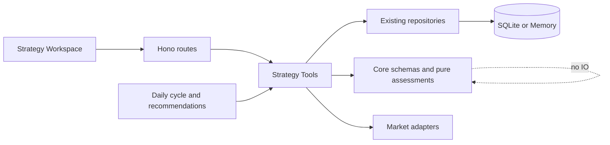

# Strategy 实验、晋级与反馈闭环详细设计

> 状态：Wave A～Wave C 已实施；Wave D 开发中
> 日期：2026-08-30
> 2026-09-02 修订：`eligible-for-human-review` 的人工评审语义已被
> [策略自动化与 AI 管理 PRD](../prd/strategy-ai-managed-automation.md) 扩展——eligible 版本由
> strategy-autonomy-weekly 自动接 publish（晋级门阈值不变），人工评审只处理 blocked；
> 见 [Strategy AI 生命周期管理详细设计](./strategy-ai-lifecycle-detailed-design.md)。
> 开发计划：[Strategy 实验、晋级与反馈闭环开发计划](../strategy-experiment-feedback-development-plan.md)
> 对应需求：[策略工作台 PRD](../prd/strategy-v2.md)、[AI 投资决策闭环产品总纲](../prd/ai-investment-decision-loop.md)
> 上位设计：[策略工作台详细设计](./strategy-workspace-detailed-design.md)、[Strategy 日运行与历史评估可靠性详细设计](./strategy-daily-cycle-and-replay-detailed-design.md)
> 安全约束：[SECURITY.md](../SECURITY.md)、[CONTEXT.md](../../CONTEXT.md)

## 1. 设计结论

本设计把 Strategy Workspace Phase C 从“已有独立 Tool”收口为可操作的实验与人工晋级流程，但不新增
持久化 Experiment 聚合。所有事实继续来自现有对象：

2026-08-30 实施快照：Slice A～D 与 Slice E 的 X4 反馈部分已落地并通过组合验证及真实浏览器验收；
Slice E 的 X5 RecommendationPolicy V2 独立进入开发。

```text
Strategy
  ├── StrategyVersion（基线、候选，不可变）
  ├── StrategyRun / Result / Signal
  ├── StrategyEvaluationSession / Day
  └── SignalObservation
```

页面中的“实验”是 read model 与短生命周期 UI 状态：

- definition diff 来自两个 StrategyVersion；
- sample trial 来自 `trial_strategy_version` 的 `persist=false` 响应，只在当前页面会话中存在；
- 历史验证来自持久化 evaluation session/day；
- 真实表现来自 StrategySignal 对应的 SignalObservation；
- 晋级结论来自 core 纯函数，只可能是 `blocked` 或 `eligible-for-human-review`；
- 发布继续调用既有 validate/publish Tool，并要求用户独立确认。

这避免同时维护 StrategyImprovementProposal、ExperimentRun 或 PromotionDecision 表，也避免把页面流程
误建模成新的领域事实。

## 2. 设计目标

1. 修正外部访问并写库 Tool 的组合能力声明；
2. 让 StrategyResult 的总分可解释、可复算；
3. 给 Web 提供稳定的 DSL catalog 和实验上下文契约；
4. 用同一工作台编排草案、Diff、trial、历史验证、观察和人工发布；
5. 把“证据是否足够进入人工评审”做成确定性领域判断；
6. 为 RecommendationPolicy V2 提供账户级确定性预检边界；
7. 保持 StrategySignal、Advice、Trade 三层隔离。

## 3. 非目标

- 不新增自动调参 Agent、在线学习器或自动发布器；
- 不把 trial、历史评估或观察统计称为组合回测收益；
- 不在 UI 中用自定义 JavaScript 执行表达式；
- 不允许页面绕过 Field Registry 生成任意字段；
- 不持久化 sample trial；
- 不修改已发布 StrategyVersion；
- 不在 RecommendationPolicy 中调用交易 adapter；
- 不把基本面 mock 或当前值接入生产策略；
- 不改变严格回测八项数据门禁。

## 4. 模块边界



约束：

- scoring component 求值、promotion assessment、policy preflight 纯判断位于 core；
- Tool 负责读取和聚合事实，永远返回 ToolResult；
- Hono route 只做参数映射、能力/Origin 检查和 envelope；
- Web 只渲染 Tool 输出，不重算总分、晋级原因或账户风险；
- Workflow 只通过 `ctx.tools.*`，不直接读 repository；
- X0～X4 不新增 repository 或 DDL；JSON 字段扩展保持旧数据可读。

## 5. 副作用与能力模型

### 5.1 组合能力原则

`sideEffect` 仍表示 Tool 的主要类别；`requiredCapabilities` 表示调用者必须同时开启的完整能力集合。

| 操作 | sideEffect | requiredCapabilities |
|---|---|---|
| 查询 DSL catalog、实验上下文、晋级证据 | read | `[read]` |
| AI 生成未持久化草案 | external | `[external]` |
| 同样本 trial，`persist=false` | external | `[external]` |
| 正式 Strategy 运行并持久化 | external | `[external, write]` |
| 数据准备并写 checkpoint/revision | external | `[external, write]` |
| 创建/校验/发布版本 | write | `[write]` |
| 生成 Advice | advice | `[advice, external]` |

Tool capability 是静态契约，不根据 `persist` input 动态改变。通用 `run_strategy` 既包含正式持久化能力，
就必须声明组合能力；external-only 的样本试算继续走 `trial_strategy_version`。这会让调用方在能力层面
无法用 `persist=false` 为 `run_strategy` 降权，但换来 Web/MCP 的静态可审计性。

### 5.2 门控位置

- registry 暴露 `requiredCapabilities`；
- Web 专用 route 和通用 Tool route 都检查所有 required capabilities；
- MCP exposure 使用相同的 every-capability 语义；
- CLI/TUI 在执行 mutation 前沿用确认和审计；
- advice/trade 硬隔离不变，trade 仍不进入 MCP。

## 6. Scoring Breakdown 领域契约

### 6.1 Schema

在 `packages/core/src/entity/strategy.ts` 增加：

```ts
const StrategyScoreComponentEvaluationSchema = z.object({
  schemaVersion: z.literal(1),
  ruleId: z.string().min(1),
  expression: z.string().min(1),
  status: z.enum(['available', 'missing', 'error']),
  inputs: z.array(RuleInputFactSchema),
  weight: z.number().positive().max(1),
  rawScore: z.number().min(0).max(100).optional(),
  contribution: z.number().min(0).max(100).optional(),
  error: z.string().min(1).optional(),
});

StrategyResultSchema.extend({
  scoringBreakdown: z.array(StrategyScoreComponentEvaluationSchema).optional(),
});
```

`ruleId` 保留与 selection rule 的引用关系；同一 definition 中 scoring component 的 ruleId 必须唯一。
DSL schema 增加该唯一性校验，避免分解结果无法稳定寻址。旧 definition 如果存在重复 component，读取不重写；
新建/校验版本必须拒绝重复。

### 6.2 求值规则

对 definition 中每个 component，按原数组顺序输出一条 evaluation：

1. 使用现有安全 AST 求值，不新增 `eval` 或 Function；
2. `inputs` 只保存实际读取路径，沿用三值短路语义；
3. 表达式可用且在 `[0, 100]`：`status=available`，保存 rawScore、weight、contribution；
4. 输入缺失：`status=missing`，不保存 rawScore/contribution，不填 0；
5. 解析、求值或越界：`status=error`，保存受控错误摘要；
6. 只有所有 component available 时才写 StrategyResult.score；
7. `score = sum(contribution)`，不做展示层四舍五入；
8. 任一 missing/error 保持现有 partial 结果和 error 审计。

### 6.3 兼容与存储

- `scoringBreakdown` optional，旧 JSON row 无需迁移；
- memory/Drizzle mapper 继续通过 StrategyResultSchema round-trip；
- 新 evaluator 必须写 breakdown；
- 旧 run 展示 `explainability=legacy-unavailable`，不从总分倒推 component；
- run diff 继续比较总分，详情页可展示 component delta，但不改变现有 change kind。

### 6.4 展示

结果详情以表格或小型 waterfall 展示：component/rule、rawScore、weight、contribution、状态。缺失或错误
使用中性色，不显示为 0 分；score 不带百分号，也不表述为 confidence。

## 7. DSL Catalog

### 7.1 Tool

新增 `get_strategy_dsl_catalog`：

```ts
input = z.object({ schemaVersion: z.literal(1).default(1) });

output = z.object({
  schemaVersion: z.literal(1),
  fields: z.array(z.object({
    path: z.string(),
    type: z.enum(['number', 'boolean', 'string']),
    unit: z.string().optional(),
    requiredLookback: z.number().int().nonnegative().optional(),
    dataSource: z.enum(['quote', 'daily-bars', 'meta', 'limit-up-ladder']),
    coverage: z.array(z.literal('CN_A_SHARES_SH_SZ')),
    operators: z.array(z.string()),
  })),
  limits: z.object({
    selectionRules: z.number().int().positive().nullable(),
    scoringComponents: z.number().int().positive().nullable(),
    signalRulesPerScope: z.number().int().positive().nullable(),
  }),
});
```

字段来自 `STRATEGY_FIELD_REGISTRY`；operators 由 field type 确定：number 支持比较和受控算术，boolean 支持
等值/逻辑，string 只开放当前 expression grammar 已支持的等值操作。catalog 不新增 expression 能力，
只描述现有白名单。当前 core 没有统一且实际强制的规则数量上限，因此三个 `limits` 字段返回 `null`；
UI 不得把 `null` 当成可用上限，也不得自行补一份规则数量白名单。未来若增加并强制 canonical limit，
再通过 schema 版本化契约返回具体正整数。

### 7.2 前端使用约束

- 规则构建器不能自带第二份字段列表；
- dataSource、unit、lookback 直接显示 catalog 值；
- catalog 未返回的字段不能由结构化模式产生；
- 高级 JSON 可以编辑任意文本，但保存前必须经过现有 server schema 和字段 registry 校验；
- 前端生成 expression 后仍由 core parser 决定是否合法。

## 8. Experiment Context Read Model

### 8.1 输入

新增 `get_strategy_experiment_context`：

```ts
const GetStrategyExperimentContextInput = z.object({
  strategyId: z.string().min(1),
  baseVersionId: z.string().min(1).optional(),
  candidateVersionId: z.string().min(1).optional(),
  trainingSessionId: z.string().min(1).optional(),
  validationSessionId: z.string().min(1).optional(),
  observationHorizon: z.enum(['t1', 't3', 't5']).default('t5'),
});
```

默认基线为 current published version；默认候选为同 Strategy 最新未发布版本。显式 ID 必须属于同一 Strategy。

### 8.2 输出

```ts
interface StrategyExperimentContext {
  strategy: Strategy;
  baseVersion?: StrategyVersion;
  candidateVersion?: StrategyVersion;
  definitionDiff?: StrategyDefinitionDiff;
  versionState: {
    candidatePersisted: boolean;
    candidateValid: boolean;
    candidatePublished: boolean;
    parentMatchesBase: boolean;
  };
  validation?: {
    session: StrategyEvaluationSession;
    days: readonly StrategyEvaluationDay[];
    runIds: readonly string[];
    vintageCoverageRatio: number;
    evaluatorIdentityStatus: 'consistent' | 'mixed' | 'unavailable';
    evaluatorIdentities: readonly StrategyExperimentEvaluatorIdentity[];
  };
  observations: {
    horizon: SignalObservationHorizon;
    stats: readonly SignalObservationStats[];
    benchmarkCoverageRatio: number;
    observationIds: readonly string[];
    horizons: readonly StrategyExperimentObservationHorizon[];
    observationLinks: readonly StrategyExperimentObservationLink[];
  };
  realObservations: StrategyExperimentObservationSet;
  strictBacktests: readonly StrictBacktestRun[];
  adaptivePersonality?: AdaptivePersonalityAssessment;
  evidenceLayers: readonly StrategyExperimentEvidenceLayer[];
  starterTemplate: StrategyExperimentStarterTemplate;
  promotion: StrategyPromotionAssessment;
  limitations: readonly string[];
}
```

没有候选或 validation 时返回可解释的 blocked assessment，而不是 404；显式 ID 不存在或归属错误才返回
not_found/invalid_input。

### 8.3 聚合规则

1. 只读取 candidate version 对应 evaluation run；
2. run 必须属于指定 evaluation session；
3. observation 只通过这些 run 的 StrategySignal sourceIds 查询；
4. 校验 observation.stockId 必须与其 StrategySignal.stockId 一致；不一致事实跳过并记录 limitation；
5. 复用 `deduplicateSignalObservations` 和 `aggregateSignalObservationStats`；
6. pending/unavailable 不作为 0 收益；
7. benchmark coverage 分母为 complete observations；complete 为 0 时比率为 0；
8. 输出所有采用的 session/run/observation IDs；
9. 最大查询量沿用现有 session/day、run、observation 预算，超过预算返回 partial limitation，不截断后假装 complete。
10. 四周期整体状态按 expected/complete/missing 汇总；只有已存在的 observation 全部 complete 不能证明其它周期完整；
11. production feedback 只读取已发布版本的 publishable operational run；显式未发布 baseline 不得冒充发布后反馈；
12. evaluator identity 只有在所有采用的 validation run 都携带身份且一致时才标记 consistent；部分缺失为 unavailable；
13. adaptive personality 只作为附加评估，不能覆盖通用 promotion assessment。

sample trial 不在 context 输出中持久化或查询。前端调用 trial 后把响应并列展示；刷新页面即丢失，符合
`persist=false` 语义。

## 9. Promotion Assessment

### 9.1 Schema

```ts
const StrategyPromotionReasonSchema = z.enum([
  'base-version-missing',
  'candidate-version-missing',
  'candidate-already-published',
  'candidate-not-valid',
  'candidate-parent-mismatch',
  'definition-unchanged',
  'validation-session-missing',
  'validation-version-mismatch',
  'validation-not-complete',
  'validation-days-insufficient',
  'pit-vintage-coverage-insufficient',
  'observations-insufficient',
  'benchmark-coverage-insufficient',
]);

const StrategyPromotionAssessmentSchema = z.object({
  policyVersion: z.literal('strategy-promotion-v1'),
  status: z.enum(['blocked', 'eligible-for-human-review']),
  reasons: z.array(StrategyPromotionReasonSchema),
  metrics: z.object({
    validationTradingDays: z.number().int().nonnegative(),
    vintageCoverageRatio: z.number().min(0).max(1),
    completeObservationCount: z.number().int().nonnegative(),
    benchmarkCoverageRatio: z.number().min(0).max(1),
  }),
  factReferences: z.array(z.string()),
  limitations: z.array(z.string()),
});
```

默认 policy：最少 20 个独立验证交易日、PIT vintage 覆盖 100%、至少 30 个 complete observations、
benchmark 覆盖至少 90%。这些是证据质量门禁，不是收益阈值。

### 9.2 语义

- reasons 稳定排序且去重；
- 任一 reason 存在即 blocked；
- eligible 只表示证据完整度允许人工评审；
- 不检查“收益是否为正”，不计算胜率阈值；
- 不自动调用 validate/publish/run；
- 自适应参数版本还必须单独通过 `assess_adaptive_personality`；通用门禁通过不能覆盖附加门禁失败。

### 9.3 与发布关系

Phase 1 不改变 `publish_strategy_version` 的核心领域前置条件，避免旧用户 Strategy 被新证据门禁锁死。
Web 实验路径仅在 eligible 或用户明确查看 blocked 原因后提供发布确认；服务端仍要求 version valid、归属正确
和 write capability。后续若要把 promotion assessment 变成强制发布契约，必须另行设计可持久化、可复核的
assessment snapshot，不能依赖浏览器本地状态。

## 10. Web 交互设计

### 10.1 信息架构

Strategy Workspace 增加 `experiment` tab：

```text
[1 基线] → [2 草案] → [3 Diff] → [4 Trial] → [5 独立验证] → [6 人工评审]
```

每一步显示 `not-started / ready / running / complete / blocked / unavailable`。状态来自 Tool facts，前端
不得根据颜色或按钮状态反推出领域结论。

### 10.2 草案编辑

规则构建器包含：

- metadata：style、horizon；
- universe：include/exclude；
- selection：all/any、规则 ID、名称、字段、操作符、值、evidence；
- scoring：引用 selection rule、score expression、weight、top；
- signals：entry/exit/risk、direction、score、emission/cooldown；
- 高级 JSON 切换。

第一版结构化编辑器只生成单字段比较和受控常量表达式；复杂安全表达式继续在高级模式编辑。不要为了 UI
方便扩展 grammar。

### 10.3 Mutation 顺序

```text
propose（external，无持久化）
  → 用户确认 create version（write）
  → validate（write）
  → trial（external，无持久化）
  → 可选创建/运行 evaluation（write + external，沿用现有 route）
  → 查看 promotion facts（read）
  → publish（write，独立确认）
```

任一步失败都保留之前已提交事实，不自动继续后续步骤。按钮要防重复提交；请求取消不能伪造完成。

### 10.4 关键状态

| 状态 | 页面行为 |
|---|---|
| builtin Strategy | 只允许从模板创建用户 Strategy，不生成修改草案 |
| 无基线 | 引导先创建并校验首个版本 |
| 未持久化 AI 草案 | 展示 Diff；trial 前必须先确认创建版本 |
| trial complete | 展示基线/候选入选变化、coverage、score contribution |
| trial partial | 保留结果，突出缺失与 provider limitations |
| validation running | 显示日期进度、取消；不显示 eligible |
| observations pending | blocked，显示到期 horizon 和缺失率 |
| eligible-for-human-review | 显示事实引用和发布确认，不使用“推荐发布”文案 |

## 11. RecommendationPolicy V2

### 11.1 定位

StrategyResult 是发现事实；RecommendationPolicy V2 判断该候选是否适合进入某账户的 Advice 分析。
该判断不改变 StrategyResult、rank 或 publication。

### 11.2 Versioned schema

保留现有 V1 union，新增 V2：

```ts
interface StrategyRecommendationPolicyV2 {
  schemaVersion: 2;
  minScore?: number;
  maxRank?: number;
  maxPerRun: number;
  cooldownHours: number;
  observationHorizons: SignalObservationHorizon[];
  portfolioPreflight: {
    maxIndustryExposurePct?: number;
    maxSinglePositionExposurePct?: number;
    skipExistingHolding: boolean;
    requireLiquidityFacts: boolean;
    maxDataAgeTradingDays: number;
    rejectOnExitSignal: boolean;
    rejectOnRiskSignal: boolean;
  };
  notify: boolean;
  channel: 'log' | 'feishu';
}
```

V1 读取保持原语义，不隐式补成 V2。只有显式保存 schemaVersion=2 才启用账户预检。

### 11.3 Preflight 输出

```ts
interface StrategyRecommendationPreflight {
  accountId: string;
  stockId: string;
  status: 'eligible' | 'skipped' | 'unavailable';
  reasons: StrategyRecommendationPreflightReason[];
  factReferences: string[];
  evaluatedAt: Date;
  metrics: Record<string, number | undefined>;
}
```

预检顺序固定：数据新鲜度 → exit/risk 冲突 → 现有持仓 → 单仓/行业暴露 → 流动性 → cooldown。缺少必需事实
返回 unavailable，不把缺失当作安全。只有 eligible 进入 LLM Advice；skipped/unavailable 记录在 workflow
摘要，且不调用模型、不通知。

### 11.4 设置页版本切换

设置页必须把版本选择建模为显式产品动作，而不是根据新增字段猜测：

- 读取无 `schemaVersion` 的存量 policy 时显示 `Legacy V1`，普通保存继续提交 V1；
- 只有用户选择“启用账户预检 V2”并确认后，才提交 `schemaVersion: 2` 和完整
  `portfolioPreflight`；
- 从 V2 切回 V1 会丢弃账户预检配置，必须单独确认；取消时不得发送 POST；
- V2 首次启用的界面建议值为：跳过已有持仓、要求流动性事实、最大数据年龄 1 个交易日、拒绝 exit/risk
  信号；单仓和行业阈值默认留空，由用户依据账户策略显式填写；
- 阈值留空表示“不启用这一项检查”，序列化时省略字段，不能转成 `0`；
- `enabled` 与 `notify` 仍是两个独立开关，V2 不改变现有通知语义。

### 11.5 预检历史只读投影

新增 `get_strategy_recommendation_preflight_history` 只读 Tool，输入为 `strategyId` 和有界 `limit`。Tool
只读取既有 `strategy-daily-cycle` WorkflowRun，不执行 recommendation、不请求行情、不调用 LLM：

```ts
interface StrategyRecommendationPreflightHistory {
  strategyId: string;
  runs: Array<{
    startedAt: Date;
    finishedAt: Date;
    workflowStatus: 'succeeded' | 'partial' | 'failed';
    total: number;
    eligible: number;
    skipped: number;
    unavailable: number;
    candidates: Array<{
      stockId: string;
      status: 'eligible' | 'skipped' | 'unavailable';
      reasonCodes: StrategyRecommendationPreflightReasonCode[];
      factCount: number;
      evaluatedAt: Date;
    }>;
  }>;
  reasonCounts: Array<{ code: StrategyRecommendationPreflightReasonCode; count: number }>;
  limitations: string[];
}
```

投影规则：

1. repository 查询限制为 `workflowName=strategy-daily-cycle` 的最近终态运行；
2. 先校验 `inputSummary.strategyId` 与请求一致，再用
   `StrategyRecommendationPreflightSummarySchema.safeParse(outputSummary.preflight)` 校验快照；
3. 旧运行没有 preflight 时跳过并记录 limitation；损坏快照、归属不一致或 running 状态不进入聚合；
4. run 和 candidate 按时间、stockId 稳定排序，reasonCounts 按 Core reason code 契约顺序输出；
5. 对 Web 投影不返回 accountId、runId、Advice id 或原始 factReferences，只返回事实数量；底层审计事实继续
   保留在 WorkflowRun 中；
6. 空历史是合法结果，不以 fixture、重新计算或默认 eligible 补齐。

### 11.6 设置页呈现

沿用现有 Strategy Workspace 的工业化、事实优先视觉语言，在“自动调度”面板内增加：

- `Legacy V1 / Account-gated V2` 状态带和显式升级/降级动作；
- “候选资格、账户暴露、信号冲突、数据质量”四组字段，避免一列长表单；
- 最近一次预检的 eligible/skipped/unavailable 三段摘要；
- reason code 使用稳定中文文案，并保留英文 code 作为次级审计信息；
- 候选行展示股票代码、状态、原因和事实数量，不展示内部实体 ID；
- 无历史、旧历史、损坏历史分别显示可区分空态，不把未运行解释为全部通过。

布局在 1320px 使用双列参数区与右侧运行摘要，1020px 收为两段，640px 为单列；键盘焦点、checkbox
label、可选数字输入的空值和确认对话框必须可用。视觉实现复用现有变量和组件，不引入新框架或外部字体。

## 12. API 映射

| Method | Route | Tool | 能力 |
|---|---|---|---|
| GET | `/api/strategy/dsl-catalog` | `get_strategy_dsl_catalog` | read |
| GET | `/api/strategies/:id/experiment` | `get_strategy_experiment_context` | read |
| POST | `/api/strategies/:id/draft` | `propose_strategy_version_draft` | external |
| POST | `/api/strategies/:id/versions` | `create_strategy_version` | write |
| POST | `/api/strategies/:id/validate` | existing validate Tool | write |
| POST | `/api/strategies/:id/trial` | `trial_strategy_version` | external |
| POST | `/api/strategies/:id/backtests` | existing evaluation job | write + external |
| POST | `/api/strategies/:id/publish` | existing publish Tool | write |
| GET | `/api/strategies/:id/recommendation-preflights` | `get_strategy_recommendation_preflight_history` | read |

experiment route query 支持 baseVersionId、candidateVersionId、trainingSessionId、validationSessionId、
observationHorizon。所有 ID
归属由 Tool 再校验，route 不自行读取版本或 session。

## 13. 错误与降级

- 非法 schema/表达式/字段：invalid_input，返回稳定 issues；
- 版本或 session 不存在：not_found；
- 跨 Strategy 版本/session：invalid_input；
- 外部行情失败：trial/evaluation 返回 adapter_error 或 partial，不保存伪事实；
- observation 不足：正常 blocked 数据，不返回 500；
- benchmark 不可用：coverage 下降并 blocked，不补 0；
- legacy result 无 breakdown：页面显示 legacy-unavailable；
- LLM 草案失败：保留原定义与事实，不创建空草案；
- capability 缺失：permission_denied，不通过 route 白名单绕过。

## 14. 安全与投资建议边界

1. Strategy 实验只处理策略定义和研究事实，不接触下单 adapter；
2. score contribution 是确定性排序分解，不是概率；
3. observation 只描述历史信号样本，不是组合回测或未来承诺；
4. promotion eligible 不是发布建议，更不是买卖建议；
5. RecommendationPolicy preflight 只决定是否进入 Advice 分析；
6. Advice 仍需 evidence、counterEvidence、risks、disclaimer、validUntil；
7. Trade 只能由用户显式操作，永不从策略 workflow 自动产生；
8. audit log 不记录 token、完整私人持仓输入或 LLM 密钥；
9. Web mutation 保留 token、Origin 与 requiredCapabilities 检查。

## 15. 测试设计

### 15.1 Core

- scoring component available/missing/error/越界；
- 实际读取字段与三值短路；
- contribution 求和与浮点精度；
- component ruleId 重复拒绝；
- StrategyResult legacy round-trip；
- promotion 每个 reason code、稳定顺序、边界比率；
- eligible 不包含收益判断或副作用。

### 15.2 Repository

- 新 StrategyResult JSON 在 memory/Drizzle round-trip 一致；
- 旧 row 无 breakdown 可读；
- 无 DDL 变化；
- evaluation session/day/run/version 归属查询不串 Strategy。

### 15.3 Tools

- DSL catalog 与 Field Registry 一致；
- experiment 默认/显式版本选择；
- validation session 归属、version mismatch、预算截断；
- observation 只取候选 evaluation signals；
- sample dedupe 与 benchmark coverage；
- `run_strategy`/`prepare_strategy_data` 组合能力声明；
- trial/propose external-only 且零持久化。

### 15.4 Web server

- 新 GET route 参数映射和 envelope；
- 专用 mutation route 检查全部 required capabilities；
- Origin/token 回归；
- blocked/unavailable 作为 200 业务数据；
- 跨 Strategy ID 返回正确错误；
- 通用 tool call 与专用 route 的能力行为一致。

### 15.5 Web frontend

- catalog 加载、字段过滤和单位/lookback 展示；
- 结构化模式与 JSON 模式往返；
- definition diff、trial partial、legacy breakdown；
- validation 轮询、取消、恢复；
- promotion blocked/eligible；
- 每一步独立确认与重复点击保护；
- textContent/DOM 注入安全；
- score 不带百分号，observation 不显示为胜率。

### 15.6 浏览器验收

使用真实启动的本地 Web 验证：

1. 1320px 完成从用户 Strategy 基线到持久化草案、校验和 trial；
2. 1020px 步骤导航和 Diff 不溢出；
3. 640px 表格可滚动、按钮可触达；
4. 键盘可以切换字段、规则、模式和确认框；
5. external-only 时正式运行被拒绝而 trial 可用；
6. write-only 时草案可保存但 trial/正式运行被拒绝；
7. 两种能力同时开启时完整人工流程可用；
8. observations 不足显示 blocked，fixture 充分时显示 eligible-for-human-review；
9. 页面不存在自动发布、自动 Advice 或交易入口。

## 16. 实施顺序与合并边界

### Slice A：能力门禁

只修改 Tool 声明和 exposure tests，不混入 UI 或 schema 变化，可独立交付。

**状态：已完成。** 实施中增加独立 `trial_strategy`，避免用运行时 `persist=false` 降低
`run_strategy` 的静态组合能力要求。

### Slice B：评分分解

先提交 core schema/evaluator/tests，再提交 repository/tool 透传。保持字段 optional，避免一次性回填。

**状态：已完成。** 新数据写入既有 JSON 列的版本化对象形态，读取端同时兼容历史数组形态。

### Slice C：实验 read model

提交 promotion core、DSL catalog、experiment context Tool/API/tests，不修改 Web 页面。

**状态：已完成。** DSL 数量上限在当前实现中以 `null` 明示未设产品级限制，不由前端猜测固定值。

### Slice D：Web 实验室

在 B/C 合入后实现 UI、前端测试和浏览器验收，避免在前端临时定义 schema。

**状态：已完成。** 规则 ID、scoring 引用和结构化表达式均由确定性 helper 维护；无法安全结构化的
高级表达式保持只读并引导到 JSON 模式，连续 JSON 输入不重挂载编辑节点。

### Slice E：反馈与推荐预检

先交付通用人工晋级展示和首个真实试验，再单独扩展 RecommendationPolicy V2。V2 必须作为独立切片，
不得与实验 UI 混合提交。

**状态：已完成（2026-08-31）。** X4 的人工晋级、四层证据和真实反馈展示已完成；RecommendationPolicy V2
作为 X5 独立实现，不与实验 UI 混合提交。V1 policy 保持无版本字段的 legacy 读取语义，V2 必须显式
`schemaVersion=2`；账户级预检只消费 tools 层组装的账户、持仓、行情、信号、交易归因和 Advice 事实，
缺失事实返回 unavailable，只有 eligible 候选进入 LLM，不创建 Trade。

## 17. 迁移与回滚

- scoringBreakdown 是 JSON optional 字段，无 SQLite DDL；回滚旧代码仍能忽略新字段；
- 新 Tool/API 是增量接口，回滚不影响原 Strategy Workspace；
- experiment tab 可通过前端入口隐藏，不删除任何事实；
- requiredCapabilities 收紧属于安全修复，回滚前必须重新评审，不能为兼容旧配置静默放宽；
- RecommendationPolicy V2 使用 union，回滚时 V1 schedule 继续工作，V2 schedule 必须明确报不支持，不能按 V1 猜测执行。

## 18. 验收门槛

实现完成必须满足：

- `run_strategy` 和数据准备不存在 external-only 持久化绕过；
- 新 StrategyResult 总分可由 breakdown 确定性复算；
- catalog 是 Field Registry 的投影，不存在第二份字段白名单；
- experiment context 的版本、session、run、observation 全部可追溯；
- blocked 与 unavailable 不被展示为失败收益或 0；
- sample trial 不持久化、不进入 current run；
- eligible 状态不自动发布；
- Advice 与 Trade 边界不变；
- 相关 `test:all`、typecheck、lint、build 和真实浏览器验收通过。
