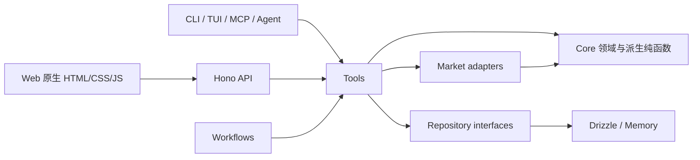
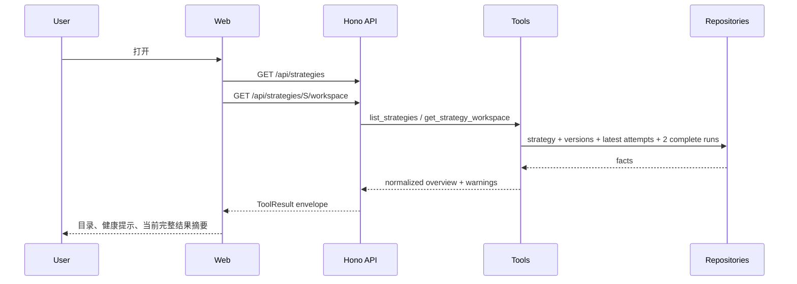
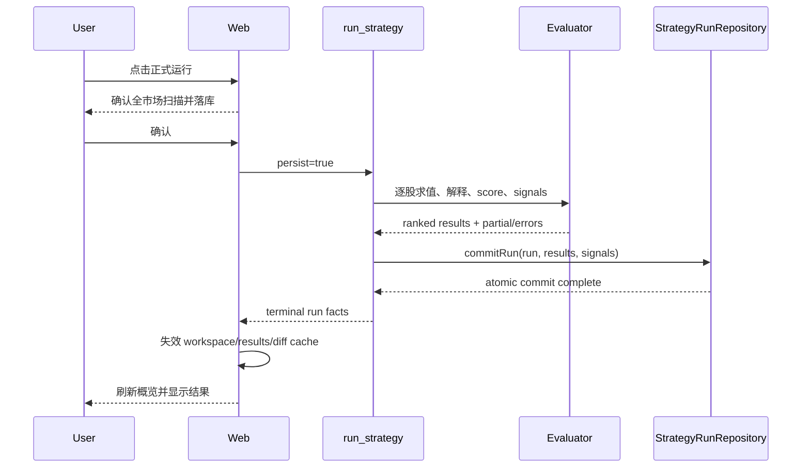

# 策略工作台（Strategy Workspace）详细设计

> 状态：草案 v0.1
> 日期：2026-08-01
> 对应需求：[策略工作台 PRD](../prd/strategy-v2.md)
> 上位约束：[CONTEXT.md](../../CONTEXT.md)、[架构说明](../ARCHITECTURE.md)、[安全说明](../SECURITY.md)
> 相关设计：[Strategy 与统一 Watchlist 详细设计](./strategy-watchlist-unification-detailed-design.md)、[Web 对话助手设计](./web-chat-design.md)
> 当前实现：`packages/core/src/entity/strategy.ts`、`packages/core/src/strategy/evaluator.ts`、`packages/tools/src/tools/strategy-query.ts`、`packages/tools/src/tools/run-strategy.ts`、`apps/web/src/server.ts`、`apps/web/public/js/target-pages.js`

## 1. 设计结论

策略工作台建立在现有事实链上，不恢复旧 `StockPool` 模型，也不为页面创建新的持久化投影：

```text
Strategy
  └── StrategyVersion       不可变规则定义
        └── StrategyRun     一次运行及数据审计事实
              ├── StrategyResult   逐股选择与逐规则求值事实
              └── StrategySignal   运行产生的信号事实
```

页面中的股票池、候选池、健康度和运行 Diff 均由上述事实确定性派生：

```text
最近一次持久化 complete run
  ├── selected=true                         → 股票池
  ├── all + 仅一条确定性规则未命中          → 规则近失
  ├── 全部规则命中 + rank > scoring.top     → 排名近失
  └── unknown/error/历史解释缺失             → 数据不完整

最近两次持久化 complete run
  └── 逐 stockId 比较派生 entered/exited/rank/score/blocking-rule 变化
```

本设计采用以下实现决策：

1. Phase A 不新增数据库表；扩展 JSON 契约并提供旧运行兼容读取；
2. 规则解释由 evaluator 保存结构化求值快照，Web 和 Agent 不重新解析表达式猜原因；
3. 派生规则放在 `core` 纯函数中，Tool、Web、MCP 共享同一语义；
4. Tool 返回规范化工作台视图，Web server 不直接访问 repository；
5. Web 保持 Hono + 原生 HTML/CSS/JS，沿用现有深色量化终端视觉和 split-pane 骨架；
6. partial/failed run 只出现在执行记录中，不覆盖当前有效股票池；
7. StrategySignal、候选和 score 都不等于 Advice，更不能触发交易；
8. Phase B 的调度采用独立运行配置，不写入不可变 Strategy DSL；
9. ranking-near-miss 默认展示 top 之后 20 条，调用方可在 1～100 内调整；
10. StrategySignal 直接创建 SignalObservation，WatchTrigger 观察链继续独立存在。

## 2. 范围

### 2.1 本设计包含

- Phase A0：规则解释、运行摘要和输入审计；
- Phase A1：概览、股票池、候选池、运行 Diff 和完整 Web 工作台；
- Phase B 的接口边界：调度、StrategySignal 真实表现和健康状态；
- Phase C 的接口边界：AI 生成版本草案、definition diff 和人工确认；
- Tool、repository、HTTP、前端状态、UI、测试和迁移方案。

### 2.2 本设计不包含

- 严格历史回测、组合收益、回撤、费用和滑点；
- 仓位、止盈止损和自动交易；
- 自动把 StrategyResult 同步到 Watchlist；
- 新的前端框架、构建链或设计系统；
- 让 LLM 重新执行规则或补造缺失的市场事实；
- Phase D 的历史数据快照与 point-in-time universe 实现。

## 3. 当前实现与差距

| 层 | 当前能力 | 主要差距 |
|---|---|---|
| Core | Strategy/Version/Run/Result/Signal 已存在；evaluator 支持 all/any、weighted score、top 和稳定排名 | 未命中仅保留布尔值，缺少结构化输入与解释；summary/inputSnapshot 是自由 record |
| Repository | run、results、signals 可落库，终态 run 可原子提交 | 按 run 查询 signal 需要先按 strategy 全量读取再过滤 |
| Tools | 可列出 run、读取 run/results/signals、按 stock 查 signal | 没有统一工作台摘要、结果分类、Diff 查询 |
| Web API | 已有策略 CRUD、校验、发布、试跑、正式运行和历史查询 | 前端需要多次拼装；没有派生视图与 Diff 端点 |
| Web UI | `#strategies` 已使用左目录、右详情；支持版本操作、试跑、正式运行和手工加入 Watchlist | 信息堆叠在单一详情区；无 tab、解释、候选、Diff、完整状态设计 |
| Observation | watch-trigger 已接 SignalObservation | source kind 尚不支持 strategy-signal |

设计不改变以下已成立的行为：

- `assignStableStrategyRanks` 按 score 降序、stockId 升序稳定排名；
- `scoring.top` 截断后的结果仍保留 score/rank，只把 `selected` 改为 false；
- `commitRun` 原子写入终态 run、results 和 signals；
- Web mutation 继续经过 token、Origin 和 side-effect 校验；
- 试跑 `persist=false` 不成为当前有效运行，也不参与默认 Diff。

## 4. 模块边界



依赖硬约束：

- `core` 不做 IO，不依赖 db、tools、workflows 或 surface；
- 派生分类和 Diff 是领域规则，必须位于 `core`；
- Tool 负责鉴权边界内的查询编排和 Zod 输入输出；
- Web server 只调用 Tool，不在 route 中复制候选或 Diff 算法；
- Workflow 只通过 `ctx.tools.*` 编排，不直接调用 repository；
- repository 新增方法必须同步 drizzle、memory 和 contract tests。

## 5. Core 设计

### 5.1 规则解释契约

现有 `RuleEvaluation` 保留 `ruleId/status/value/evidence/error`，新写入增加以下字段：

```ts
type RuleScope = 'selection' | 'entry' | 'exit' | 'risk';

interface RuleInputFact {
  path: string;
  status: 'available' | 'missing';
  value?: unknown;
}

interface RuleExplanation {
  code: 'matched' | 'not-matched' | 'missing-input' | 'evaluation-error';
  message: string;
}

interface RuleEvaluationV2 {
  schemaVersion: 2;
  ruleId: string;
  scope: RuleScope;
  expression: string;
  status: 'matched' | 'not-matched' | 'unknown' | 'error';
  value?: unknown;
  inputs: RuleInputFact[];
  explanation: RuleExplanation;
  evidence: string[];
  error?: string;
}
```

解释生成必须是 evaluator 的确定性行为：

| 情况 | code | message 口径 |
|---|---|---|
| 表达式为 true | matched | `规则「{name}」已命中` |
| 表达式为 false | not-matched | `规则「{name}」未命中：表达式求值为 false` |
| 依赖字段不存在 | missing-input | `缺少字段：{sorted paths}` |
| 解析或求值失败 | evaluation-error | 使用受控错误摘要，不暴露堆栈 |

`inputs` 只保存 `extractExpressionPaths(expression)` 返回的路径及其值，不复制整个 quote、indicator
或 meta 上下文。路径排序稳定，值必须可 JSON 序列化。证据模板只有在模板依赖完整时才插值。

`dataAsOf` 继续由外层 `StrategyResult.dataAsOf` 提供，避免在同一结果的每条规则中重复存储。
Tool 输出规则解释时必须同时返回结果级 `dataAsOf`。

### 5.2 历史兼容

数据库中的 `rule_evaluations_json` 可能包含旧结构，不能把新增字段直接设为无条件 required 后读取。
实现采用存储 schema 与规范化 schema 分离：

```text
StoredRuleEvaluationSchema = LegacyRuleEvaluationSchema | RuleEvaluationV2Schema
                                     │
                                     └── normalizeRuleEvaluation()
                                                │
                                                ▼
                                  RuleEvaluationViewSchema
```

旧记录规范化时：

- 保留已有 status/value/evidence/error；
- `explainability='legacy-unavailable'`；
- 不伪造 expression、inputs 或未命中阈值；
- 已入选结果仍可进入股票池；
- 未入选旧结果不进入候选池，归入“历史解释不可用”；
- 页面引导用户重新运行当前版本以获得完整解释。

新运行只写 V2。无需改 SQLite 列，JSON 兼容读取由 repository mapper 完成。

### 5.3 StrategyRun 审计 schema

自由 record 收口为带版本的 schema，同时为历史记录提供 legacy 分支：

```ts
interface StrategyRunSummaryV2 {
  schemaVersion: 2;
  universeCount: number;
  evaluatedCount: number;
  selectedCount: number;
  signalCount: number;
  partialCount: number;
  failedCount: number;
}

interface StrategyRunInputSnapshotV2 {
  schemaVersion: 2;
  strategyVersionId: string;
  definitionHash: string;
  evaluatorVersion: string;
  coverage: 'CN_A_SHARES_SH_SZ';
  stockIds: string[];
  stockIdChecksum: string;
  requestedBy: 'manual' | 'scheduled' | 'replay';
  universeCheckpoint?: {
    provider: string;
    syncedAt: Date;
  };
}
```

约束：

- `stockIds` 排序、去重后保存；checksum 使用 canonical JSON 的 SHA-256；
- `summary.universeCount === inputSnapshot.stockIds.length`；
- `evaluatedCount === results.length`；
- `selectedCount === results.filter(selected).length`；
- partial/failed 计数必须来自逐股执行结果，不能由 UI 猜测；
- provider 状态继续使用 `StrategyRun.providerStatuses`，不重复塞进 inputSnapshot；
- legacy run 可以展示已有字段，但标记 `auditStatus='legacy-partial'`。

这使运行可审计，但仍不宣称完整可重放；行情快照、历史 universe 和代码制品 identity 属于 Phase D。

### 5.4 结果视图分类

新增纯函数模块，建议路径 `packages/core/src/strategy/result-view.ts`：

```ts
type StrategyResultViewKind =
  | 'selected'
  | 'rule-near-miss'
  | 'ranking-near-miss'
  | 'incomplete'
  | 'excluded';

interface StrategyResultView {
  kind: StrategyResultViewKind;
  result: StrategyResult;
  blockingRuleIds: string[];
  distance?:
    | { kind: 'rule-count'; missingRuleCount: 1 }
    | { kind: 'rank'; rank: number; top: number; positionsAway: number };
}
```

分类顺序必须固定：

1. 任一 selection evaluation 为 unknown/error，或解释为 legacy-unavailable → incomplete；
2. `result.selected=true` → selected；
3. 定义有 `scoring.top`、所有 selection rule matched、score/rank 完整且 `rank > top`
   → ranking-near-miss；
4. `logic=all`、恰好一条 selection rule 为 not-matched、其余全部 matched
   → rule-near-miss；
5. 其余 → excluded。

`logic=any` 不生成 rule-near-miss。ranking-near-miss 默认只返回 `top + 1` 到 `top + 20`，Tool
允许调用方通过 `rankingWindow` 调整，最大 100。这个窗口只影响展示，不改变分类事实。

### 5.5 运行 Diff

建议路径 `packages/core/src/strategy/run-diff.ts`。输入是两个已规范化的运行视图和各自版本定义，输出：

```ts
interface StrategyRunDiffRow {
  stockId: string;
  before?: StrategyResultView;
  after?: StrategyResultView;
  changes: Array<
    | 'entered'
    | 'exited'
    | 'stayed'
    | 'candidate-promoted'
    | 'selected-demoted'
    | 'rank-changed'
    | 'score-changed'
    | 'blocking-rule-changed'
  >;
  rankDelta?: number;
  scoreDelta?: number;
}

interface StrategyRunDiff {
  fromRunId: string;
  toRunId: string;
  definitionChanged: boolean;
  summary: Record<DiffChangeKind, number>;
  rows: StrategyRunDiffRow[];
}
```

规则：

- 输入 run 必须属于同一 Strategy，且均为持久化终态；
- 默认比较由 Tool 限定为最近两次 complete run；
- 用户显式选择时可以比较 partial，但结果顶部必须标记不完整，不能成为当前默认视图；
- `definitionChanged = from.strategyVersionId !== to.strategyVersionId`；
- entered/exited 只依据 selected 的前后变化；
- candidate-promoted/selected-demoted 是附加标签，可与 entered/exited 同时存在；
- score delta 使用 `after - before`，缺少任一 score 时不返回；
- rule 阻断比较使用有序、去重的 ruleId；
- rows 最终按“entered、exited、其他变化、stockId”稳定排序；
- `REMOVED` 不写回 StrategyResult。

### 5.6 完整、部分、失败与空结果

| 状态 | 是否成为当前有效运行 | 页面语义 |
|---|---|---|
| complete + selected>0 | 是 | 正常股票池 |
| complete + selected=0 | 是 | 有效空结果，不显示错误 |
| partial | 是（可用基准） | 少数 unknown/error 股票不影响整体结果；结果直接作为当前股票池 |
| failed | 否 | 执行记录和异常提示可见；当前股票池不变 |
| running | 否 | 显示进行中；禁止重复提交同策略同版本的正式运行 |

“当前有效运行”的唯一规则是：该 Strategy 最新一条持久化 `status=complete` 或 `partial` 的 run。不能使用最新尝试、
最新 startedAt 或 Web 内存中的试跑结果代替；最近尝试为 failed/running 时回退到更早一条可用运行并给出 warning。

## 6. Repository 与存储

### 6.1 Phase A repository 变更

`StrategyRunRepository` 新增：

```ts
signalsByRun(runId: string): Promise<readonly StrategySignal[]>;
```

目的：`get_strategy_run` 不再调用 `signalsByStrategy` 后在内存中过滤全部历史。实现要求：

- drizzle 使用 `strategy_signals.run_id` 精确过滤，按 `ts DESC, id DESC`；
- memory 使用同样的排序；
- contract tests 覆盖不存在 run、空 signal、多 run 隔离和排序；
- 若 schema 尚无 `run_id` index，drizzle schema 与 `ensureSchema` 同步增加幂等索引。

不新增以下 repository：

- StockPoolRepository；
- CandidatePoolRepository；
- StrategyDiffRepository；
- LatestUsableRunRepository（complete 或 partial）。

最后一项可由现有 `listRuns({ strategyId, limit: 10 })` 拉取后在代码里过滤 complete|partial 表达，无需额外接口。

### 6.2 持久化与事务

- Phase A 继续使用 `strategy_runs`、`strategy_results`、`strategy_signals`；
- run 的终态、results 和 signals 必须继续通过 `commitRun` 一次提交；
- 派生视图不得在 run 事务内写入其他聚合；
- inputSnapshot/summary/ruleEvaluations 仍存原 JSON 列；
- 结构扩展不需要 DDL 数据迁移，但需要 mapper 兼容旧 JSON；
- 索引变更必须同步 Drizzle schema 和 `ensureSchema` SQLite DDL。

### 6.3 Phase B 调度存储

调度是可暂停、可修改的运行配置，不应改变 StrategyVersion 的 definitionHash。Phase B 新增独立实体：

```ts
interface StrategySchedule {
  id: string;
  strategyId: string;
  cron: string;
  timezone: string;
  enabled: boolean;
  nextRunAt?: Date;
  lastRunId?: string;
  createdAt: Date;
  updatedAt: Date;
}
```

调度器只触发 `run_strategy`，并生成 `mode='scheduled'` 的 StrategyRun；不得创建 Advice 或交易。
具体 cron 解析、抢占和多实例锁另立 Phase B 实施设计，不在 Phase A 建表。

## 7. Tool 契约

所有 schema 使用 Zod 定义并派生 TypeScript、MCP 和 OpenAI schema；所有失败返回 `ToolResult`。

### 7.1 保留并调整现有 Tool

| Tool | 调整 |
|---|---|
| `list_strategies` | 保持现有过滤；不在列表接口内加载全量 results |
| `get_strategy` | 保持 Strategy + versions 事实查询 |
| `list_strategy_runs` | 保持倒序和 limit；输出规范化 audit status |
| `get_strategy_run` | 改用 `signalsByRun`；返回规范化 rule explanations 和涉及股票的 identity map |
| `run_strategy` | 写 V2 summary/inputSnapshot/evaluations；正式运行继续原子提交 |
| `strategy_signals_by_stock` | 保持 signal ≠ Advice 的描述与 read 副作用 |

所有面向 Web、Agent 或 MCP 的策略查询视图统一使用展示身份契约，但不修改 StrategyResult 和
StrategySignal 事实：

```ts
interface StockIdentityView {
  stockId: string;
  stockName: string;
  nameStatus: 'resolved' | 'unavailable';
}
```

Tool 优先一次读取本地 StockUniverse/Stock repository 并按 stockId 建立 map，禁止逐行调用外部搜索。
未解析到历史股票名称时返回 `stockName='名称暂缺'`、`nameStatus='unavailable'` 和 warning，不能省略
stockName 或用代码冒充名称。`get_strategy_run` 以 companion identity map 补充现有 results/signals，
避免改变持久化事实；新的结果视图和 Diff row 直接携带 `stock` 字段。

### 7.2 新增 `get_strategy_workspace`

输入：

```ts
{ strategyId: string }
```

输出：

```ts
{
  strategy: Strategy;
  currentVersion?: StrategyVersion;
  latestAttempt?: StrategyRun;
  currentRun?: StrategyRun;
  previousCompleteRun?: StrategyRun;
  overview: {
    selectedCount?: number;
    ruleNearMissCount?: number;
    rankingNearMissCount?: number;
    incompleteCount?: number;
    enteredCount?: number;
    exitedCount?: number;
    maxAbsRankDelta?: number;
    health: 'ready' | 'never-run' | 'running' | 'partial' | 'failed';
  };
  warnings: string[];
}
```

无 complete run 时计数为 absent，不返回伪造的 0。`health` 反映最新尝试，`currentRun` 仍严格指向最近
complete run，因此“当前结果”和“最近失败”可以同时展示。

### 7.3 新增 `list_strategy_result_views`

输入：

```ts
{
  strategyId: string;
  runId?: string; // 省略时使用 current complete run
  view: 'selected' | 'rule-near-miss' | 'ranking-near-miss' | 'incomplete' | 'excluded';
  rankingWindow?: number; // default 20, max 100
  query?: string;         // stockId 精确/前缀搜索
  sort?: 'rank' | 'score' | 'stock-id';
  order?: 'asc' | 'desc';
  offset?: number;
  limit?: number;         // default 50, max 200
}
```

输出包含 run/version、总数、分页 rows 和 `dataAsOf`。每个 row 包含 `stock: StockIdentityView`、
result、分类、阻断规则和可展示解释。Tool 必须校验显式 runId 属于 strategyId。

Phase A 可以在 Tool 内读取单次 run 的全部 results 后分类、排序、分页；当单次结果规模或调用频率证明
存在瓶颈后，再为 repository 增加带索引的查询，不提前创建派生表。

### 7.4 新增 `compare_strategy_runs`

输入：

```ts
{
  strategyId: string;
  fromRunId?: string;
  toRunId?: string;
}
```

缺省时选择最近两次 complete run；只提供一个 ID 时返回 invalid-input。显式 run 必须属于同一
Strategy。输出使用 §5.5 的 `StrategyRunDiffSchema`，每个 Diff row 补充 `stock: StockIdentityView`，
并附带两个 version 摘要和 provider 状态。

### 7.5 副作用

| Tool | sideEffect |
|---|---|
| 工作台、结果视图、Diff 查询 | read |
| 样本试跑（读取外部行情） | external |
| 持久化正式运行 | external；内部包含明确持久化语义 |
| 创建草案、校验、发布、调度修改 | write 或 external，沿用现有显式 opt-in |
| AI 洞察 | advice 或受控 LLM 推理，不得调用 trade |

`trade` Tool 不通过 MCP 暴露，任何 Strategy workflow 都不得包含交易步骤。

## 8. HTTP API

### 8.1 Route 映射

| Method | Route | Tool | 说明 |
|---|---|---|---|
| GET | `/api/strategies/:id/workspace` | `get_strategy_workspace` | 首屏摘要 |
| GET | `/api/strategies/:id/results` | `list_strategy_result_views` | 股票池、候选和数据不完整 |
| GET | `/api/strategy-runs/compare` | `compare_strategy_runs` | 运行 Diff |
| GET | `/api/strategy-runs/:id` | `get_strategy_run` | 单次运行详情 |
| POST | `/api/strategies/:id/run` | `run_strategy` | 保持现有试跑/正式运行 |

query 参数只负责转换为 Tool input；枚举、limit 和 run 归属由 Tool schema/handler 再校验。HTTP route
不得自己实现 classification 或 diff。

### 8.2 返回与错误

- 保持现有 `{ ok: true, data } / { ok: false, error }` envelope；
- not_found 用于 strategy/run 不存在；
- invalid_input 用于跨 Strategy 比较、单边 runId 和非法分页；
- adapter_error 用于外部行情失败；
- partial 是领域运行状态，不通过 HTTP 500 表示；
- workspace 可以带 `warnings` 降级，但不能把 currentRun 读取失败伪装成空池；
- 错误响应不得包含表达式求值堆栈、token、provider credential 或私人投资数据。

### 8.3 缓存与并发

- 首屏 workspace 请求内复用 strategy/version/run/results 查询；
- GET 响应可使用短时私有缓存，但 cache key 必须包含 strategyId、runId 和 view；
- 正式运行按钮在客户端提交期间禁用；服务端 Phase A 保持现有运行语义；
- Phase B 增加同 strategyId + versionId 的运行锁，冲突返回已有 ToolError 模型；
- 新 complete run 提交后，workspace、result view 和 diff 缓存一并失效。

## 9. Web 信息架构

保留现有一级路由 `#strategies`，选中态写入 hash query，支持刷新和分享定位：

```text
#strategies?strategyId={id}&tab={overview|pool|candidates|runs|insights|settings}
            [&runId={id}][&compareRunId={id}][&view={kind}]
```

没有 strategyId 时：

- 桌面端显示策略目录和右侧空状态；
- 移动端先显示策略目录；
- 仅有一个策略时不自动选择，避免刷新后触发用户未预期的大查询；
- 创建成功后显式导航到新 strategyId 的设置 tab。

页面结构：

```text
策略
├── 策略目录
└── 策略工作台
    ├── 概览
    ├── 股票池
    ├── 执行记录
    ├── AI 洞察
    └── 设置
```

> 2026-08-02：候选池 tab 已从工作台下线（用户拍板「只看股票池」），
> 后端 view kind（rule-near-miss / ranking-near-miss）与 core 派生保留，仅前端下线。
> 同日第二次修订：「数据不完整」视图一并下线，股票池为纯入选列表（分页 + 搜索），
> kind（incomplete）仍保留供 API 与未来 UI 使用。

“创建策略”和“模板中心”继续通过现有 modal 进入，不新增一级侧栏项。

## 10. Web 页面详细设计

### 10.1 视觉方向与现有规范

页面定位为“量化研究控制台”，严格复用项目现有视觉语言：

- 背景使用 `--bg`、`--panel`、`--panel-2` 与细网格，不新增浅色页面；
- 交互主色使用 `--accent` 电青色，激活态使用 `--accent-soft`；
- 正文使用 `--font-body`，标题使用 Rajdhani，代码、数字和时间使用 `--font-mono`；
- 所有计数、score、rank、delta 使用 `font-variant-numeric: tabular-nums`；
- A 股行情方向保持红涨 `--pos`、绿跌 `--neg`；
- `--pos/--neg` 不单独承担运行状态含义，错误/成功必须同时有图标或文本；
- warning/partial 使用 `--warning`，数据说明可使用 `--info`/`--tea`；
- 复用 `.route-header`、`.card`、`.card-header`、`.btn`、`.badge`、`.table-wrap`、
  `.split-pane`、`.entity-row`、`.entity-item`、`.status`、`.placeholder`；
- 新样式只使用 CSS token，不在组件中散落新的 hex 颜色；
- 不使用渐变标题、紫色 AI 装饰、悬浮聊天气泡或与现有页面无关的卡通插画。

### 10.2 股票标识与行情入口

策略工作台内所有出现股票的区域统一复用首页看板的视觉层级：名称在上、完整代码在下。适用范围包括：

- 股票池和候选池；
- 执行记录展开后的 StrategyResult 与 StrategySignal；
- 运行 Diff；
- AI 洞察中的股票事实引用；
- 设置页展示的关联 signal 标的。

标准组件：

```text
┌──────────────────┐
│ 比亚迪           │  ← stockName，正文颜色，中等字重
│ 002594.SZ        │  ← stockId，mono + muted
└──────────────────┘
```

交互规范：

- 两行必须位于同一个真实 `<a>` 中，整个股票标识区域均可点击；
- `href` 使用现有 `buildMarketLink(stockId)`，结果为 `#market?stockId={stockId}&range=3m`；
- 不拦截浏览器默认修饰键，因此支持新标签页、复制链接和返回/前进；
- accessible name 为 `查看 {stockName}（{stockId}）行情`；
- 表格有展开、Watchlist、Advice 等操作时，不把整行设为链接，避免嵌套交互和误触；
- 没有其他行内操作的紧凑列表可以像首页看板一样让整行导航，但名称/代码仍保持两行；
- 名称超长时单行省略，完整代码不得截断；
- 名称缺失显示“名称暂缺”，第二行仍展示 stockId，链接继续可用；
- 不允许只显示 stockId、把名称和代码写在同一行，或点击后默认进入研究/AI 页面。

前端应把 `pages.js` 中的单行 `stockMarketLink` 收口为共享 `stockIdentityLink` 组件，供首页看板、
策略工作台及其他股票列表复用。组件只负责身份展示和行情链接，不请求数据；名称由 Tool 提供。

### 10.3 桌面布局

```text
┌─────────────────────────────────────────────────────────────────────────────┐
│ 策略 / Strategy Workspace                         [+ 新增策略]              │
├───────────────────┬─────────────────────────────────────────────────────────┤
│ 策略目录          │ 趋势动量 v4   [运行中]        [样本试跑] [正式运行]      │
│ ┌───────────────┐ │ 数据截止 08-01 15:10 · 最近可用运行 15:13               │
│ │ 趋势动量  ●   │ ├─────────────────────────────────────────────────────────┤
│ │ 低波红利      │ │ 概览  股票池  执行记录  AI 洞察  设置           │
│ │ 事件反转      │ ├─────────────────────────────────────────────────────────┤
│ └───────────────┘ │ [当前 38] [规则近失 12] [排名近失 20] [新增 4/退出 2]   │
│                   │                                                         │
│                   │ 主 tab 内容：表格 / Diff / 规则解释 / 版本              │
└───────────────────┴─────────────────────────────────────────────────────────┘
```

- 外层继续使用 `.split-pane` 的 280～360px 目录列；
- 右侧 detail card 内部由 header、tabs、summary strip 和 tab panel 组成；
- 右侧 header 的状态、版本、dataAsOf 永远可见，tab 切换不重复渲染；
- 正式运行是 primary，样本试跑是 outline；发布等高风险动作位于设置页；
- 卡片不无限嵌套，统计块使用扁平边界和现有间距节奏。

### 10.4 策略目录

每行展示：

- 名称；
- active/draft/paused/archived badge；
- 当前版本；
- 当前股票数或 `尚无可用运行`；
- 最近尝试异常时显示带文字的 warning 标记。

交互：

- 复用 `.entity-row.selected`；
- 目录搜索仅在策略数超过 8 时展示；
- 状态过滤使用原生 select，不新增复杂 filter builder；
- 选择后更新 hash query，返回/前进恢复选中项和 tab；
- 列表刷新不得清空仍存在的 selectedStrategyId。

### 10.5 工作台头部与概览

头部展示：名称、描述、owner、状态、当前版本、definitionHash 短值、dataAsOf、最近可用运行和最近尝试。

概览首行四个核心统计：

1. 当前股票数；
2. 规则近失；
3. 排名近失；
4. 本次新增/退出。

第二层展示 provider 完整度、partial/failed 计数和最大排名变化。无有效 run 时显示一块明确空状态：

```text
尚无可用运行
发布有效版本后可进行样本试跑或正式运行。试跑不会成为当前股票池。
```

若最新尝试失败或进行中但存在旧的可运行（complete 或 partial），页面同时展示：

- 顶部 warning：`最近运行失败，当前结果仍来自 2026-08-01 15:13 的运行`；
- 统计继续来自 current run；
- “查看失败详情”跳到执行记录并选中失败 run。

### 10.6 股票池 tab

> 2026-08-02（第二次修订）：股票池不再细分，「数据不完整」视图也已从工作台下线；
> 池区域为纯入选（selected）股票列表，保留分页（每页 50）与代码/名称搜索。
> 后端 view kind（rule-near-miss / ranking-near-miss / incomplete）与 core 派生全部保留，仅前端无 UI 入口。

默认列：

| 列 | 内容 |
|---|---|
| 股票 | 上方 stockName、下方完整 stockId；两行组成行情页链接 |
| 排名 | rank；无 scoring 显示 `--` |
| 分数 | score；明确标注为规则分，不显示百分号或概率 |
| 关键命中 | 最多两条 matched rule，剩余用 `+N` |
| 数据截止 | StrategyResult.dataAsOf |
| 变化 | 新增/连续、rank delta；没有 previous run 时显示 `无比较基线` |
| 操作 | 查看解释、研究档案、加入 Watchlist、主动生成 Advice |

点击“查看解释”在当前行下方展开 rule evaluation，不用 modal：

- selection 与 entry/exit/risk 分组；
- 每条展示状态、规则名、表达式、实际输入、解释和 evidence；
- unknown/error 固定展示缺失路径或受控错误；
- legacy-unavailable 显示“历史运行未保存详细解释”；
- 展开区使用 `aria-expanded`，再次点击折叠。

“加入 Watchlist”继续调用现有手工成员路径，source 为 manual，不写 StrategyResult，也不结束其他来源。
“研究档案”保留为独立操作；点击名称或代码始终进入行情页。

### 10.7 候选池视图（已从工作台下线）

> 2026-08-02：候选池 tab 下线，随后「数据不完整」视图也一并下线（股票池为纯入选列表）；
> near-miss 与 incomplete 两类视图均不再有 UI 入口，本节与 10.6 的交互描述保留作 kind 语义存档。

原 tab 使用次级 segmented tabs：

```text
[规则近失 12] [排名近失 20] [数据不完整 7]
```

规则近失列出唯一 blocking rule、实际输入、解释和 dataAsOf。排名近失列出 rank、top、positionsAway、
score 和命中规则。数据不完整列出 missing paths/error，并明确“不计入候选数量”。

约束：

- 不显示“成功率”“潜力”“买入”等措辞；
- 不用 score 推导 logic=any 的规则距离；
- 规则近失和排名近失为空时显示有效空状态，而不是请求失败；
- ranking window 顶部显示 `展示 Top N 后 20 名`，允许切换 10/20/50；
- 分页、搜索和排序写入局部 state，不必全部写入 hash。
- 三个候选区块的股票列均使用 §10.2 的两行行情链接，不允许退化为纯代码。

### 10.8 执行记录 tab

桌面采用时间线表格，默认按 startedAt 倒序：

| 字段 | 说明 |
|---|---|
| 时间 | startedAt/finishedAt 与耗时 |
| 模式 | scan/scheduled/replay/backtest；当前产品不把 backtest 解释为严格回测 |
| 版本 | vN + definitionHash 短值 |
| 状态 | complete/partial/failed/running，文字与 badge 同时存在 |
| 摘要 | universe/evaluated/selected/signal/partial/failed |
| Provider | 完整、部分或失败来源 |
| 操作 | 查看详情、设为 Diff 起点/终点 |

Diff 默认比较最近两次 complete run。用户选择 from/to 后显示：

- 两个 run 的版本和 dataAsOf；
- 跨版本时固定 warning：`定义已变化，以下差异不能单独归因于市场`；
- entered/exited/candidate-promoted/selected-demoted 计数；
- score/rank/blocking rule 变化表；
- partial run 被显式选择时显示不完整警告。

运行详情继续包含 results 与 signals，但不把 signal 条数当作入选数。result、signal 和 Diff 行中的
股票均使用 §10.2 的两行行情链接。

### 10.9 AI 洞察 tab

Phase A 展示占位说明，不发起 LLM 请求。Phase B 只有在存在可审计事实时展示：

- 30 天进入/退出、候选转正和规则阻断频次；
- StrategySignal 的 T+1/T+3/T+5/T+20 观察；
- 样本数、缺失率、benchmarkStatus 和观察截止时间；
- 版本变化前后的事实差异；
- “生成改进草案”入口。

AI 输出使用普通研究区块，不做聊天气泡。每个结论必须能展开查看引用 run/signal/observation。样本不足时
展示 unavailable，不显示胜率预测或未来收益概率。

### 10.10 设置 tab

设置页包含：

- Strategy 基本信息；
- 版本历史和 validation status；
- definition JSON（等宽字体、只读查看或草案编辑）；
- 创建模板版本、校验、发布、暂停和恢复；
- 引用该 StrategySignal 的 AlertPlan；
- Phase B 的调度状态。

已发布版本只读。编辑总是创建 `parentVersionId` 指向当前版本的新草案。发布前顺序固定：

```text
查看 definition diff → 静态校验 → 显示错误/依赖 → 用户确认 → 发布
```

发布、暂停、恢复和正式运行使用现有 confirm modal；按钮提交期间 disabled，完成后通过 toast 和页面内状态
双重反馈。关闭 modal 不提交。

### 10.11 移动端与响应式

现有断点保持不变：

- `<=1020px`：`.split-pane` 变单列，目录位于工作台上方；
- `<=640px`：route header 和动作纵向排列；策略 tab 横向滚动；
- 数据表保留 `.table-wrap` 横向滚动，避免把 score/rank 拆成难比较的卡片；
- 股票列在横向表格中 sticky，保持名称在上、代码在下，背景使用 panel token；
- 次要操作收进每行“更多”菜单，保留查看解释主操作；
- 可点击目标最小高度 40px；
- modal 宽度不超过 viewport，JSON textarea 高度可视区内滚动；
- 返回策略目录按钮只在移动端工作台顶部显示。

### 10.12 无障碍与动效

- tabs 使用 `role="tablist"/"tab"/"tabpanel"` 和 `aria-selected`；
- 左右方向键切换 tab，Enter/Space 激活；
- 所有 icon button 有可读 label；
- 股票身份链接使用 `查看 {stockName}（{stockId}）行情` 作为 accessible name；
- table 使用 `th scope="col"`，排序按钮声明当前方向；
- 请求状态放入 `aria-live="polite"`；
- 状态不只依赖颜色，始终有中文文本；
- focus 使用现有可见 focus ring；
- 规则展开按钮维护 `aria-expanded` 和 `aria-controls`；
- 遵守 `prefers-reduced-motion`，不新增不可关闭的循环动画；
- route 首次进入可复用现有 rise 动效，tab 切换不重复播放整页动画。

### 10.13 页面状态矩阵

| 状态 | 目录 | 右侧工作台 |
|---|---|---|
| 首次加载 | skeleton/加载文案 | 保持空壳，不闪现旧策略数据 |
| 无策略 | 创建引导 | 模板中心与新增策略入口 |
| 未选择 | 正常列表 | “选择策略查看工作台” |
| 无版本 | 状态 badge | 设置页引导创建版本 |
| 无 complete run | 正常 header | 概览空状态；池/候选不可用说明 |
| complete 空结果 | 当前数量 0 | 有效空池，展示 dataAsOf |
| 最新 partial | warning | 旧 complete 结果 + partial 提示 |
| 最新 failed | danger text | 旧 complete 结果 + 失败详情入口 |
| 请求失败 | 保留可用列表 | inline error + 重试，不清空最后成功数据 |
| 正式运行中 | 当前策略 running 标记 | 按钮 disabled + 进度文案 |

## 11. 前端代码组织

策略工作台复杂度已经超过 `target-pages.js` 中单个详情函数的合理边界。建议新增：

```text
apps/web/public/js/
├── strategy-workspace.js       页面状态、请求编排、DOM 渲染与事件
├── strategy-workspace.test.js  纯函数与 DOM 行为测试
├── stock-link.js               共享的名称/代码两行行情链接组件
├── stock-link.test.js          href、缺失名称、键盘语义与安全文本测试
├── target-pages.js             保留入口并委托 renderStrategies
├── api.js                      复用 callApi/token
├── modal.js                    复用 confirm/prompt
└── ui.js                       复用 el/mount/format helpers
```

状态模型：

```ts
interface StrategyWorkspaceState {
  strategyId: string;
  tab: 'overview' | 'pool' | 'candidates' | 'runs' | 'insights' | 'settings';
  runId?: string;
  compareRunId?: string;
  candidateView: 'rule-near-miss' | 'ranking-near-miss' | 'incomplete';
  rankingWindow: 10 | 20 | 50;
  requestEpoch: number;
}
```

实现规则：

- durable selection 写入 hash query；loading、expanded rows、分页保留在模块内；
- 每次策略切换增加 requestEpoch，旧请求返回后不得覆盖新策略 DOM；
- workspace 首屏一次请求，pool/candidate/runs tab 首次进入时懒加载；
- tab 数据按 strategyId + runId + view 缓存，新 complete run 后清空该策略缓存；
- DOM 通过 `el` 和 `textContent` 构造，不拼接未转义 HTML；
- 事件使用 `addEventListener`，不使用 inline handler；
- 渲染函数拆成可测纯映射与薄 DOM 层；
- 不引入 React、Vue、状态管理库或新 bundler。

建议新增的 scoped class：

```text
.strategy-workspace
.strategy-workspace-head
.strategy-tabs
.strategy-summary-grid
.strategy-health-banner
.strategy-result-table
.strategy-rule-evaluation
.strategy-diff-strip
.strategy-run-timeline
.strategy-empty-state
```

这些 class 只组织布局；按钮、badge、card、table、status 的视觉继续复用公共 class。

## 12. 关键数据流

### 12.1 页面进入



### 12.2 正式运行



正式运行失败时不修改上一次 complete run 的派生视图。

### 12.3 运行 Diff

```text
选择/默认 from、to
  → Tool 校验同一 Strategy
  → 读取两个 run/version/results
  → core 分类每条结果
  → core 对 stockId 并集做确定性 Diff
  → Web 展示 summary + rows + 定义变化警告
```

## 13. Phase B：真实信号观察

### 13.1 Source kind

`SignalObservationSourceKindSchema` 增加 `strategy-signal`，保留 `tactic-signal` 只用于历史读取：

```ts
z.enum(['watch-trigger', 'strategy-signal', 'tactic-signal'])
```

新数据不得再写 `tactic-signal`。StrategySignal observation 使用：

- `sourceKind='strategy-signal'`；
- `sourceId=StrategySignal.id`；
- horizon 为 t1/t3/t5/t20；
- baseline 使用 signal.ts 后第一个可用交易时点的受控价格；
- provenance 明确 provider、dataAsOf 和缺失原因。

### 13.2 生成流程

持久化 StrategyRun 成功后，由独立可重试 tool/workflow 为每个 StrategySignal 创建 pending observations。
该步骤不放入 `commitRun` 事务，避免外部行情或 observation 写入拖垮运行事实。

幂等键继续使用：

```text
signal-observation:strategy-signal:{signalId}:{horizon}
```

观察 workflow 只调用 tools，按交易日补齐价格；不可用时写 unavailableReason。页面聚合必须展示：

- 样本数；
- pending/complete/unavailable 数；
- 观察窗口；
- 平均 return/MFE/MAE；
- benchmarkStatus；
- 数据截止时间。

这些指标是信号后的事实观察，不是回测组合收益，也不能自动生成 Advice。

## 14. Phase C：AI 版本迭代

Phase C 不新增 StrategyImprovementProposal 聚合。AI 产物落为普通 StrategyVersion 草案：

- `parentVersionId` 指向分析基线；
- `changeSummary` 保存用户可读摘要；
- agent_run 保存调用、证据引用和工具轨迹；
- definition 必须通过同一 DSL schema；
- AI 不能写已发布 version；
- AI 不能自动校验、发布、激活或运行；
- 用户看到 definition diff 和影响说明后逐步确认。

AI 输入只能引用：run diff、rule evaluation、provider status、SignalObservation 和现有研究事实。输出必须区分
事实、推断和建议，并保留风险、反证与数据限制。

## 15. 安全与隐私

- 所有 Web mutation 继续执行 bearer token 和 Origin 校验；
- read/external/write/advice 副作用声明不能因聚合端点被弱化；
- 表达式错误只返回受控摘要，不泄漏堆栈或 adapter 参数；
- inputSnapshot 只保存股票集合与数据身份，不保存 token、API key 或请求 header；
- Web 不把私人 Watchlist、持仓或 Advice 拼入策略公共描述；
- “主动生成 Advice”走既有 Advice 契约，保留反证、风险、免责声明和有效期；
- StrategySignal、候选、Diff、score 均不得翻译为自动交易指令；
- MCP 继续不暴露 trade tool，`LUOOME_EXPOSE_TRADE=true` 硬卡不变。

## 16. 测试设计

### 16.1 Core

- matched/not-matched/unknown/error 都保存稳定 explanation 和 input paths；
- 缺失路径排序、去重且不保存整个上下文；
- legacy evaluation 规范化不伪造解释；
- all 恰好一条 not-matched → rule-near-miss；
- all 两条 not-matched → excluded；
- any 未命中 → excluded；
- unknown/error/legacy → incomplete；
- top 截断结果保留 score/rank 并进入 ranking-near-miss；
- ranking window 不改变分类；
- Diff entered/exited/candidate promotion/demotion/rank/score/blocking rule；
- 跨版本 definitionChanged；
- 稳定排序与空结果。

### 16.2 Repository

- drizzle 与 memory 的 `signalsByRun` contract 一致；
- commitRun 仍具原子性；
- V2 JSON round-trip；
- legacy JSON 可读；
- run_id index 在新库和存量库启动时幂等；
- 同 strategy 不同 run 的 signal 不串读。

### 16.3 Tools

- workspace 选择最新 complete，而不是最新 partial/failed；
- 无 complete run 时计数 absent；
- complete empty 返回 selectedCount=0；
- result views 校验 run 归属、分页和 rankingWindow；
- compare 默认选择最近两次 complete；
- 单边 runId、跨 Strategy 和不存在 run 返回正确 ToolError.kind；
- get_strategy_run 不扫描整个 Strategy signal 历史；
- schema 能派生 MCP/OpenAI 定义。

### 16.4 Web server

- route 到 Tool input 的参数映射；
- ToolResult envelope 和错误状态；
- read route 不绕过 tools；
- mutation token/Origin 行为不回归；
- partial/failed 作为业务数据返回，不误报 500；
- warnings 降级不会伪造 current run。

### 16.5 Web 前端

- hash query 的 parse/serialize 和返回前进；
- 快速切换策略时旧请求不会覆盖新页面；
- tab 懒加载和缓存失效；
- complete empty、never-run、partial、failed、legacy explanation 状态；
- rule explanation 展开/折叠与 aria 属性；
- Diff 跨版本 warning；
- 正式运行确认、重复点击保护和失败后恢复按钮；
- score 不带百分号，红绿只用于明确方向；
- 所有 stock result/signal/diff 均展示名称和完整代码，点击股票标识进入默认 3m 行情页；
- 名称缺失时展示“名称暂缺”，不省略第二行代码；
- DOM 使用 textContent，不产生注入。

### 16.6 浏览器验收

文档实现完成后必须实际启动 Web 并验证：

- 1320px 桌面：目录/工作台比例、统计对齐、表格和展开解释；
- 1020px：split-pane 单列；
- 640px：header、tabs、表格滚动、modal 和触控目标；
- 键盘完成目录选择、tab 切换、展开规则、运行确认；
- 键盘和鼠标点击股票名称或代码均能进入对应行情页，浏览器返回可恢复策略工作台；
- reduced-motion；
- never-run、complete empty、partial over complete、failed over complete 四类关键状态；
- 深色背景、accent、A 股红涨绿跌和现有页面一致。

交付前按改动范围运行：

```bash
bun run test
bun run test:db
bun run test:web
bun run typecheck
bun run lint
```

## 17. 分期与实施顺序

### Phase A0：解释与审计

1. 增加 V2 rule evaluation、summary、input snapshot schema；
2. evaluator 写结构化解释；
3. legacy mapper 与 repository round-trip；
4. `signalsByRun` 和 get_strategy_run 优化；
5. 执行记录先展示完整审计事实。

### Phase A1：派生视图与 Web 工作台

1. core result-view 与 run-diff；
2. workspace/result-view/diff tools；
3. Hono routes；
4. strategy-workspace.js、HTML 容器和 scoped CSS；
5. 概览、股票池、候选池、执行记录和 Diff；
6. 单元、db、web 与浏览器验收。

### Phase B：自动运行与真实观察

1. StrategySchedule 独立实施设计；
2. scheduled run 和并发锁；
3. strategy-signal observations；
4. 观察聚合与 AI 洞察事实区；
5. AlertPlan 引用关系展示。

### Phase C：AI 版本迭代

1. definition diff；
2. 事实引用与 prompt contract；
3. AI 生成新版本草案；
4. 样本试算；
5. 用户确认校验和发布。

Phase D 严格回测必须等待 Strategy DSL PRD 中的历史数据前置条件全部满足。

## 18. 验收门槛

Phase A 完成必须同时满足：

- 股票池、候选和 Diff 都能从 run/results 确定性重算；
- 不存在新的 StockPool/CandidatePool/Diff 持久化表；
- 每条新运行规则均有可审计解释，历史缺失被明确标记；
- partial/failed 不覆盖上一 complete 结果；
- Web、Tool、MCP 使用同一分类和 Diff 规则；
- Web 视觉、响应式、无障碍和交互符合现有 UI 规范；
- 正式运行、发布和 AI 草案保持明确确认；
- Strategy 路径没有新增任何交易能力；
- 相关测试、typecheck、lint 和浏览器验收通过。

## 19. 后续独立设计项

以下内容已确定方向，但在进入对应 Phase 前仍需独立实施设计：

1. StrategySchedule 的 cron 语法、时区、节假日、补跑、并发锁和多实例 ownership；
2. StrategySignal baseline price 的具体交易时点与 provider fallback；
3. 大规模 result 查询达到瓶颈后的索引或物化策略；
4. 显式“订阅策略到 Watchlist”的 opt-in 投影、完整同步和 stale 语义；
5. Phase D point-in-time universe、行情快照和 evaluator code identity。

在这些设计完成前，页面不得提前暴露不可生效的调度设置、自动 Watchlist 同步或严格回测指标。
