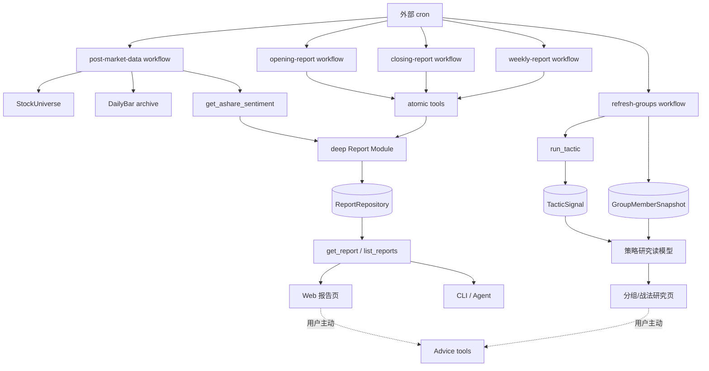

# Vibe A 股市场报告与策略研究迁移详细设计

> 状态：**Phase 0～5 已完成；旧 Tactic/StockGroup/ResearchNote 仅作为迁移历史术语，当前实现以 Strategy/Watchlist/ResearchTopic 为准**
>
> 日期：2026-07-29
>
> 产品输入：[ruo 能力迁移产品设计](../prd/ruo-feature-migration-product-design.md)、
> [统一 Watchlist](../prd/watchlist.md)
>
> 技术依赖：[行情数据底座详细设计](./market-data-and-stock-universe-detailed-design.md)、
> [Strategy 与统一 Watchlist 详细设计](./strategy-watchlist-unification-detailed-design.md)、
> [ruo 能力迁移详细设计](./ruo-feature-migration-detailed-design.md)、
> [连板天梯详细设计](./limit-up-ladder-detailed-design.md)
>
> 参考实现：`/Volumes/mm/project/Vibe-Trading` 的 A 股市场报告与策略市场

本文是 Vibe-Trading「A 股市场报告」与「策略市场」迁入 luoome 的实现事实来源。
产品语义以 PRD 和 [CONTEXT.md](../../CONTEXT.md) 为准；行情底座契约以
[行情数据底座详细设计](./market-data-and-stock-universe-detailed-design.md)及其落地代码为准。
本文不要求兼容 Vibe 的 Python Interface、文件格式、内置调度或页面路由。
文中早期迁移表保留 `Tactic`、`StockGroup`、`ResearchNote` 等历史名称仅用于追溯；当前代码与
维护文档以 `Strategy`、`Watchlist`、`ResearchTopic/ResearchDocument` 为准。

## 1. 结论

迁移采用“能力重写”，不做代码平移：

1. 新建深 `Report` Module，负责报告状态、不变量、结构化内容、幂等持久化与历史。
2. 新建 `AShareSentimentSnapshot` 值对象，承接 Vibe 中可验证的指数、市场宽度、涨停、
   炸板、连板、封单和热点事实。
3. 开盘、收盘、周报分别由 workflow 编排原子 tool；自动运行使用外部 cron。
4. 报告正文以结构化 section/block 为事实源；Markdown 只是派生展示格式。
5. 报告可以自动生成事实摘要，但不会自动生成 Advice，更不会触发 Trade。
6. Vibe「策略市场」不迁成新的 `Strategy` 实体、注册表、内存 store 或一级导航。
7. 首期策略研究复用 `Tactic`、`TacticSignal`、`StockGroup`、`GroupMemberSnapshot` 和
   `WorkflowRun`；复杂横截面算法以后通过 `strategy` resolver Seam 接入。
8. 共振结果是同一交易日、同一 coverage 下的信号事实聚合，不叫“置信度”，不输出操作建议。
9. 回测曲线和收益指标等到 `SignalObservation`、复权、费用、基准与样本口径完整后再建设。
10. 共享前置是当前工作树已基本落地的 `StockUniverse` 目录主链路，以及仍待完成的
    `all-stocks` coverage、规范 `DailyBar`、交易日历、MarketSnapshot envelope 与盘后数据归档。

## 2. 范围

### 2.1 本文覆盖

- `Report` core schema、不变量、repository 和 SQLite 表。
- `AShareSentimentSnapshot` 及其 Adapter/Manager/tool Seam。
- 开盘、收盘、周报的 section 模板、workflow、幂等和 partial 语义。
- 报告历史、详情、Markdown 导出、通知状态和 Web/CLI 消费。
- Vibe 五个可见策略到 luoome 领域概念的逐项映射。
- 策略研究读模型、分组快照演进、同日共振规则和刷新 workflow。
- 外部 cron 顺序、运行审计、数据新鲜度、安全、测试和实施拆分。

### 2.2 明确不做

- 不复制 Vibe 的 `MarketReportTask` 单体 Implementation。
- 不把 `~/.vibe-trading/ashare/reports/*.md` 作为 luoome 的运行时事实源。
- 不迁移 `AShareScheduler`、每日 lock 文件或进程内 `StrategyMarketStore`。
- 不新增独立 `Strategy` 聚合根、策略发布/订阅/付费能力或自动交易路径。
- 不迁移 Vibe 的启发式 `confidence`、`action_suggestion` 或 consensus 文案。
- 不把 LLM 自由 Markdown 保存为唯一报告内容。
- 不在本期建设严谨回测、收益曲线、夏普、胜率、盈亏比或仓位建议。
- 不承诺导入 Vibe 用户目录中的历史文件；可选导入见 §16。

## 3. 源项目能力与目标落点

| Vibe 能力 | 当前 Implementation | luoome 落点 | 处理 |
|---|---|---|---|
| 开盘/收盘/周报 | Python task + Markdown | `Report` + 三个 workflow | 重写 |
| 涨停情绪指标 | JSONL 日库 + 聚合函数 | `AShareSentimentSnapshot` | 复用语义，重写契约 |
| 指数行情 | 单独 HTTP 请求 | 现有 MarketData Adapter | 复用 |
| LLM 报告分析 | 自由 Markdown prompt | 用户主动摘要；事实报告不依赖 LLM | 不平移 |
| 报告历史 | Markdown + sidecar | ReportRepository | 重写 |
| 报告定时 | 内置 interval scheduler | 外部 cron + workflow | 替换 |
| 策略目录 | 进程内 registry | Tactic + formula StockGroup | 映射 |
| 策略最新快照 | 进程内 map | GroupMemberSnapshot + WorkflowRun | 替换 |
| 匹配标的 | MatchedSymbol | TacticSignal + 分组成员 | 映射 |
| 一键选股 | 启发式 consensus | 同日信号共振读模型 | 降级为事实 |
| 操作建议 | runner 硬编码文案 | 用户主动生成 Advice | 隔离 |
| 回测指标 | runner 内一年回测 | Phase 3 SignalObservation/后续回测 Module | 延后 |

## 4. 目标架构



依赖方向不变：

```text
cli / web / mcp ──► tools ──► core
workflows ─────────► tools ──► core
tools ─────────────► { db, adapters } ──► core
```

Report Module 的 Interface 只暴露 schema、不变量和 repository 契约；证据采集、报告模板、
渲染与通知分别位于 tools/workflows/surface。删除 Report Module 会迫使幂等、partial、
历史和结构化渲染规则重新散落到所有调用方，因此它提供足够 Depth、Leverage 和 Locality。

## 5. 领域模型

### 5.1 Report

`Report` 是某个周期的个性化事实简报：

- 回答“这一时段发生了什么、哪些数据不可用、应去哪里继续研究”。
- 可以引用 Stock、StockGroup、WatchTrigger、StockEvent、ResearchNote 和 Advice。
- 不嵌入新的 Advice 决策，不把信号分数表述成收益概率。
- 同一 kind、scope、period 只有一个逻辑报告；重跑更新同一记录。
- 报告历史指不同周期的记录，不要求保留每次重跑的正文版本。

### 5.2 AShareSentimentSnapshot

`AShareSentimentSnapshot` 是指定沪深 A 股交易日的市场情绪事实集合：

- coverage 首期固定为 `CN_A_SHARES_SH_SZ`。
- 每个维度独立携带状态和 provenance。
- “数据源成功且确实为空”与“数据源不可用”严格区分。
- 涨停池、炸板池、指数、宽度和热点可来自不同 Adapter。
- 候选股票只描述事实，例如“首板且封单金额位于样本前列”，不描述“可以买入”。

它不是 `MarketSnapshot`。`MarketSnapshot` 是某一时刻的全市场价格横截面；
`AShareSentimentSnapshot` 是面向报告的日级派生事实。

四个容易混淆的概念必须保持分离：

| 概念 | 回答的问题 | 持久化 |
|---|---|---|
| `Market` | 产品粗粒度属于哪个市场 | 枚举 |
| `StockUniverse` | coverage 内有哪些规范股票身份 | 是 |
| `MarketSnapshot` | 某一时刻 coverage 内的价格横截面 | 首期短 TTL |
| `DailyBar` | 单只股票的规范历史序列 | 是 |

`Market='cn-a'` 包含沪、深、北交所，不能代替首期
`coverage='CN_A_SHARES_SH_SZ'`。标题、输入、产物、日志与 provenance 都必须携带准确 coverage。

### 5.3 策略研究视图

“策略研究”是由现有实体组合出来的读模型，不是新业务实体：

```text
Tactic                    确定性规则定义
TacticSignal              单只股票命中事实
StockGroup                研究对象集合
GroupMemberSnapshot       一次筛选后的持久成员批次
WorkflowRun               刷新成功、部分成功或失败的审计
SignalObservation         后续真实表现（Phase 3）
Advice                    用户主动请求的建议
```

Vibe 的 `StrategyDefinition` 不平移。算法名称若能表达为 Tactic，就注册为 Tactic；
需要横截面排序或自适应参数时，才进入预留的 `strategy` resolver。

## 6. Report core 契约

新文件：`packages/core/src/entity/report.ts`。

### 6.1 枚举和值类型

```ts
export const ReportKindSchema = z.enum(['opening', 'closing', 'weekly']);
export const ReportStatusSchema = z.enum(['complete', 'partial']);
export const ReportSectionStatusSchema = z.enum(['complete', 'partial', 'unavailable']);
export const ReportValueSchema = z.union([
  z.string(),
  z.number(),
  z.boolean(),
  z.null(),
]);

export const ReportScopeSchema = z.discriminatedUnion('kind', [
  z.object({ kind: z.literal('all-accounts') }),
  z.object({ kind: z.literal('account'), accountId: z.string().min(1) }),
]);
```

日期字段分两类：

- `periodStart` / `periodEnd`：`YYYY-MM-DD`，按 Asia/Shanghai 解释。
- `generatedAt` / `dataAsOf` / `createdAt` / `updatedAt`：带时区的时间戳。

### 6.2 结构化 block

报告不持久化任意 HTML。section 内保存受限 block，Web 和 Markdown renderer 消费同一结构：

```ts
const MetricBlockSchema = z.object({
  kind: z.literal('metrics'),
  items: z.array(z.object({
    key: z.string().min(1),
    label: z.string().min(1),
    value: ReportValueSchema,
    unit: z.string().optional(),
    displayValue: z.string().optional(),
  })),
});

const TableBlockSchema = z.object({
  kind: z.literal('table'),
  columns: z.array(z.object({
    key: z.string().min(1),
    label: z.string().min(1),
  })).min(1),
  rows: z.array(z.record(z.string(), ReportValueSchema)),
});

const ListBlockSchema = z.object({
  kind: z.literal('list'),
  items: z.array(z.object({
    title: z.string().min(1),
    detail: z.string().optional(),
    entityKind: z.enum([
      'stock',
      'stock-group',
      'watch-plan',
      'watch-trigger',
      'stock-event',
      'research-note',
      'advice',
    ]).optional(),
    entityId: z.string().optional(),
  })),
});

const TextBlockSchema = z.object({
  kind: z.literal('text'),
  text: z.string().min(1),
  tone: z.enum(['factual', 'warning']).default('factual'),
});

export const ReportBlockSchema = z.discriminatedUnion('kind', [
  MetricBlockSchema,
  TableBlockSchema,
  ListBlockSchema,
  TextBlockSchema,
]);
```

`ReportBlock` 只表达事实、提示和实体跳转。它没有 `decision`、`positionSize`、
`stopLoss`、`takeProfit` 或 `confidence` 字段。

### 6.3 证据引用和缺失维度

```ts
export const ReportEvidenceSchema = z.object({
  id: z.string().min(1),
  dimension: z.string().min(1),
  provenance: DataProvenanceSchema,
});

export const ReportMissingDimensionSchema = z.object({
  dimension: z.string().min(1),
  reason: z.string().min(1).max(500),
  errorKind: z.string().optional(),
  retryable: z.boolean(),
});

export const ReportSectionSchema = z.object({
  key: z.string().min(1),
  title: z.string().min(1),
  required: z.boolean(),
  status: ReportSectionStatusSchema,
  dataAsOf: z.coerce.date().optional(),
  blocks: z.array(ReportBlockSchema),
  evidenceIds: z.array(z.string()).default([]),
  missingDimensions: z.array(ReportMissingDimensionSchema).default([]),
});
```

`ReportEvidence.dimension` 使用稳定名字，例如：

- `market.index`
- `market.breadth`
- `market.limit-up`
- `portfolio.valuation`
- `watch.triggers`
- `events.company`
- `groups.freshness`

### 6.4 Report schema

```ts
export const ReportSchema = z.object({
  id: z.string().min(1),
  kind: ReportKindSchema,
  scope: ReportScopeSchema,
  periodStart: z.string().date(),
  periodEnd: z.string().date(),
  title: z.string().min(1).max(200),
  generatedAt: z.coerce.date(),
  dataAsOf: z.coerce.date(),
  status: ReportStatusSchema,
  sections: z.array(ReportSectionSchema).min(1),
  evidence: z.array(ReportEvidenceSchema),
  missingDimensions: z.array(ReportMissingDimensionSchema).default([]),
  deliveryStatus: DeliveryStatusSchema.default('not-requested'),
  workflowRunId: z.string().min(1),
  createdAt: z.coerce.date(),
  updatedAt: z.coerce.date(),
});
```

### 6.5 不变量

`assertReportInvariants` 必须检查：

1. `periodStart <= periodEnd`。
2. `dataAsOf <= generatedAt`。
3. `updatedAt >= createdAt`。
4. `opening` / `closing` 的 period 必须是同一交易日。
5. `weekly` 的 period 必须覆盖同一上海自然周内的交易日。
6. `sections.key` 唯一；`evidence.id` 唯一。
7. 每个 `section.evidenceIds` 都能解析到报告内 evidence。
8. section 为 `complete` 时不得有 missingDimensions。
9. section 为 `unavailable` 时 blocks 只能为空或包含 warning text。
10. 任一 required section 不是 `complete` 时，Report.status 必须为 `partial`。
11. 所有 required section 均 complete 时，Report.status 必须为 `complete`。
12. `status=partial` 时，报告级或 section 级至少存在一条缺失原因。
13. ListBlock 的 `entityKind` 与 `entityId` 必须同时存在或同时缺失。
14. 自动 workflow 生成的 block 不得包含 Advice 决策字段。

### 6.6 逻辑键与重跑

逻辑键：

```text
(kind, scopeKey, periodStart, periodEnd)
scopeKey = "all-accounts" | "account:<accountId>"
```

- 首次生成：插入新 `Report`，`createdAt = updatedAt`。
- 相同逻辑键重跑：保留 `id` / `createdAt`，替换正文、证据和状态，更新 `generatedAt` /
  `updatedAt` / `workflowRunId`。
- 重跑不是新历史版本，不产生重复报告。
- 不同周期自然产生历史记录。
- 同一逻辑键并发写由唯一索引和 repository transaction 收敛为一行。

## 7. Report repository 与 SQLite

### 7.1 Repository Interface

在 `packages/core/src/repository/index.ts` 增加：

```ts
export interface ReportRepository {
  upsertForPeriod(report: Report): Promise<Report>;
  findById(id: string): Promise<Report | null>;
  findByPeriod(input: {
    kind: Report['kind'];
    scopeKey: string;
    periodStart: string;
    periodEnd: string;
  }): Promise<Report | null>;
  list(input: {
    kind?: Report['kind'];
    scopeKey?: string;
    from?: string;
    to?: string;
    status?: Report['status'];
    limit?: number;
  }): Promise<readonly Report[]>;
  setDeliveryStatus(id: string, status: DeliveryStatus): Promise<void>;
}
```

必须同时提供 Drizzle 和 in-memory Adapter，并复用 repository contract tests。

### 7.2 表结构

新增 `reports`：

| 列 | 类型 | 说明 |
|---|---|---|
| `id` | TEXT PK | 稳定报告 id |
| `kind` | TEXT NOT NULL | opening/closing/weekly |
| `scope_key` | TEXT NOT NULL | 逻辑键组成部分 |
| `scope_json` | TEXT NOT NULL | ReportScope |
| `period_start` | TEXT NOT NULL | YYYY-MM-DD |
| `period_end` | TEXT NOT NULL | YYYY-MM-DD |
| `title` | TEXT NOT NULL | 报告标题 |
| `generated_at` | INTEGER NOT NULL | 生成时间 |
| `data_as_of` | INTEGER NOT NULL | 数据截止时间 |
| `status` | TEXT NOT NULL | complete/partial |
| `sections_json` | TEXT NOT NULL | 结构化 section/block |
| `evidence_json` | TEXT NOT NULL | evidence + provenance |
| `missing_dimensions_json` | TEXT NOT NULL | 缺失原因 |
| `delivery_status` | TEXT NOT NULL | 复用 DeliveryStatus |
| `workflow_run_id` | TEXT NOT NULL | 运行审计引用 |
| `created_at` | INTEGER NOT NULL | 首次创建 |
| `updated_at` | INTEGER NOT NULL | 最近重跑 |

索引：

- UNIQUE `(kind, scope_key, period_start, period_end)`。
- INDEX `(period_end DESC)`。
- INDEX `(kind, period_end DESC)`。
- INDEX `(status, period_end DESC)`。
- INDEX `(workflow_run_id)`。

Drizzle schema 与 `ensureSchema` DDL 同步；启动迁移幂等。JSON parse 后必须再次通过
`ReportSchema`，不信任数据库字符串。

## 8. AShareSentimentSnapshot

新文件：`packages/core/src/entity/ashare-sentiment.ts`。

### 8.1 维度状态

```ts
export const EvidenceDimensionStatusSchema = z.enum([
  'complete',
  'partial',
  'unavailable',
]);

const EvidenceDimensionBase = {
  status: EvidenceDimensionStatusSchema,
  provenance: z.array(DataProvenanceSchema).min(1),
  warnings: z.array(z.string()).default([]),
};
```

外部调用成功并返回真实空集合时，状态是 `complete` 且值为 0/空数组；外部调用失败时，
状态是 `unavailable` 且相应 value 缺省。任何 Adapter 都不得用 0 代替 unavailable。

### 8.2 情绪 schema

```ts
export const AShareSentimentSnapshotSchema = z.object({
  date: z.string().date(),
  coverage: z.literal('CN_A_SHARES_SH_SZ'),
  dataAsOf: z.coerce.date(),

  indexes: z.object({
    ...EvidenceDimensionBase,
    values: z.array(IndexQuoteSchema).optional(),
  }),

  breadth: z.object({
    ...EvidenceDimensionBase,
    value: z.object({
      advancing: z.number().int().nonnegative(),
      declining: z.number().int().nonnegative(),
      unchanged: z.number().int().nonnegative(),
      total: z.number().int().positive(),
    }).optional(),
  }),

  limitUp: z.object({
    ...EvidenceDimensionBase,
    value: z.object({
      sealedCount: z.number().int().nonnegative(),
      brokenCount: z.number().int().nonnegative(),
      brokenRate: z.number().min(0).max(1).nullable(),
      maxLadderLevel: z.number().int().nonnegative(),
      totalSealAmount: z.number().nonnegative().nullable(),
      boardDistribution: z.record(z.string(), z.number().int().nonnegative()),
      leaders: z.array(z.object({
        stockId: z.string(),
        name: z.string(),
        ladderLevel: z.number().int().positive(),
        sealAmount: z.number().nonnegative().nullable(),
        openCount: z.number().int().nonnegative().nullable(),
      })),
    }).optional(),
  }),

  themes: z.object({
    ...EvidenceDimensionBase,
    value: z.object({
      industries: z.array(z.object({
        name: z.string(),
        count: z.number().int().positive(),
      })),
      concepts: z.array(z.object({
        name: z.string(),
        count: z.number().int().positive(),
      })),
    }).optional(),
  }),
});
```

现有 `IndexQuote.changePct` 的单位是“百分点”（`1.2` 表示 `1.2%`），不是小数比例。
Report renderer 必须按百分点格式化；与内部使用小数比例的指标计算交互时必须显式转换，
禁止仅凭字段名直接混算。

`brokenRate` 只有在封板池和炸板池都 complete 时计算：

```text
brokenRate = brokenCount / (sealedCount + brokenCount)
```

分母为 0 时保存 `null`，不保存 0。`totalSealAmount`、`sealAmount`、`openCount` 的外部字段
缺失时为 `null`，不做猜测。

### 8.3 Adapter Seam

```ts
interface AShareSentimentSource {
  readonly name: string;
  readonly capabilities: readonly (
    | 'limit-up'
    | 'broken-board'
    | 'themes'
  )[];
  fetch(input: {
    date: string;
    coverage: 'CN_A_SHARES_SH_SZ';
  }): Promise<AShareSentimentRawSnapshot>;
}
```

首期 Implementation：

- `EastmoneyAShareSentimentAdapter`：封板池、炸板池、连板、封单和行业；概念字段需另选
  已验证来源。
- `TushareAShareSentimentAdapter`：仅在配置 token 且相应 Interface 已验证时注册为 fallback。
- 指数与宽度不塞入此 Adapter；由现有 MarketData Adapter 和全市场快照/日线归档提供。

Phase 2 实施事实：东方财富涨停池只提供可靠的行业字段，没有可验证的概念字段，因此
`themes` 返回行业统计、空 concepts、`status='partial'` 与明确 warning，不把行业冒充概念。
炸板池只支持近期交易日；超出上游可查询范围时 `limitUp` 按维度降级为 partial，不用 0
伪装炸板家数。待验证独立概念来源后再把 `themes` 提升为 complete。

`AShareSentimentManager` 隐藏：

- provider fallback；
- 字段规范化；
- 封板/炸板去重；
- coverage 检查；
- 维度级状态；
- provenance；
- 交易日和数据日期一致性；
- 短 TTL 进程缓存。

当前 `MarketSnapshot` 尚未统一携带 coverage、source、asOf 和 completeness envelope。
在行情底座补齐该契约前，`get_ashare_sentiment.breadth` 必须返回 unavailable，不能从部分报价
推算后声称覆盖沪深 A 股。补齐后 Manager 必须校验 expected/received 数量和分页完整性。

Manager 不隐藏持久化。持久化由 Report 保存的 evidence 完成；如 Phase 3C 需要独立日历史，
再增加专用 repository，不提前建表。

### 8.4 与 LimitUpLadder 的关系

- `LimitUpLadder` 继续回答“当日封板股票按连板高度如何分层”。
- `AShareSentimentSnapshot.limitUp` 回答“封板、炸板、封单与连板的市场情绪统计”。
- 两者共享底层 Eastmoney transport 和字段归一化函数，但不互相嵌套持久化。
- `get_ashare_sentiment` 可以调用 `limit_up_ladder` 获得梯队事实；炸板池和封单扩展留在
  AShareSentiment Adapter，不污染现有梯队 Interface。

## 9. Report tool 契约

### 9.1 `get_ashare_sentiment`

```ts
input = {
  date: string;                    // YYYY-MM-DD，必须是交易日
  includeIndexes?: boolean;        // default true
  includeBreadth?: boolean;        // default true
}

output = {
  snapshot: AShareSentimentSnapshot;
}
```

- sideEffect：`external`。
- 不接收任意 provider URL。
- 单个维度失败仍返回 `ok`，在 snapshot 中标记 partial/unavailable。
- 无法确认 date 为交易日 → `invalid_input`。
- coverage 固定，不提供模糊的 `all`。

### 9.2 `get_report`

```ts
input =
  | { id: string }
  | { kind: ReportKind; scope?: ReportScope; periodEnd: string }

output = { report: Report }
```

- sideEffect：`read`。
- period 查询按 kind 推导 periodStart。
- 找不到返回 `not_found`，不隐式生成。

### 9.3 `list_reports`

```ts
input = {
  kind?: ReportKind;
  scope?: ReportScope;
  from?: string;
  to?: string;
  status?: ReportStatus;
  limit?: number;                  // default 30, max 200
}

output = {
  reports: Array<Pick<
    Report,
    'id' | 'kind' | 'scope' | 'periodStart' | 'periodEnd' |
    'title' | 'generatedAt' | 'dataAsOf' | 'status' | 'deliveryStatus'
  >>;
}
```

- sideEffect：`read`。
- 默认按 `periodEnd DESC, generatedAt DESC`。
- 列表不返回 sections 大 JSON。

### 9.4 `save_report`

```ts
input = {
  report: Report;
}

output = {
  report: Report;
  created: boolean;
}
```

- sideEffect：`write`。
- 供 report workflow 使用；MCP write 未 opt-in 时不可调用。
- 调用 repository 前执行 schema 和全部不变量。
- repository 返回逻辑键对应的稳定 id。

### 9.5 `set_report_delivery_status`

```ts
input = {
  reportId: string;
  deliveryStatus: DeliveryStatus;
}
output = { reportId: string; deliveryStatus: DeliveryStatus }
```

- sideEffect：`write`。
- 只允许合法状态迁移；`sent` 不得回到 `pending`。

### 9.6 `render_report`

```ts
input = {
  reportId: string;
  format: 'markdown' | 'plain-text';
}
output = {
  content: string;
  contentType: string;
}
```

- sideEffect：`read`。
- renderer 只消费 ReportBlock；不查询外部数据、不调用 LLM。
- Markdown 导出必须展示 dataAsOf、partial、缺失原因和 provenance 摘要。

## 10. Report workflow

### 10.1 公共执行算法

三个 workflow 共享内部模板函数，但仍各自注册稳定 workflowName：

```text
1. 用 Asia/Shanghai 交易日历解析 kind、periodStart、periodEnd。
2. 写 WorkflowRun(running)，逻辑输入包含 scope + period。
3. 并发调用 section 所需的原子 read/external tools。
4. 每个 tool 结果独立归一化为 complete/partial/unavailable section。
5. 计算 report.dataAsOf = 所有成功 required 证据中的最早截止时间。
6. 按 required section 状态派生 Report.status。
7. 调 save_report 做逻辑键 upsert。
8. 若开启通知，先把 deliveryStatus 置 pending，再调用 send_notification。
9. 按发送结果更新 deliveryStatus。
10. 写 WorkflowRun(succeeded|partial|failed)。
```

Workflow 只通过 `ctx.tools.*` 编排。为避免新增 workflow 直接访问 repository，需要补一个内部
write tool `record_workflow_run`，或先把同等能力纳入 `defineWorkflow` 生命周期；二选一后统一使用，
不得复制当前个别 workflow 直接写 repository 的做法。

当前 `defineWorkflow` 不会自动写 `WorkflowRun`；`sync-stock-universe` 也只是单步 tool 编排。
因此“workflow 自动审计”是本设计的前置实现任务，不是可直接复用的现状。

Report.status 与 WorkflowRun.status 不完全相同：

| 场景 | Report | WorkflowRun |
|---|---|---|
| 所有 required section 成功且保存成功 | complete | succeeded |
| 部分 required section 缺失且保存成功 | partial | partial |
| 所有 required section unavailable，但 skeleton 保存成功 | partial | partial |
| 报告身份/周期无法解析 | 不保存 | failed |
| SQLite 保存失败 | 不保证保存 | failed |
| 报告已保存但通知失败 | complete/partial | partial |

### 10.2 开盘简报 `opening-report`

输入：

```ts
{
  date?: string;                   // 缺省 = 当前上海交易日
  scope?: ReportScope;             // 缺省 all-accounts
  notify?: boolean;                // scheduled default true, manual default false
}
```

section：

| key | 必需 | 数据截止 | 内容 |
|---|---:|---|---|
| `market-pulse` | 是 | 前一交易日收盘 | 指数、宽度、涨停/炸板、连板、热点 |
| `upcoming-events` | 是 | 当前同步批次 | 今日及未来 7 天重要 StockEvent |
| `overnight-portfolio` | 是 | 前一交易日收盘 | 持仓隔夜变化、缺行情和异常 |
| `watch-plans` | 是 | 生成时 | 启用的重要 WatchPlan |
| `group-health` | 是 | 生成时 | 动态分组 stale、最近刷新失败 |
| `research-follow-ups` | 否 | 生成时 | 昨日新增/待跟进 ResearchNote |

周一和节假日后的开盘报告必须通过交易日历找到前一交易日，不能扫描“最近有文件的日期”。

### 10.3 收盘复盘 `closing-report`

section：

| key | 必需 | 数据截止 | 内容 |
|---|---:|---|---|
| `market-pulse` | 是 | 当日收盘 | 指数、宽度、涨停/炸板、连板、热点 |
| `account-performance` | 是 | 当日收盘 | 账户当日估值变化；缺现金流时不宣称严格收益率 |
| `important-triggers` | 是 | 当日 | 重要 WatchTrigger 与处理状态 |
| `group-changes` | 是 | 当日刷新 | 动态分组 entered/exited/stale |
| `advice-expiry` | 是 | 当日 | 今日到期、失效 Advice |
| `next-events` | 是 | 当前同步批次 | 下一交易日关键 StockEvent |

“强势标的”“首板机会”只能作为 market-pulse 的事实表格，列出筛选条件和证据。
不得出现“参与、买入、追涨、仓位、止损”等决策文案。

### 10.4 周报 `weekly-report`

周期是本周第一个到最后一个交易日，不是固定自然日 7 天。

| key | 必需 | 内容 |
|---|---:|---|
| `market-week` | 是 | 每日指数、宽度、涨停家数、炸板率、连板高度趋势 |
| `account-week` | 是 | 周度估值变化与最大回撤；口径不完整时 partial |
| `alert-feedback` | 是 | 预警处理率、有用率、失败送达 |
| `signal-outcomes` | 否 | SignalObservation 样本数、缺失率和 T+N 真实表现 |
| `research-changes` | 否 | 新增笔记与 thesis 版本变化 |
| `next-week-events` | 是 | 下一周重要 StockEvent |

`signal-outcomes` 在 SignalObservation 未实现前为 optional unavailable，不使整份周报 partial。
实现后再通过模板版本将其提升为 required，不动态改变历史报告判定。

### 10.5 模板版本

Report 增加内部模板常量，例如 `opening-v1`、`closing-v1`、`weekly-v1`，保存到
WorkflowRun.inputSummary 和 Report evidence 中，不额外增加用户可编辑模板系统。

模板改变 required section、指标口径或排序时提升版本；文案微调不提升。

### 10.6 推荐 cron

```cron
# 交易日目录/日线/事件等数据准备
30 16 * * 1-5  luoome workflow run post-market-data --mode scheduled

# Watchlist 在收盘数据准备完成后刷新
0 17 * * 1-5   luoome workflow run sync-portfolio-watchlists --mode scheduled

# 收盘复盘
0 18 * * 1-5   luoome workflow run closing-report --mode scheduled --input '{"notify":true}'

# 周报
0 19 * * 5     luoome workflow run weekly-report --mode scheduled --input '{"notify":true}'

# 开盘简报；workflow 自行判断交易日
0 9 * * 1-5    luoome workflow run opening-report --mode scheduled --input '{"notify":true}'
```

cron 的星期过滤只是降低空跑；workflow 自身仍必须检查交易日并幂等。

## 11. partial、时间与 fallback 语义

### 11.1 空结果与不可用

| 情况 | section 状态 | 展示 |
|---|---|---|
| provider 成功，封板池为空 | complete | “当日封板 0 家” |
| provider 超时，无法获取封板池 | unavailable | “封板数据不可用：timeout” |
| 封板成功、炸板失败 | partial | 展示封板；炸板率为不可用 |
| 无未来事件且事件同步成功 | complete | “未来 7 天无已知事件” |
| 事件 provider 失败、保留旧数据 | partial | 展示旧事件并标 stale |
| 没有 Advice 到期 | complete | “今日无 Advice 到期” |

### 11.2 dataAsOf

- section.dataAsOf：该 section 最旧的成功必要证据时间。
- Report.dataAsOf：所有 required section.dataAsOf 的最小值。
- optional section 不拖低 Report.dataAsOf，但自身显示独立时间。
- generatedAt 只表示报告生成时间，不能代替市场数据时间。

### 11.3 fallback

- Adapter fallback 记录在 DataProvenance.fallbackFrom。
- fallback 数据满足完整性和新鲜度要求时可为 complete。
- fallback 返回部分字段时为 partial。
- 所有来源失败时 unavailable；不读取任意陈旧文件伪装当前结果。

## 12. 策略研究详细设计

### 12.1 首期产品形态

不新增“策略市场”一级入口。现有战法/分组页面形成研究闭环：

1. 战法页展示 Tactic 定义、适用范围和最近命中。
2. formula StockGroup 卡片展示最近刷新状态、dataAsOf、成员数和变动。
3. 分组详情展示成员、分数、证据、entered/exited，并可配置 WatchPlan。
4. “共振”页签聚合多个 formula group 在同一交易日的命中事实。
5. 对单只股票需要判断时，用户点击“生成建议”调用 Advice tool。

### 12.2 GroupMemberSnapshot 演进

为了承接策略研究事实，扩展现有 schema；旧行允许字段为空：

```ts
export const GroupMemberSnapshotSchema = z.object({
  id: z.string().min(1),
  groupId: z.string().min(1),
  stockId: z.string().min(1),
  refreshId: z.string().min(1),
  reason: z.string().min(1).max(500),
  score: z.number().min(0).max(100).optional(),
  evidence: z.array(z.string()).max(16).default([]),
  dataAsOf: z.coerce.date().optional(),
  tacticSignalRef: z.object({
    tacticId: z.string().min(1),
    ts: z.coerce.date(),
  }).optional(),
  createdAt: z.coerce.date(),
});
```

语义：

- `score` 是规则排序分，不是收益概率或置信度。
- `dataAsOf` 是产生该成员所用行情截止时间；旧行缺失时 UI 显示 unknown。
- formula resolver 必须保存原始 TacticSignal 的 score/evidence/引用。
- LLM resolver 不写虚构 score；只保存 reason/evidence。
- 同一 refreshId 内所有成员必须具有同一 Shanghai market date。

SQLite 的 `group_member_snapshots` 增加可空 `score`、`data_as_of`、`tactic_id`、`signal_ts`
和非空默认 `'[]'` 的 `evidence_json`；Drizzle/ensureSchema 同步。

### 12.3 分组刷新结果

`refresh_stock_group` 输出增加：

```ts
{
  groupId: string;
  refreshed: boolean;
  refreshId: string | null;
  dataAsOf?: Date;
  coverage?: 'CN_A_SHARES_SH_SZ';
  evaluatedStocks: number;
  memberCount: number;
  entered: string[];
  exited: string[];
  warnings: string[];
  failureReason?: string;
}
```

修正现有口径：

- `evaluatedStocks` 是实际求值股票数量，不是命中股票数量。
- `all-stocks` 来自 active StockUniverse，不能回退成“本地已有股票”后仍声称全市场。
- 股票目录或日线 coverage 不完整时，刷新为 partial/失败并保留旧批；结果必须带 warning。
- 空结果只有在完整 coverage 下才是可信空结果。为延续现有“空结果保旧”安全策略，首期仍不写空批，
  但 `failureReason` 必须区分 `valid-empty` 与 `unavailable`，后续产品确认后再决定是否允许空批。

现有 `resolve_llm_group` 使用涨幅靠前的有限候选集，带有强势股抽样偏置；它不能代表
`CN_A_SHARES_SH_SZ` 全量研究。若页面展示其结果，必须标记 sampling 方法和偏置，且不得与
完整 coverage 的 formula group 混入同一共振批次。

### 12.4 同日共振读模型

新增 read tool `get_tactic_consensus`：

```ts
input = {
  groupIds?: string[];             // 缺省 = enabled formula groups
  marketDate?: string;             // 缺省 = 最近共同交易日
  minGroups?: number;              // default 2
  topN?: number;                   // default 20, max 100
}

output = {
  marketDate: string;
  dataAsOf: Date;
  coverage: 'CN_A_SHARES_SH_SZ';
  groups: Array<{
    groupId: string;
    refreshId: string;
    dataAsOf: Date;
  }>;
  matches: Array<{
    stockId: string;
    rankScore: number;
    supportingSignals: TacticSignal[];
    opposingSignals: TacticSignal[];
    groupIds: string[];
  }>;
  excludedGroups: Array<{
    groupId: string;
    reason: 'stale' | 'different-market-date' | 'unknown-coverage' | 'failed';
  }>;
}
```

规则：

1. 只使用 marketDate 一致、coverage 一致、非 stale 的最新批次。
2. `rankScore` 是可复现排序分，推荐首版取支持信号 score 平均值加共振数量的有限加分。
3. opposingSignals 不得被丢弃；同一股票 bullish/bearish 同时出现时明确展示冲突。
4. 不输出 `dominantSignal`、`confidence`、`actionSuggestion`。
5. 若不足 `minGroups`，tool 返回 `invalid_input` 或空结果并说明 excludedGroups，不用旧日期拼接。
6. tool 只聚合已持久事实，不调用 LLM，sideEffect 为 `read`。

首版排序公式：

```text
supportAverage = average(bullish/neutral support scores)
oppositionPenalty = average(bearish scores) * 0.5
resonanceBonus = min(15, (supporting group count - 1) * 5)
rankScore = clamp(0, 100, supportAverage - oppositionPenalty + resonanceBonus)
```

该分数只用于同批结果排序。页面必须显示公式提示，不称为胜率或置信度。

### 12.5 Vibe 策略逐项映射

| Vibe strategy | 目标 | 首期 | 依赖 |
|---|---|---:|---|
| `trend_timing` | 组合现有均线多头、放量突破 Tactic 的 formula groups | 是 | 修正 tactic-scan/全市场 coverage |
| `early_breakout` | 新 Tactic/指标表达式 | 第二批 | MA20/MA60 距离、交叉时间、RSI |
| `bollinger_band` | 新 Tactic | 第二批 | Bollinger 上下轨、带宽和位置指标 |
| `local_selector` | `strategy` resolver | 延后 | 横截面排序、批量 DailyBar、参数 schema |
| `adaptive_personality` | 独立研究算法 | 延后 | 参数版本、训练/验证分离、可信回测 |
| `stock_profile` | 研究读模型 | 延后 | 不作为 market-visible 策略 |
| `my_multi_factor` / `my_bollinger` | 不迁移 | 否 | Vibe 中隐藏且与信号投递耦合 |

### 12.6 `strategy` resolver 的未来 Seam

只有 `local_selector` 等无法由 Tactic DSL 表达的算法才启用：

```ts
const StrategyGroupResolverSchema = z.object({
  kind: z.literal('strategy'),
  strategyId: z.string().min(1),
  params: z.record(z.string(), z.unknown()).default({}),
  maxMembers: z.number().int().min(1).max(200).default(50),
});
```

相应纯算法 Interface：

```ts
interface StockSelectionStrategy {
  readonly id: string;
  readonly paramsSchema: z.ZodType;
  evaluate(input: {
    marketDate: string;
    coverage: 'CN_A_SHARES_SH_SZ';
    universe: readonly StockUniverseEntry[];
    dailyBars: ReadonlyMap<string, readonly DailyBar[]>;
  }): Promise<readonly {
    stockId: string;
    score: number;
    evidence: readonly string[];
  }[]>;
}
```

Implementation 必须是确定性纯计算，不直接访问网络、数据库或环境变量。数据读取由
`run_stock_selection_strategy` tool 在 Seam 外完成并一次性传入。这样测试可以用固定行情 fixture
验证完整算法，运行时也不会退化为数千次逐股网络请求。

`strategy` resolver 进入 GroupResolver union 前，至少需要两个真实算法 Implementation，
否则保留为文档预留，避免只有一个 Adapter 的假 Seam。启用该 resolver 需要单独设计评审；
本迁移首期和第二批策略不修改当前 GroupResolver union。

### 12.7 LLM 精排

现有 `tactic-scan` 的 `score_signals` 最多接收 50 条，而聚合信号可能超过 50 条。迁移前必须：

- 把确定性过滤和排序放在 LLM 前。
- 只把显式 top 50 传给 `score_signals`。
- LLM 精排成为用户主动的可选步骤，不作为 nightly refresh 的必要条件。
- LLM 失败时保留确定性结果。
- LLM rationale 不覆盖原始 score/evidence。

## 13. Web、CLI 与实时更新

### 13.1 报告页

新增一级“报告”入口，包含：

- 历史列表：kind、period、status、dataAsOf、deliveryStatus。
- 报告详情：section/block 渲染、partial 提示、缺失维度、provenance。
- Markdown/纯文本导出。
- 手动重跑当前周期。
- 对 Stock、StockGroup、WatchTrigger、Advice 等实体的跳转。
- “生成建议”按钮只针对用户选择的具体 section/股票，调用现有 Advice tool。

Web 端不使用 `new Date().toISOString().slice(0, 10)` 推导上海日期；日期由服务端返回或用显式
Asia/Shanghai formatter。

HTTP 路径建议：

```text
GET  /api/reports
GET  /api/reports/:id
POST /api/reports/run/:kind
GET  /api/reports/:id/render?format=markdown
```

surface 只解析请求、鉴权和映射 ToolResult；不复制报告模板、共振或 partial 判定。

### 13.2 策略研究页面

不新增一级“策略市场”。在现有战法/分组信息架构中增加：

- formula group 卡片；
- 最近刷新状态和 dataAsOf；
- 成员、分数、支持/反对证据；
- entered/exited；
- 手动刷新单组/全部；
- 同日共振页签；
- 对选中股票主动生成 Advice。

### 13.3 更新机制

首期采用持久化结果 + 请求完成后刷新 + 60 秒低频 polling：

- 报告和分组刷新都是分钟级/日级任务，不需要为迁移复制 Vibe SSE。
- 若后续统一事件总线已存在，可发布 `report.updated` / `stock-group.refreshed` 具名事件。
- 事件 payload 只带 id/version，页面随后通过 read tool 对应 endpoint 读取事实源。
- 未做端到端事件测试前，polling 保留为正确性兜底。

### 13.4 CLI

```text
luoome workflow run opening-report --mode manual --input '{"notify":false}'
luoome workflow run closing-report --mode manual --input '{"date":"2026-07-28","notify":false}'
luoome workflow run weekly-report --mode manual --input '{"periodEnd":"2026-07-31"}'
luoome tools call list_reports --input '{"kind":"closing","limit":10}'
luoome tools call get_tactic_consensus --input '{"minGroups":2,"topN":20}'
```

CLI 不直接读 SQLite 或 Markdown 文件。

## 14. 安全与副作用

| 能力 | sideEffect | 默认暴露 |
|---|---|---|
| get/list/render report | read | 是 |
| get_tactic_consensus | read | 是 |
| save_report / delivery status | write | 需 write opt-in |
| get_ashare_sentiment | external | 需 external opt-in |
| refresh_stock_group | external | 需 external opt-in |
| report workflows | external + write | 只由 CLI/Web 显式触发或 cron |
| 生成 Advice | advice | 用户主动 |
| Trade | trade | 不涉及 |

强约束：

- 报告、共振、分组刷新和 WatchTrigger 都不能调用 trade tool。
- 自动 workflow 不能调用 advice tool。
- ReportBlock 不保存模型隐藏推理。
- 外部错误信息截断并去除 token、URL query 和响应体隐私。
- Vibe 的硬编码 HTTP 网关和 token 配置不迁移。
- Web 手动重跑受现有鉴权、Origin 和 side-effect policy 约束。

## 15. 运行审计与可观测性

每次报告和分组刷新至少记录：

- workflowName、mode、status、startedAt、finishedAt。
- logical key / reportId / refreshId。
- period、marketDate、coverage、dataAsOf。
- 每个 provider/section 的成功、partial、unavailable。
- evaluatedStocks、memberCount、entered、exited。
- fallback、stale、missingDimensions。
- 通知结果。

禁止记录：

- 报告完整正文。
- 账户持仓明细或私人研究笔记内容。
- 外部 token、原始响应体。
- LLM 隐藏推理。

建议指标：

- 报告定时生成成功率、partial 率、重跑幂等冲突数。
- 各 evidence dimension unavailable 率。
- 报告 dataAsOf 延迟。
- 动态分组覆盖率、刷新耗时、保留旧批次数。
- 共振排除 stale/different-date 分组数。
- Advice 主动生成率；不得统计“自动推荐转化率”。

## 16. Vibe 历史数据处理

### 16.1 报告文件

默认不导入 `~/.vibe-trading/ashare/reports/*.md`：

- Markdown 缺乏 section 级 provenance。
- sidecar 可能不存在。
- 缺失维度可能已被渲染为零。
- LLM 文本可能包含未标记的操作建议。

若用户明确要求保留历史，另做一次性 importer：

- 只读指定目录，不自动扫描 HOME。
- 每份文件导入为 `legacy-vibe` text section。
- Report.status 固定为 partial。
- provenance.provider = `vibe-legacy-file`。
- generatedAt 取 sidecar；缺 sidecar 时用文件 mtime 并标 unknown。
- 导入内容只读，不参与 Advice 或统计。
- importer 完成后归档，不成为运行时依赖。

### 16.2 策略快照

Vibe 当前快照仅在进程内，默认没有可靠存量可导入。旧设计稿描述的 JSON 文件不作为事实依据。

### 16.3 双跑

迁移验收期可以在固定 fixture 上双跑，但不比较自由 Markdown：

- 比较封板、炸板、连板、封单和热点指标。
- 比较迁移后 Tactic 的命中股票与证据。
- 允许因 coverage、复权和交易日修正产生有解释的差异。
- 禁止为了匹配 Vibe 的错误日期、零值和启发式 confidence 而降低新契约。

## 17. 数据依赖与实施门禁

### 17.1 开始 Report 前

- 当前工作树中的 StockUniverse core、两个 source Adapter/Manager、双 repository、
  `sync_stock_universe`、状态 tool 和同步 workflow 合并且全绿。
- 交易日历能解析前一交易日和周区间。
- IndexQuote 可稳定获取并带 source/ts。
- LimitUpLadder 现有测试保持通过。
- StockEvent、WorkflowRun 已有实现保持可用。
- MarketSnapshot 如参与宽度计算，必须补 coverage/source/asOf/completeness envelope；
  否则 breadth 明确 unavailable。

### 17.2 开始全市场策略刷新前

- `post-market-data` 能为 active StockUniverse 提供所需 lookback 的 qfq DailyBar。
- 能报告 expected/available/missing symbols。
- `run_tactic(all-stocks)` 不再把本地少量股票静默称为全市场。
- 单次刷新不会执行数千个在线逐股请求。
- 目录、日线和信号使用同一 marketDate/coverage。

### 17.3 开始回测前

- SignalObservation 已实现。
- 复权、停牌、涨跌停、公司行动和交易日语义已冻结。
- 费用、滑点、benchmark 和样本筛选可审计。
- 训练期和验证期分离。
- 页面展示样本数、时间范围和缺失率。

## 18. 实施阶段

### Phase 0：稳定共享底座

- 合并当前已基本完成的 StockUniverse 目录主链路及 contract tests。
- 落地交易日历共享 Module。
- 完成规范 DailyBar 盘后归档和 coverage 状态。
- 补 MarketSnapshot coverage/source/asOf/completeness envelope。
- 给 workflow runner 增加统一 WorkflowRun 审计，或提供只供 workflow 使用的原子 tool。
- 修正 `run_tactic(all-stocks)`、`tactic-scan` 超 50 条和 evaluatedStocks 口径。

### Phase 1：Report core 与历史

- [x] `Report` schema、不变量和导出。
- [x] ReportRepository 双 Adapter、SQLite schema、ensureSchema。
- [x] get/list/save/render report tools。
- [x] repository、tool 和 renderer 测试。
- [x] Web 历史/详情只读页面。

### Phase 2：A 股情绪证据

- [x] `AShareSentimentSnapshot` schema。
- [x] Eastmoney sentiment Adapter/Manager。
- [x] 封板/炸板/封单/热点 fixture。
- [x] get_ashare_sentiment tool。
- [x] 组合请求交易日一致的 IndexQuote；MarketSnapshot/DailyBar 完整性信封落地前，
  breadth 按 §8.3 明确返回 unavailable。

### Phase 3：三类报告 workflow

- [x] opening-report。
- [x] closing-report。
- [x] weekly-report。
- [x] WorkflowRun、partial、幂等、通知和 cron 文档。
- [x] Web 手动生成、状态与导出。

### Phase 4：策略研究首期

- [x] GroupMemberSnapshot 增量字段和兼容迁移。
- [x] formula refresh 保存 score/evidence/dataAsOf。
- [x] get_tactic_consensus。
- [x] 战法/分组页面研究视图。
- [x] `trend_timing` 到现有 Tactic 组合的 golden tests。

### Phase 5：第二批策略

- [x] RSI、20 日动量、MA20/MA60 距离与上穿新鲜度指标。
- [x] Bollinger 20 日上下轨、带宽和位置指标。
- [x] `early-breakout`、`bollinger-band` Tactic。
- [x] 复杂横截面算法尚未达到两个，保持 strategy resolver 关闭。

### Phase 6：真实观察与回测

- [x] SignalObservation：WatchTrigger / StrategySignal 建立 T+1/3/5/20 的可审计观察记录；
  `tactic-signal` 仅保留历史读取兼容。
- [x] 本地日线完成观察，样本统计返回样本数、时间范围、缺失率及收益描述统计。
- [x] benchmark 未接入时显式标为 unavailable；满足 §17.3 后才建设回测 Module 和曲线。

## 19. 文件影响范围

预计新增：

```text
packages/core/src/entity/report.ts
packages/core/src/entity/ashare-sentiment.ts
packages/db/src/repository/drizzle/report.ts
packages/db/src/repository/memory/report.ts
packages/adapters/src/ashare-sentiment/*
packages/tools/src/tools/get-report.ts
packages/tools/src/tools/list-reports.ts
packages/tools/src/tools/save-report.ts
packages/tools/src/tools/render-report.ts
packages/tools/src/tools/get-ashare-sentiment.ts
packages/tools/src/tools/get-tactic-consensus.ts
packages/workflows/src/opening-report.ts
packages/workflows/src/closing-report.ts
packages/workflows/src/weekly-report.ts
```

预计修改：

```text
CONTEXT.md
docs/README.md
docs/ARCHITECTURE.md
packages/core/src/index.ts
packages/core/src/entity/stock-group.ts
packages/core/src/repository/index.ts
packages/db/src/schema/index.ts
packages/db/src/client.ts
packages/db/src/repository/contract-tests.ts
packages/db/src/repository/{drizzle,memory}/index.ts
packages/tools/src/context.ts
packages/tools/src/registry.ts
packages/workflows/src/index.ts
packages/workflows/src/tactic-scan.ts
packages/workflows/src/refresh-groups.ts
packages/cli/src/index.ts
apps/web/src/server.ts
apps/web/public/*
skills/luoome/SKILL.md
```

实际实施按 phase 拆分，不允许一次提交修改全部文件。

## 20. 测试设计

### 20.1 Core

- Report 日期、status、section、evidence 引用和时间不变量。
- partial 与 required/optional section 真值表。
- ReportBlock 禁止无配对 entityKind/entityId。
- AShareSentiment unavailable 不得携带伪造 value。
- brokenRate 分母为 0 时 null。
- GroupMemberSnapshot 新字段兼容旧行。

### 20.2 Repository contract tests

Drizzle/in-memory 共用：

- upsertForPeriod 首次创建、重跑保留 id/createdAt。
- 并发/重复逻辑键不产生两行。
- findByPeriod、list filters、排序和 limit。
- JSON roundtrip 后通过 ReportSchema。
- deliveryStatus 更新。
- GroupMemberSnapshot 新字段 roundtrip。

### 20.3 Adapter/Manager

- 封板/炸板去重。
- 炸板定义为收盘未封，不是盘中曾开板。
- 缺 sealAmount/openCount 保留 null。
- 单维度失败 partial。
- 全源失败 unavailable，不返回正常零值。
- fallbackFrom 和 observedAt/fetchedAt。
- coverage/date 不一致拒绝。
- 沪深 coverage 混入北交所时拒绝。
- MarketSnapshot 分页缺失、received/expected 不符时 partial。
- IndexQuote 百分点与内部小数比例的转换。
- provider HTML/字段漂移 fixture。

### 20.4 Tool

- get/list/save/render report。
- save_report 拒绝不变量错误。
- get_ashare_sentiment 的 complete/partial/unavailable。
- get_tactic_consensus 排除 stale、不同日期、未知 coverage。
- 共振保留 opposingSignals。
- rankScore 可复现且不越界。
- `score_signals` 输入最多 50。

### 20.5 Workflow

- opening 周一取前一交易日。
- 法定节假日前后日期。
- closing 证据单项失败仍保存 partial。
- weekly 只聚合本周交易日。
- 同逻辑键重跑幂等。
- 保存成功但通知失败：Report 保留、WorkflowRun partial。
- 全 required section unavailable：保存 skeleton partial。
- 自动 workflow 不调用 advice/trade。
- refresh group 使用 active StockUniverse，并报告实际 evaluatedStocks。
- active universe 缺失/过期/为空时不得回退历史 stocks 冒充全市场。
- MarketSnapshot 不完整时不得产出 complete 全市场研究结果。
- WorkflowRun 必须覆盖 running 到终态，且 workflow 全程只调用 tools。

### 20.6 Web

- 报告历史筛选、详情、partial、provenance 和导出。
- 上海日期，不使用 UTC 日期截断。
- 手动生成鉴权与 side-effect policy。
- 策略研究成员、变动、共振冲突显示。
- “生成建议”是显式用户动作。
- 页面没有“AI 胜率”“重点买入”“追涨”等越界文案。
- UI 改动必须实际启动并通过浏览器验证。

### 20.7 Vibe golden fixtures

从 Vibe 测试抽取不含隐私的固定 fixture，覆盖：

- 炸板语义。
- 行业 fallback。
- 连板分布。
- 封单层级。
- 周度每日涨停数。
- 上一交易日选择。
- 结构化事实在 LLM 不可用时仍完整。

不复制 Vibe 的 scheduler lock、SSE 错误行为或硬编码网关。

## 21. 验收清单

### 报告

- [x] 同一 kind/scope/period 重跑只有一条 Report。
- [x] 开盘、收盘、周报使用正确上海交易日。
- [x] generatedAt 与 dataAsOf 分离展示。
- [x] required 维度缺失时 Report 为 partial 且原因可见。
- [x] provider 失败不显示正常 0 值。
- [x] 报告重启后仍可查询和导出。
- [x] Markdown 由结构化 block 派生。
- [x] 外部 cron 重复运行不产生重复报告。
- [x] 通知失败不丢报告。
- [x] 自动报告不生成 Advice，也不调用 Trade。

### 策略研究

- [x] formula group 保存 score/evidence/dataAsOf。
- [x] 刷新重启后结果仍存在。
- [x] all-stocks coverage 明确为沪深 A 股。
- [x] coverage 不会混入北交所或用 `Market='cn-a'` 替代。
- [x] 刷新不执行逐股在线 K 线请求。
- [x] 同日共振排除 stale 和不同 marketDate 批次。
- [x] 支持和反对信号同时可见。
- [x] rankScore 不标注为 confidence/胜率。
- [x] action suggestion 只通过用户主动 Advice 产生。
- [x] early-breakout 拒绝 RSI 超买、过度延伸和陈旧突破。
- [x] bollinger-band 仅输出长期趋势未破的下轨均值回复事实。
- [x] Vibe 五个策略按 §12.5 分批，不为齐功能绕过数据门禁。
- [x] 回测指标在 §17.3 前不展示。

### 工程

- [x] core 零 IO，依赖方向符合 ARCHITECTURE。
- [x] repository 有 Drizzle/in-memory 双 Adapter 和 contract tests。
- [ ] Workflow 只通过 `ctx.tools.*` 编排。
- [x] Tool sideEffect 和 MCP exposure 正确。
- [x] Drizzle schema 与 ensureSchema 同步且迁移幂等。
- [x] `bun run typecheck` 通过。
- [x] 相关 test、`bun run lint`、`git diff --check` 通过。

## 22. 已冻结决策

1. 报告事实源是结构化 Report，不是 Markdown 文件。
2. 报告历史按周期保存；同周期重跑 upsert，不保留正文版本链。
3. 自动报告不调用 LLM、Advice 或 Trade。
4. A 股情绪是报告证据，不是投资建议。
5. 市场数据缺失不等于零。
6. 报告调度使用外部 cron，不引入内置 scheduler。
7. “策略市场”是研究读模型，不新增 Strategy 聚合根或一级导航。
8. 首期策略研究使用 Tactic + formula StockGroup。
9. 共振只聚合同日、同 coverage 的持久事实。
10. 共振分数只用于排序，不表示胜率或置信度。
11. 复杂策略必须使用本地批量数据，不允许逐股在线抓取。
12. 回测和收益指标等待 SignalObservation 与完整市场口径。
13. Vibe 历史文件默认不导入。
14. 当前 StockUniverse 目录主链路已在未提交工作树中基本落地；实现必须先合并并保持全绿，
    再补下游 all-stocks、MarketSnapshot envelope 和 workflow 审计，不得覆盖或倒退其契约。
