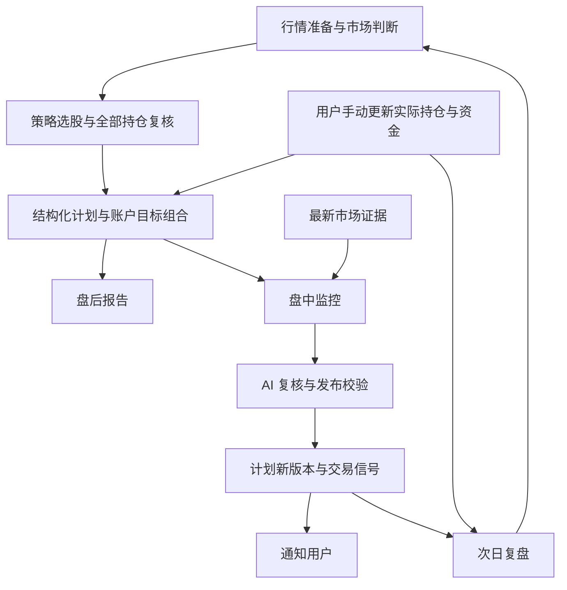

# MVP 2.0：AI 股票投研自动化工作流

> 状态：讨论整理稿，待实施；日期：2026-09-08。
> 变更（2026-09-15，用户决定）：不再使用「手工核对的账户快照」作为仓位分母。现金改为账户上的
> 余额字段（`Account.cashBalance`），由交易、持仓改动与资金流水在同一事务内增减（不计手续费）；
> 持仓市值来自行情；两者合成「账户事实」（`AccountFacts`，含 `accountFactsDigest` 指纹）。
> 计划锚定事实指纹而非快照版本。本文 §5.1 关于「账户待核对」的描述仅作历史记录，
> 当前实现以 `CONTEXT.md` 与代码为准。
> 本文记录用户已确认的需求，以及用户授权后制定的仓位默认值；其余产品默认值单独标注。
> 本次只交付 PRD，不表示功能已经实现、真实行情已验收或运行配置已变更。
> 领域基线：[CONTEXT](../../CONTEXT.md)；[架构](../ARCHITECTURE.md)；[安全边界](../SECURITY.md)。
> 关联：[策略自动化与 AI 管理](./strategy-ai-managed-automation.md)、[策略工作台](./strategy-v2.md)、
> [投资决策闭环](./ai-investment-decision-loop.md)、[统一 Watchlist](./watchlist.md)。

## 1. 问题陈述

用户希望每天盘后自动获得能指导后续操作的研究计划，盘中由 AI 根据市场变化动态判断，
在需要行动时收到有事实依据的信号，减少盯盘和无效交易。持有时间由系统建议，实际交易由用户执行并手动更新。

现有代码已经具备策略扫描、候选 Advice、收盘报告、盘中规则和通知可靠性，但仍存在以下断点：

1. 自动候选建议主要消费选股结果，无法覆盖所有已有持仓的持续持有、减仓和退出。
2. Advice 的价格、周期和文字理由不足以表达可供盘中持续求值的完整计划；预计持有周期与有效期需要分开。
3. 收盘报告按单个策略调度分别生成并推送，没有账户与交易日级统一完成边界；核心研究缺失可能未影响完整性状态。
4. 盘中规则未承接 Advice，部分 `buy/sell` 字段实际表示行情方向，不能直接表示建议买卖动作。
5. 部分数据的 fresh 只证明刚抓取或属于当天，不能证明上游行情足够及时。
6. 多个建议缺少统一的拟议组合预算，账户资金和持仓口径也需要统一。

本 PRD 以代码和相邻测试审查为基线；未把既有文档中的“已交付”当作本版本端到端验收。

## 2. 解决方案与确认记录

### 2.1 产品闭环

**盘后形成计划 → 统一报告 → 盘中基于市场数据重新判断 → 计划更新与信号通知 → 用户手动更新 → 次日复盘。**

报告和盘中监控共同消费结构化计划。报告是阅读入口，不解析 Markdown 反推执行条件。

### 2.2 用户已经确认

| 决策 | 需求 |
|---|---|
| 目标 | 完成盘后策略扫描、盘后报告、盘中监控预警三段自动化 |
| 重构 | 允许重构与 MVP 2.0 冲突的现有实现 |
| 交易频率 | 低频交易；系统建议预计持有周期，并按新证据调整 |
| AI 自主权 | 盘中有较高调整权，判断必须根据实时数据而非编造事实 |
| 信号时效 | 市场变化至收到信号，端到端延迟上限为 10 分钟 |
| 数据范围 | 仅股票市场数据，不考虑新闻、公告和财务数据 |
| 实际状态 | 用户手动更新持仓；建议发出不视为成交 |
| 仓位表达 | 使用百分比，不要求具体下单股数 |
| 仓位限制 | 用户授权由产品方案制定默认规则，见第 5 节 |
| 交付顺序 | 先讨论计划，再输出 PRD；本阶段不实施代码 |

### 2.3 本稿采用的产品默认值

以下用于形成完整可实施方案，未声称是用户逐项指定的参数；实现时提供必要的设置项。

| 项目 | 默认方案 |
|---|---|
| 市场 | 沿用沪深 A 股覆盖，不扩展北交所、港股或美股 |
| 盘后发现 | 基于已发布 Strategy 扫描其范围；全市场策略使用完整沪深股票目录 |
| 研究数量 | 每账户每日最多深入分析 10 只新增候选；跨策略同股合并；全部实际持仓独立复核，不占候选名额 |
| 盘中范围 | 全部实际持仓与当前有效候选计划；不每分钟重新进行全市场 AI 选股 |
| 执行节奏 | 交易日 16:30 启动盘后批次，完成后发布；18:00 为默认出报截止时间，时区 Asia/Shanghai |
| 监控节奏 | 交易时段每 60 秒检查；启动、恢复运行、持仓变更时也检查；午休和闭市按交易日历处理 |
| 计划激活 | 用户首次开启自动化后，校验通过的计划自动纳入监控，无须逐条审批 |
| 产品入口 | Web 首页显示最新盘后报告及当前行动；保留报告历史、计划详情和信号历史 |
| 通知 | 复用飞书；报告按日发布，盘中只推送合格的实质变化；未配置渠道时明确显示仅本地记录 |

已存在的手动策略和单独工作流继续可用；正式自动化需要统一编排，不再靠多套调度反复发布日报。

## 3. 用户故事

1. 作为个人投资者，我希望收盘后自动完成研究，以便每天打开系统即可了解下一步行动。
2. 作为个人投资者，我希望系统复核全部持仓，以便股票退出选股池后仍能得到持有或退出建议。
3. 作为个人投资者，我希望同一股票的多策略证据被合并，以便得到一致且可解释的计划。
4. 作为个人投资者，我希望只深入研究少量新增候选，以便控制注意力和无效交易。
5. 作为个人投资者，我希望每只股票有明确的买卖条件、价格区间和目标仓位，以便理解何时行动。
6. 作为个人投资者，我希望系统建议持有周期和复核时间，以便跨日延续仍然有效的判断。
7. 作为个人投资者，我希望 AI 能根据新行情撤销或修改计划，以便及时应对市场变化。
8. 作为个人投资者，我希望看到每次修改的依据和前后差异，以便理解判断为何发生变化。
9. 作为个人投资者，我希望事实、推断和未知分开展示，以便识别证据支持到什么程度。
10. 作为个人投资者，我希望行情陈旧时系统明确提示无法确认，以便避免把旧信息当作实时信号。
11. 作为个人投资者，我希望合格信号在 10 分钟内送达，以便及时处理需要关注的变化。
12. 作为个人投资者，我希望轻微波动不反复推送，以便保持低频交易节奏。
13. 作为个人投资者，我希望重要风险变化不被普通冷却规则阻断，以便及时得到提醒。
14. 作为个人投资者，我希望多条建议共用账户预算，以便同时执行时不会超配。
15. 作为个人投资者，我希望目标仓位按账户总资产计算，以便不同股票之间可以直接比较。
16. 作为个人投资者，我希望手动登记后系统立即复核计划，以便后续建议反映实际状态。
17. 作为个人投资者，我希望未登记的成交保持未知，以便系统不会假定我已经执行建议。
18. 作为个人投资者，我希望报告明确哪些策略失败或尚未完成，以便分清没有机会和没有完成研究。
19. 作为个人投资者，我希望补充报告能保留旧版本，以便回看当时看到的内容。
20. 作为个人投资者，我希望看到真实通知状态，以便知道信号是生成、渠道受理还是已经送达。
21. 作为个人投资者，我希望复盘区分信号表现和实际交易结果，以便不把未执行建议当作账户收益。
22. 作为个人投资者，我希望暂停自动化、撤销计划或修改上限，以便始终保留产品控制权。

## 4. 交易计划与 AI 判断

### 4.1 计划内容

“交易计划”是本版本新增的产品概念：基于一组明确证据，对某个账户、某只股票给出的条件化行动安排。
计划不等于真实 Trade。实体命名、Advice 扩展方式与表结构在 DDD 中确定，不复活旧 Tactic/StockPool 模型。

| 内容 | 要求 |
|---|---|
| 身份 | 稳定计划身份、不可变版本、账户和股票归属；关联来源 Strategy、版本、run、signal、Advice |
| 证据 | 市场证据快照、来源与数据时间、计算版本、账户状态版本；每项事实有可引用身份 |
| 动作 | 观察、建仓、加仓、持有、减仓、退出、回避；与价格上涨/下跌方向分开 |
| 入场 | 价格区间、确认条件、市场条件、不能入场的情形；不只给单个价格 |
| 仓位 | 当前比例、目标比例、增减百分点、约束检查结果；未完成的前置动作单独列示 |
| 持有 | 预计持有交易日区间、下次复核时间、提前退出条件、允许延长的依据 |
| 退出 | 止损、止盈或其它退出条件；注明当前可卖状态和不可执行原因 |
| 有效性 | 生效时间、有效期、失效条件、替代版本；预计持有周期与计划有效期分别表达 |
| 解释 | 支持证据、反证、风险、未知、与上一版本的差异；confidence 不能解释为收益概率 |

预计持有周期由系统结合策略、波动和市场证据建议，不固定成 T+1/T+3/T+5；既有观察节点仍用于信号复盘。
复核到期只要求重新判断，不机械触发卖出。交易日周期通过交易日历计算，不能直接加自然日。

### 4.2 生命周期

计划有效性、实际持仓状态、通知状态分别维护：

- 计划校验通过后可生效；之后可以被替代、撤销、判定失效或到期。
- 当前监控引用确切生效版本；新版本生效后旧版本不能产生新行动信号，旧的待发行动通知必须重新核验。
- 实际是否持有、数量与可卖数量由用户维护的账户事实决定，信号触发不改变这些事实。
- 部分买入、部分卖出、手动关闭或重新开仓后重算计划；不能从价格穿越推断成交。
- 无法明确归因的实际成交可以待关联，不将其强行计入某条建议的绩效。
- 候选计划失效后停止其新入场信号；实际持仓仍留在风险复核范围。

### 4.3 高调整权的范围

AI 可以改变建议动作、价位、目标仓位、预计持有时间和市场前提，也可以撤销原计划。
每次改变必须说明新证据、受影响的原前提及反证，并产生可追溯的新版本。

AI 不能自行修改账户硬上限、伪造持仓、编造缺失指标、放宽数据资格规则或跳过发布校验。
调整风险条件不能消除已有越界记录；旧风险触发与新计划必须同时可追溯。

低频交易通过持续复用有效计划、减少无效换手实现，不设必须每天买卖或必须满仓的目标。
普通变更默认采用以下去噪规则，参数可配置：

- 只改文字、信心度或数据展示而未改变行动条件时，不生成行动通知。
- 目标仓位累计变化不足 2 个百分点，且动作、关键价格条件、市场前提和风险状态均未实质改变时，不推送普通调仓。
  累计变化以最近一次已发布行动信号的目标为基准；草稿和静默计划更新不能重置基准。尚无行动信号时以当前实际仓位为基准。
- 同股同方向、没有新增实质变化的普通提醒默认冷却 60 分钟；完全相同的计划版本与触发证据去重。
  累计目标变化达到门槛或重要条件改变时属于新事件，不受此冷却压制，仍适用 10 分钟时限。
- 普通方向反转需要新事实改变原前提，并默认连续两个监测周期确认；AI 观点变化本身不足以立即反向通知。
  风险越界、退出条件命中和计划撤销不等待这项持续确认，也不被普通冷却压制；仍需证据校验。
- 价格阈值设置明确的越界、恢复与再次触发条件，防止阈值附近抖动；规则由版本化计划表达。

## 5. 仓位与账户默认规则

### 5.1 分母与上限

仓位分母为该投资账户当前总资产：**现金余额 + 按合格行情估值的股票市值**。
不是家庭全部资产、初始本金或仅股票持仓市值。百分比增减使用“百分点”，避免相对增长率歧义。
用户手动维护实际持仓与资金；使用最新可追溯账户快照，不因 AI 输出修改现金或持仓。
涉及成交的更新须形成持仓与现金一致的账户快照；只改持仓而未同步资金时标记“账户待核对”，
不能因为旧现金仍有数值就视为资料完整。待核对期间暂停精确仓位及当前可执行增仓建议，保留条件研究和风险提醒。
更新完成后重新计算实际仓位与目标的调整差额，并记录变化来源。

| 规则 | 本版默认值 |
|---|---|
| 建议股票总仓位上限 | 80% |
| 建议单只股票仓位上限 | 15% |
| 建议同一行业股票仓位合计上限 | 30% |
| AI 可建议的低仓位 | 可低于上限，也可空仓；没有必须配置满的要求 |
| 修改上限 | 用户可在设置中修改；AI 不能自行提高 |

这些数字是启动产品所用的可配置默认值，不是经过回测证明的最优比例，也不表示应实际投入到上限。
分散与集中风险控制提供原则依据，但不直接推出这些具体数值；投资期限与风险承受能力会影响适合的配置。
参见 [FINRA：集中风险](https://www.finra.org/investors/insights/concentration-risk) 和
[Investor.gov：资产配置](https://www.investor.gov/introduction-investing/getting-started/asset-allocation)。

### 5.2 组合一致性

- 同时有效的买入、加仓计划按全部可能执行后的组合共同校验，不能各自通过后合计超限。
- 建议预算与实际现金分开维护；计划生效占用相应建议额度，撤销、过期或替代时释放或重算。
- 同股多策略或同计划多版本不得重复占用额度；互斥情景必须显式建模，未能证明互斥的按可能同时发生核算。
- 尚未实际完成并登记的卖出不能释放现金或仓位额度。依赖卖出的买入只能是有前置条件的计划，不能标为当前可执行。
- 价格自然上涨造成被动超限时记录偏离、暂停增加对应敞口，由 AI 复核是否需要减仓，不机械地每天再平衡。
- 已有超限仓位不阻断全账户分析；持有不变或降低风险的计划可以继续，但不能新增超限敞口。
- 行业采用统一且可追溯的分类口径；行业信息缺失时不能宣称行业校验通过，也不能发布依赖该校验的增仓建议。
- 资金、持仓或估值不完整时保留条件研究和可验证风险提醒，精确目标百分比标为 unavailable。

持仓更新会使进行中的旧账户版本分析失效。发布计划与预留建议预算必须共同防并发超配。
不新增融资或自动交易路径；可卖数量、交易时段、停牌和涨跌停等状态要在行动发布前检查。
受限时可展示退出意向或观察条件，不能宣称当前能够执行。

## 6. 市场数据与防幻觉要求

### 6.1 数据范围与证据资格

允许使用个股量价、规范日线与分钟线、指数、板块、市场宽度、涨跌分布、涨停梯队等市场交易事实。
证券身份、行业分类与交易日历属于必要基础资料。行情产生的指标由确定性代码计算。

每个维度独立记录来源、真实观测时间、抓取时间、频率/延迟、覆盖范围、价格口径与可用状态。
完整性和新鲜度分别表达；抓取时间不得冒充上游观测时间，日线或延迟指数不得冒充盘中报价。
同时检查时间含义、时区及系统时钟；未来时间戳、异常时钟偏差或时间语义不明不能获得实时资格。
不能以负年龄或时间解析失败后的默认当前时间通过时效检查。

| 关键数据 | 本稿初始资格标准 |
|---|---|
| 个股报价、用于决策的实时指数 | 可核验的上游时间；盘中发布校验时年龄不超过 120 秒 |
| 分钟线 | 已闭合桶用于确认指标；最新桶距当前不超过两个周期，扣除非交易时段；缺口单列 |
| 市场宽度、板块和情绪快照 | 上游数据时间可核验，年龄不超过 5 分钟；覆盖不足不得推断全市场结论 |
| 日线与日线指标 | 使用最近已完成交易日的规范数据，明确历史窗口、复权口径和截止日期 |
| 时间未知或仅有抓取时间的数据 | 可带限制展示，不能作为声称“当前实时”的关键依据 |

这些是初始产品阈值，不是对现有 provider 的可用性承诺。M0 必须验证真实来源能否满足；
无法满足时显示能力未就绪，不通过改时间戳或降低门槛将其标为已验收。
盘后数据按交易日完成状态校验，不套用盘中秒级阈值；跨维度时间不一致必须披露并判断能否联合推断。

日线 qfq、分钟 raw 和实时交易价不能直接混算。跨价格口径引用必须有可复核的换算依据；缺依据返回 unknown。
AI 不能将未闭合分钟桶描述为已经确认的整周期事实。

### 6.2 三段校验

1. **输入校验**：工具生成带身份的证据包，判定关键维度时效、覆盖、账户版本与可用性；明确事实、计算值和未知。
2. **输出校验**：AI 返回结构化动作、条件、目标仓位、依据与反证；程序校验引用是否存在、数字及比较关系是否一致、约束是否满足。
3. **发布前校验**：重新取得关键行情与账户版本；若证据过期、条件越界、账户变化或计划已被替代，则旧结果不能发布。

刷新行情后，如果结构化依据和行动条件仍成立，可以附加最新校验结果发布，保留 AI 原分析时点；
不能把新数据时间改写成原分析使用的时间。只有关键前提失效、无法验证或账户版本改变时才重新分析，
普通价格跳动不应造成无止境重算。

关键事实判断需使用可机器验证的结构化主张，例如指定指标、窗口、比较关系及对应证据。
仅引用一个有效 fact id 不证明自然语言论断成立。无法自动核验的判断明确标为 AI 推断，不包装成已发生事实。
“看起来合理”或第二次 AI 审阅不能替代确定性事实校验。

输入不包含新闻、公告、财报等资料，AI 不得把这些内容作为本版判断依据；不主动获取这些数据。
输出失败最多进行一次有界修复，仍失败则保留研究失败状态；调度重试不能无上限延长同一事件的时限。

合格证据只能约束事实幻觉，不能保证投资判断正确或供应商数据绝对准确；页面保留反证、风险、有效期和免责声明。
行情或 AI 不可用时不能伪装成“没有机会”。已有确定性风险条件的事实提醒可以独立发送，明确它不是新的 AI 买卖判断。

## 7. 盘后工作流与报告

### 7.1 账户与交易日级批次

盘后批次统一串联：数据准备 → 已发布策略扫描 → 证据合并 → 全部持仓复核与候选分析 → 目标组合校验 → 计划生效 → 报告发布。
保留策略版本、checkpoint、publication、租约与阶段审计。共享扫描事实可复用，但个性化计划必须隔离到账户。

批次明确当日预期策略集合及每个策略的成功、未发布、失败、未完成、跳过状态。
持仓退出策略股票池不退出持仓复核；新候选合并后再按优先级与研究预算筛选。
未分析、证据不足、预检阻断和没有合格机会分别展示。

### 7.2 报告结构

1. **市场判断**：指数、板块和市场情绪的事实摘要；AI 对交易环境的判断、反证及数据限制。
2. **今日行动摘要**：优先展示需要处理的持仓风险与计划变化，再展示新增机会；允许明确建议保持不动。
3. **已有持仓**：继续持有、减仓或退出；当前与目标仓位、周期、价格条件和依据。
4. **候选机会**：买入前提、价格区间、目标仓位、预计持有周期、失效条件；区分可执行与等待条件。
5. **下一交易日监控**：哪些计划已进入监控、关注什么市场变化、哪些条件需要重新判断。
6. **复盘与数据状态**：前一日计划变更、信号和已登记执行情况；失败、缺失、时点、送达状态。

完整计划以 Advice/计划引用呈现，报告保留事实与解读的边界。复用 Report 实体与展示方式，
不把 Report block 直接变成业务执行字段，也不保留新闻公告作为本版必需章节。

### 7.3 发布与完整性

- 按账户、交易日统一发布，不在每个策略完成时发送一份独立日报。
- 所有预期工作完成后可提前发布；默认截止时间到达仍未完成则发布 partial 报告，列明缺口。
- 即使无合格候选、所有策略失败或数据准备失败，也应产生当日运行状态与可用事实报告。
- 策略研究和全部持仓复核是核心维度；核心维度失败不能标为完整报告。
- AI 失败时保留 facts-only 报告并标记分析缺失；不能用旧 AI 文本冒充今日判断。
- 后到结果形成有版本记录的补充；保留原发布时内容，同一版本投递有幂等身份。
- 默认仅在补充导致重要行动改变或核心缺失补齐时再次通知，避免轻微更新重复发送。
- 通知使用独立摘要，包含关键动作、风险、时点与详情链接；不能机械截断正文而丢失关键风险。

## 8. 盘中工作流与 10 分钟时限

### 8.1 触发与判断

每分钟求值计划条件和市场状态。价格确认、关键风险条件、市场前提变化、手动账户更新、计划到期等触发复核。
保持运行健康检查；连续检查无实质变化时不要求反复调用 AI。

首次启动或恢复运行必须评估当前是否已越过计划条件，不能一律只初始化边沿而不提醒。
跳空、停牌恢复等情况重新判断可执行性；不能默认在计划价成交，也不能自动追认历史入场。
风险条件可以立即生成事实提醒，AI 的后续重新判断另行记录与关联。

AI 复核、发布校验、计划替代与触发提交必须处理并发：同一账户/计划的新结果不能被旧任务覆盖。
计划、账户或行情变化使旧结果失效时，刷新证据并重新判断；保留旧尝试及原因。

### 8.2 延迟口径

10 分钟是需求上限，不能被解释成每 10 分钟抓取一次，或仅计算 AI 调用耗时。

- 行动通知资格由版本化条件与可核验事实确定，包括持续确认和实质变化要求；不能等 AI、数据补齐或投递成功后才决定是否计入。
- 对符合条件、需要复核的可检测市场事件，以首次触发证据的可信上游事件时间作为计时起点；需要持续确认的保留首次触发时点，确认耗时也计入。
- 若只有采样快照，注明它是首次可证实的触发时点，不能声称观测到了更早的真实价格穿越时刻。
- 保存源事件时间、首次取得时间、规则检测时间、AI 开始/完成时间、发布校验时间、通知尝试/受理/送达时间。
- 数据源延迟、排队、分析、发布复查和通知重试全部计入；刷新或重算不能清零原事件耗时。
- 缺可信事件时间时标为“时延不可验证”，不能算作达标；没有达到实质变化阈值的事件记录抑制原因。
- 已进入复核的事件即使之后数据过期、AI 失败、判断暂不行动或渠道失败，也保留原事件与计时；
  判定不行动时记录复核完成时延，其余按实际状态记录，不能删除不成功样本。
- 事件超时必须保留超时事实。若新数据仍支持行动，可发布注明最新时点的新判断，原超时不能被覆盖。

“渠道受理”与“用户设备收到”分别表达。渠道没有设备送达回执时，只能验证平台受理时延，
不能将其冒充用户已经收到；验收需补充真实设备链路证据，并披露无法连续观测的范围。
全部合格事件均进入时效统计，超时、缺失、失败和不可验证单列，不能只统计成功样本。

### 8.3 通知与降级

- 复用持久化触发、租约、去重、冷却、投递前记账与重试；不承诺外部渠道恰好一次。
- 重试前检查计划仍有效、关键条件仍成立、账户版本适用和交易时段适用；过期行动信号不能迟到照发。
- 闭市后保留事件历史；需要延续的计划进入下一交易日复核，闭市时不能发“当前可执行”的指令。
- 生成、待投递、渠道受理、可验证送达、失败、超时、仅日志分别展示。
- 数据源或 AI 失败时保留状态、事实与待处理项；通知渠道失败不能宣称已送达。
- 行动推送中至少包含股票、动作、价格条件、目标仓位、原因、风险、计划版本、数据时间和有效期。

## 9. 实施决策与范围边界

### 9.1 模块调整

| 模块 | 本版责任 | 复用与重构 |
|---|---|---|
| 市场证据 | 时间、覆盖、来源、口径和结构化事实资格 | 复用 adapter registry；修正展示口径与决策口径混用 |
| 计划与账户预算 | 计划版本、有效性、目标仓位、证据引用及组合约束 | 复用 Advice/账户/持仓；补足现金与目标组合事实，不复活旧模型 |
| AI 决策 | 基于证据生成条件化计划与差异 | 收敛持仓和候选的质量契约，保留结构化校验与有界重试 |
| 盘后编排与报告 | 账户交易日批次、阶段审计、统一报告及补充版本 | 复用 daily cycle、WorkflowRun、Report；改造逐策略出报 |
| 盘中决策 | 逐股条件、市场变化、AI 复核、发布前检查 | 复用 AlertPlan/WatchTrigger 可靠性；拆分行情方向与行动语义 |
| Web 与通知 | 报告、计划、差异、行动、手动更新与真实送达状态 | 保持 Hono + 原生 HTML/CSS/JS，复用飞书与现有页面能力 |

Strategy 继续负责发现与规则事实，Watchlist 继续负责关注范围，AlertPlan 继续承载规则与通知政策。
逐股计划拥有自己的价格、周期和账户归属，不通过每股新建一个 Watchlist 规避模型问题。
WatchTrigger 记录条件命中事实；AI 买卖判断通过明确关联的 Advice/计划版本表达，不重解释旧历史记录。

core 零 IO；Tool 使用 Zod 与 ToolResult；Workflow 只通过 tools；新增 repository 必须提供双实现与合约测试。
schema 与 SQLite 启动迁移同步并保持幂等。历史对象只读兼容，不能给旧数据补造证据时间或计划关系。

### 9.2 与旧设计的关系

| 旧边界 | 本版变化 |
|---|---|
| 盘中 AI 决策不在范围内 | 替换为有证据约束的盘中高调整权 AI 复核 |
| 策略行动只是报告可选部分 | 替换为本版核心交付；缺失影响报告完整性 |
| 每策略运行完成触发报告 | 替换为账户交易日批次统一发布及版本化补充 |
| Advice 周期和有效期较粗 | 分开预计持有、复核时间、有效期与条件失效 |
| 预警方向可映射为 buy/sell | 保留历史语义，新动作单独建模 |
| AI 不负责策略组合仲裁 | 本版加入同股证据冲突处理及账户目标组合预算，不扩展策略权重优化实验 |
| 只使用行情数据 | 保持；不引入新闻、公告、财务或基本面评分 |
| Advice、Trigger 不自动交易 | 保持；不新增交易路径，不把信号当成交 |

以上为目标设计覆盖，实施前当前运行行为仍以代码及维护文档为准。旧 PRD 其它已交付能力不据此删除。
现有 AI 策略生命周期管理可保留，本版不增加自治研究复杂度，不以策略自动进化作为三段工作流上线前提。

### 9.3 本版不做

- 自动下单、券商成交同步、融资或杠杆策略。
- 新闻、公告、财报、公司行动解释、基本面因子研究。
- 秒级或高频交易、每分钟全市场 LLM 扫描。
- 具体股数建议、跨市场资产配置、多用户跟单或云端账户同步。
- 用回放或固定 T+n 信号表现承诺收益；扩大严格回测或策略自动进化范围。
- 为研究数据补齐、行情恢复或计划变化逐条要求用户确认；首次启用自动化仍须满足既有能力 opt-in。

## 10. 实施计划

| 阶段 | 交付 | 退出条件 |
|---|---|---|
| M0：证据与契约验证 | 实际来源能力核验；时间/价格口径与账户估值契约；计划、动作和预算的 DDD | 至少明确可支撑首版的真实证据链；不可用能力有显式处理；核心契约可测试 |
| M1：盘后计划纵向闭环 | 持仓与候选统一分析、计划版本、账户额度、单批次完整/部分结果 | 新机会和已有持仓都能形成可追溯计划；并发不会超配或覆盖新版本 |
| M2：统一盘后报告 | 新报告结构、统一发布、版本补充、Web 计划详情和通知摘要 | 一日一份主报告，核心缺失可见，报告与计划内容一致，浏览器验收通过 |
| M3：盘中动态判断 | 计划监控、市场证据、AI 高调整权、发布复查、手动更新联动 | 能撤销/调整计划，事实和账户版本校验生效，旧计划不迟到触发 |
| M4：端到端验收 | 真实时效、通知、恢复、失败场景、次日复盘与运行状态 | 第 11 节关键场景通过，真实来源及设备链路证据明确；未就绪能力不伪报完成 |

M0 决定真实数据能支持哪些市场维度及预算，不用 fixture 代替来源验收。M1～M3 采用可独立验证的纵向切片，
按契约与存储、Tool/Workflow、surface 分步交付；不长期维护两套冲突的正式自动化路径。
工期在 M0 确认真实源、账户现金事实和 DDD 后估算，本文不编造完成日期。

## 11. 测试决策与验收标准

只验证外部可观察行为与领域不变量，不写镜像实现的测试。复用现有策略候选分析、推荐预检、
日循环租约、盘中可靠性、报告工作流、repository 双实现和 Web 测试模式。

| 场景 | 必须看到的结果 |
|---|---|
| 多策略一成功、一失败、一未完成 | 截止时形成一份 partial 主报告，分别列明状态，不反复发送阶段性日报 |
| 全部失败或没有当日正式 run | 仍有报告与运行状态，不能静默无产物或显示“没有机会” |
| 持仓不再入选任何策略 | 仍生成持仓复核，必要时给出减仓/退出，不因 selected=false 消失 |
| 无合格新机会 | 可以保持原计划或空仓；未分析与没有机会明确区分 |
| AI 引用不存在指标或错误数值 | 输出被拒绝或有界修复；新闻、公告和财务论据不能混入 |
| 刚抓到昨日行情、只有抓取时间或时间异常 | 不获得实时决策资格；未来时间、负年龄和时区错误不能通过，缺失状态可见 |
| 分钟线今日但尾部陈旧、口径不一致 | 不标 fresh；不混算 raw 与 qfq，不确认未闭合周期 |
| AI 分析中关键行情使前提失效或账户改变 | 发布前阻断旧判断，重算并保留原事件耗时；普通价格跳动且依据仍成立时可附新校验发布 |
| 10:00 事件，10:07 才取得，10:11 送达 | 记录超时，不能只按获取后 4 分钟判为达标 |
| 缺源时间或无设备回执 | 时延不可验证或仅渠道受理明确展示，不能计为已证实送达 |
| 多条买入计划并发、另有未执行卖出 | 按合并组合校验额度，卖出不提前释放现金；不分别通过后超配 |
| 买入信号已发但用户未登记 | 持仓、现金和实际收益保持原事实，不视为成交 |
| 用户部分更新、手动清仓、重新开仓 | 持仓与现金一致后更新账户版本并重算；仅更新持仓时标待核对，不能沿用旧现金给精确仓位 |
| 当前仓位被动超上限 | 有超限提示，阻断增大相关敞口，仍可研究或建议降风险，不机械频繁调仓 |
| 连续轻微波动与普通重复信号 | 按阈值、版本和冷却去噪，用户不反复收到同一行动 |
| 多次静默调整累计达到 2 个百分点 | 以最近发布的行动目标为基准触发新事件，不能逐版本重置基准，也不能被 60 分钟冷却拖延 |
| 连续普通反向建议 | 无新事实或未达到持续确认条件时不反复推送；风险退出与撤销保留即时例外 |
| 重要风险发生在普通冷却期 | 风险事实及时提醒；AI 后续判断关联同一事件，不能被普通冷却隐藏 |
| 新版本替代、计划撤销或过期 | 旧触发与待发行动通知停止，历史仍可查看 |
| 首次启动已跳空越过条件 | 重评当前情况与可执行性，不因初始化边沿漏掉重要变化 |
| 价格触发但不可卖或闭市 | 不发当前可执行卖出确认，展示限制和后续复核安排 |
| AI、源或通知失败 | facts-only、partial、未投递/超时清晰可见，重试前重验有效性 |
| 报告补充与通知正文较长 | 保存报告版本，按重要变化通知，关键风险不被截断 |
| 次日复盘 | 信号后续表现与已登记实际结果分开；样本、缺失和未执行情况可追溯 |

新增纯领域模块使用确定性时间与行情夹具测试；存储使用 drizzle/memory 同一组 contract tests。
跨阶段测试覆盖并发、重启、任务失效和通知补偿。UI 自动测试之外，必须真实启动并用浏览器验证。

交付前按改动范围执行仓库规定的 test、test:db、test:web、typecheck、lint、build；依赖 bun:sqlite 的测试使用 Bun。
真实 provider 和通知链路独立验收，保存脱敏证据。不能靠删除失败样本、提高陈旧阈值或只展示成功时延通过验收。
本次文档交付仅检查 Markdown 相对链接与差异格式，不宣称业务测试或生产验收已通过。

## 12. 后续设计需要落实的事项

以下是工程验证与 DDD 工作，不要求用户再次选择业务方向：

1. 真实源时间戳、分钟完整度、指数/板块/情绪覆盖，以及符合初始新鲜度要求的来源组合。
2. 账户当前现金及估值事实来源；手动交易与直接持仓更新两条入口如何保持一致、保留修订审计。
3. 计划版本与 Advice 的存储边界、目标组合预算的原子更新、历史读取迁移与相邻契约。
4. 来源事件时点与首次可观测时点的测量限制、真实设备送达证据和 10 分钟时限的容量预算。
5. 同股多策略矛盾、行业分类版本、价格口径换算和规则缺失时的具体失败契约。

现有确定性策略、行情底座、审计和投递机制优先复用；只有阻断本 PRD 闭环的部分进入重构范围。
